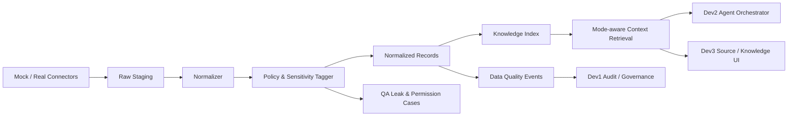
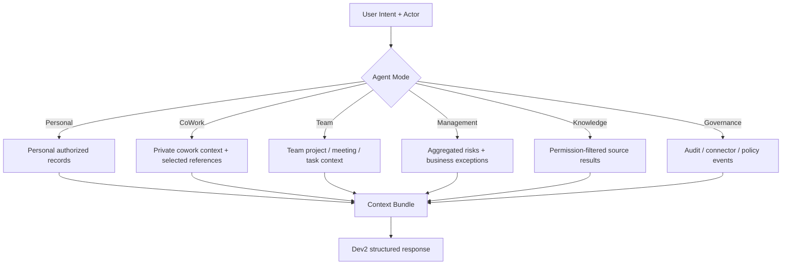
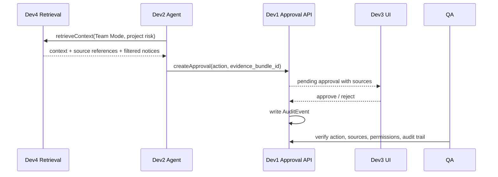

# Dev4 集成 / 数据 / 知识 MVP 可选方案

本文针对 `docs/development-plans/dev4-integrations-data-engineer.md`，在阅读当前目录文档后，给出几种最小可行且易扩展的 Dev4 落地方案。目标不是尽快堆很多 connector，而是让 AgentOS 从第一版就拥有可信的数据底座：数据有来源、权限可过滤、敏感等级可控、Agent 可引用、前端可解释、后端可审计。

Dev4 的核心判断是：它不是“数据接入工程”这么窄，而是 AgentOS 信任边界的地基。没有这个地基，Dev1 的权限与审计、Dev2 的上下文组装、Dev3 的来源展示都会各自发明一套事实标准，产品也容易偏成聊天机器人、BI 看板或代码仓库报表。

## 已参考的文档范围

- `agentos-product-design.md`
- `docs/development-plans/dev1-backend-tech-lead.md`
- `docs/development-plans/dev2-ai-agent-engineer.md`
- `docs/development-plans/dev3-frontend-product-engineer.md`
- `docs/development-plans/dev4-integrations-data-engineer.md`
- `docs/development-plans/qa-test-security.md`
- `docs/dev3/dev3-frontend-mvp-options.md`
- `gitea_zhangrui_last_month.json`
- `funkyape/general_agent/skills/gitea-repo-api/SKILL.md`
- `funkyape/general_agent/skills/gitea-repo-api/references/common-options.md`
- `funkyape/general_agent/skills/github-repo-api/SKILL.md`
- `funkyape/general_agent/skills/github-repo-api/references/common-options.md`

`gitea_zhangrui_last_month.json` 和 GitHub/Gitea skill 文档说明真实 connector 会遇到分页、认证、分支、空结果、API 错误、仓库活跃度差异等问题。它们适合成为 Dev4 的只读 connector 与错误样例参考，但不能把 AgentOS 的数据层收窄成代码仓库分析系统。

## 共同设计底线

无论选择哪种方案，Dev4 都应坚持以下边界：

1. **先统一数据契约，再谈 connector 数量。** 每条数据进入系统时都必须被包进同一套 envelope，包含来源、时间、owner、权限范围、敏感等级、实体类型和原始引用。
2. **mock 数据必须像真实数据。** mock 不是随手写 fixture，而是 Dev1/Dev2/Dev3/QA 共用的契约样本，必须覆盖正常、敏感、越权、同步失败和来源冲突场景。
3. **只读接入优先。** 首版真实 connector 只读，不写回外部系统；写动作由 Dev2 生成待审批 action，由 Dev1 的审批与审计闭环处理。
4. **Connector 载体先按后端插件处理。** 当前暂定 connector 以插件形式集成到后端，由后端插件运行时统一加载、配置、调用和审计；MVP 不先拆独立 connector service，也不让 Agent 直接持有脚本或 token。
5. **外部系统权限先不映射。** Gitea/Jira/Notion/CRM 等外部系统各自做原生鉴权，AgentOS 做自身产品入口、tenant、mode、敏感等级和审计鉴权；首版不把外部权限同步或翻译成 AgentOS 权限。
6. **权限过滤在检索层前置。** Restricted 和 AgentOS 未授权 Private 数据不应先交给 Agent 再让 Agent 自觉不说，而是在 retrieval service 阶段就过滤。
7. **来源引用是产品能力，不是调试字段。** Dev2 要用它区分事实、推断和建议；Dev3 要把它展示给用户；Dev1/QA 要用它追溯审计。
8. **管理视图只拿聚合和例外，不拿私人原文。** Management Mode 可以看到组织风险、项目偏离、客户升级，但不能默认读取员工私人共事讨论。
9. **可退回 mock。** 真实 connector 失败时，系统仍能基于 mock 数据跑通 MVP 演示，失败本身也要成为可审计的数据质量事件。

## 建议统一契约

Dev4 第一件事应交付一个很薄但稳定的 `NormalizedRecord`，作为 Dev1 的 `ConnectorSource`、Dev2 的上下文、Dev3 的 source reference 和 QA 的权限测试共同基准。

```ts
type SensitivityLevel = "Public" | "Internal" | "Private" | "Restricted";

type EntityType =
  | "project"
  | "task"
  | "meeting"
  | "document"
  | "message"
  | "customer_event"
  | "code_change"
  | "decision"
  | "cowork_note";

type NormalizedRecord = {
  id: string;
  tenant_id: string;
  source: string;
  source_type: "mock" | "github" | "gitea" | "linear" | "jira" | "notion" | "calendar" | "crm" | "chat";
  source_url?: string;
  external_id?: string;
  entity_type: EntityType;
  entity_id: string;
  title: string;
  content: string;
  metadata: Record<string, unknown>;
  owner_user_id?: string;
  team_id?: string;
  project_id?: string;
  customer_id?: string;
  timestamp: string;
  permission_scope: string[];
  sensitivity: SensitivityLevel;
  visibility: "personal" | "team" | "org" | "governance";
  raw_ref?: string;
  sync_run_id?: string;
};
```

对应的 source reference 给 Dev2/Dev3 使用，应比完整记录更小：

```ts
type SourceReference = {
  record_id: string;
  source: string;
  source_type: string;
  source_url?: string;
  title: string;
  entity_type: EntityType;
  timestamp: string;
  owner_user_id?: string;
  permission_scope: string[];
  sensitivity: SensitivityLevel;
};
```

## 总体数据流



这张图的关键是：Dev4 不直接“喂上下文给模型”，而是先标准化、打标签、索引和过滤。Agent 和前端拿到的是已经可解释、可追溯、可审计的数据。

## 方案一：契约与 Mock Data Hub 优先

### 最小范围

先做一个“契约真实、数据 mock”的 Dev4 基座，让 Dev1/Dev2/Dev3 可以立即并行开发。

交付内容：

- `NormalizedRecord`、`SourceReference`、`ConnectorSpec`、`SensitivitySpec`。
- 四类 mock connector：
  - 项目管理：项目、任务、阻塞、依赖、待决策。
  - 文档/知识库：决策 memo、项目复盘、客户背景、公开文档。
  - 聊天/会议：会议纪要、行动项、讨论摘要。
  - 客户事件：投诉、升级、续约风险、CS 记录。
- 一组私人共事样例和公开输出样例。
- 一组敏感与越权样例：Private 原始记忆、Restricted 薪酬/绩效/法律片段、管理层不可见的私人讨论。
- 一个 `mockDataAdapter`，支持按角色、模式、项目、客户、人员过滤。

### 承接关系

- 承接 Dev1：提供 `ConnectorSource` 可落库字段、权限范围、敏感等级、同步事件样例。
- 承接 Dev2：提供稳定的 source reference 和 mode-aware retrieval 输入。
- 承接 Dev3：提供可直接渲染的来源、敏感等级、过滤提示和空/错状态样例。
- 承接 QA：提供权限泄露、越权访问、同步失败、敏感数据误入上下文的测试 fixtures。

### 易扩展点

- 后续真实 connector 只要输出 `NormalizedRecord`，就能替换 mock。
- mock 数据集可以成为 contract test 的黄金样本。
- 可先用内存或 JSON 文件，后续迁移到数据库或对象存储时不改变上层语义。

### 风险

如果只停留在 mock，会让数据层看起来像演示数据工程。必须明确下一步进入检索与真实只读 connector，否则 Dev4 无法验证真实同步、错误处理和去重。

## 方案二：Knowledge Index 与 Context Retrieval 优先

### 最小范围

先实现一个基础 Knowledge Index，不追求复杂向量检索，先保证可追溯、可过滤、可稳定返回上下文。

最小能力：

- 索引 `document`、`meeting`、`task`、`project`、`customer_event`、`decision`。
- 支持关键词检索。
- 支持按项目、客户、会议、人员、实体类型、时间范围过滤。
- 支持 `sensitivity != Restricted` 的默认过滤。
- 支持 `permission_scope` 与当前用户角色/团队匹配。
- 返回 `SourceReference[]`，并保留事实片段 `snippet`。
- 提供两个接口：
  - `searchRecords(query, filters, actor)`
  - `retrieveContext(mode, actor, intent, filters)`

### 模式检索规则图



### 承接关系

- 承接 Dev1：让后端 Knowledge Aggregation API 有明确下游，可按角色过滤。
- 承接 Dev2：直接支撑 Personal、CoWork、Team、Management、Knowledge 模式的上下文组装。
- 承接 Dev3：知识页、组织雷达、项目状态、个人简报都能展示同一种来源列表。
- 承接 QA：最早验证 Restricted 数据不会进入未授权检索结果。

### 易扩展点

- 第一版可以用 SQLite FTS、轻量倒排索引或进程内索引；后续再替换为 Postgres FTS、OpenSearch 或向量索引。
- 先关键词检索，后续扩展 hybrid search，不改变返回结构。
- 检索 API 是 Agent 与前端共用的，可以防止“Agent 一套上下文、前端另一套出处”。

### 风险

这个方案容易被做成“搜索服务”。要坚持检索结果服务工作流：每个 context bundle 都要能进入组织简报、项目风险、个人简报、共事输出或审批动作，而不是只返回一堆搜索结果。

## 方案三：审批与审计来源链优先

### 最小范围

围绕一个高风险动作，把“数据来源 -> Agent 建议 -> 审批 -> 审计”的证据链做完整。例如：

> 根据项目会议纪要和任务状态，Agent 建议把一个项目风险同步到 Linear/Jira。

Dev4 只需交付：

- action 所依赖的 `SourceReference[]`。
- action 的 `evidence_bundle_id`。
- evidence bundle 中每条证据的权限、敏感等级和摘要片段。
- 敏感数据过滤记录：哪些记录被过滤，为什么不能进入 action。
- 同步/执行失败样例，供 Dev1 写审计、Dev3 展示错误、QA 验证。

### 审批来源链



### 承接关系

- 承接 Dev1：审批项和审计日志能追溯到具体数据来源，而不是只记录一段 Agent 文本。
- 承接 Dev2：Agent 能解释“为什么建议这个动作、基于哪些事实、哪些是推断”。
- 承接 Dev3：审批详情页能显示来源、影响范围、风险等级和被过滤的敏感数据提示。
- 承接 QA：第一条高风险动作 E2E 可以检查是否绕过审批、是否泄露敏感上下文。

### 易扩展点

- 后续所有高风险动作都复用 evidence bundle。
- evidence bundle 可扩展为组织记忆的一部分，记录重要决策的原因。
- 可自然支持失败重试、回滚建议和审计查询。

### 风险

这个方案闭环感最强，但覆盖的数据面较窄。建议不要单独做，最好与方案一或方案二组合。

## 方案四：真实只读 Connector 优先

### 最小范围

选择一个真实工具只读接入，建议从 GitHub/Gitea 或 Linear/Jira 中选一个。基于当前目录已有 Gitea/GitHub skill 和 `gitea_zhangrui_last_month.json`，最省力的真实样例是代码仓库活动 connector。

首版不要做“完整代码洞察”，只做标准接入能力：

- 配置 base URL、owner、repo、token 或本地只读配置。
- 拉取仓库、分支、commit、issue、PR 的基础字段。
- 处理分页、空结果、认证失败、404、500、限流。
- 将 commit/issue/PR 转换为 `NormalizedRecord`。
- 写入 `sync_run_id`、同步时间、错误日志和数据质量事件。
- 接入 Knowledge Index 后可被项目状态、知识检索和组织简报引用。
- connector 当前以**后端插件**形式落地，先由后端插件运行时加载和审计，不单独拆服务。
- 外部系统认证失败、token scope 不足和 403/404 要作为外部鉴权状态返回；不把外部权限映射成 AgentOS 权限。

### 承接关系

- 承接 Dev1：提供真实 connector 配置、同步任务、错误事件和审计字段。
- 承接 Dev2：给项目状态和知识回答提供真实来源。
- 承接 Dev3：展示真实 source URL、同步失败、空数据和认证限制状态。
- 承接 QA：验证真实 connector 不绕过 Dev1/后端插件边界、外部鉴权失败可追踪、无 token 泄露。

### 易扩展点

- GitHub/Gitea 接口模式可迁移到 Linear/Jira：分页、状态过滤、增量同步、错误归一化都类似。
- 新 connector 只要作为后端插件实现 `fetch -> normalize -> tag -> index` 四步即可。
- connector registry 后续可扩展为 SaaS 阶段的连接器市场，但 MVP 不需要市场化。

### 风险

这个方案最能验证真实世界摩擦，但也最容易偏离产品初衷：把 AgentOS 做成代码仓库动态报表。必须把代码仓库视为“项目状态证据之一”，不能让它盖过会议、任务、客户和共事数据。

## 方案五：权限与敏感数据 Gate 优先

### 最小范围

先把最容易阻断试点的事情做好：数据不进错上下文。

交付内容：

- `canReadRecord(actor, record, mode)` 权限判定规则。
- `filterRecordsForMode(records, actor, mode)` 检索前过滤。
- `redactRecord(record, actor, mode)` 展示级脱敏。
- Restricted 默认拒绝，除非 Governance Mode 或 break-glass 审批上下文明确允许。
- Private 默认只给 owner；CoWork Mode 只在私人上下文使用；Management Mode 不返回私人讨论。
- 过滤原因结构化返回，例如 `filtered_reason: "private_cowork_context"`。
- 敏感泄露测试 fixtures。

### 承接关系

- 承接 Dev1：权限规则可以进入后端中间件和 break-glass 模型。
- 承接 Dev2：Agent 上下文组装不需要自己猜哪些数据可用。
- 承接 Dev3：未授权、被过滤、需审批访问等状态有一致展示字段。
- 承接 QA：P0/P1 隐私与权限测试有明确断言对象。

### 易扩展点

- 后续新增角色、团队、项目、客户权限时扩展 policy，不改 connector。
- 可支持审计：记录谁请求了什么、哪些被过滤、是否触发越权事件。
- 能为 SaaS 阶段多租户和行业合规打基础。

### 风险

如果只做 gate，没有可用数据和检索，产品会显得“很安全但没价值”。因此这个方案适合作为所有方案的横切层，而不是单独的 MVP。

## 方案对比

| 方案 | 最小可行价值 | 最适合先验证 | 对 Dev1/Dev2/Dev3 的承接强度 | 主要风险 |
| --- | --- | --- | --- | --- |
| 契约与 Mock Data Hub 优先 | 并行开发立即可跑 | 公共契约、演示数据、QA 样例 | 均衡 | 容易停留在假数据 |
| Knowledge Index 与 Context Retrieval 优先 | Agent 有可信上下文 | 来源、权限、检索、模式上下文 | Dev2/Dev3 最强 | 易偏成搜索服务 |
| 审批与审计来源链优先 | Suggest + Confirm 可追溯 | 高风险动作闭环 | Dev1/Dev2 最强 | 覆盖面窄 |
| 真实只读 Connector 优先 | 验证真实接入摩擦 | 同步、错误、增量、真实出处 | Dev4/Dev1 最强 | 易偏成工具报表 |
| 权限与敏感数据 Gate 优先 | 降低试点安全风险 | 私人/团队/管理边界 | QA/Dev1 最强 | 单独做价值感弱 |

## 推荐路线

推荐采用“方案一 + 方案二 + 方案五”为 Dev4 第一阶段默认路线，再用“方案三”跑第一个闭环，最后选择“方案四”接一个真实只读 connector。

### 第 0 阶段：契约冻结

- 定义 `NormalizedRecord`、`SourceReference`、`SensitivityLevel`、`ConnectorSyncRun`、`DataQualityEvent`。
- 与 Dev1 对齐 `ConnectorSource`、权限字段、审计事件字段。
- 与 Dev2 对齐 `ContextBundle` 和 mode-aware retrieval 输出。
- 与 Dev3 对齐来源卡片、敏感等级、过滤提示字段。
- 与 QA 对齐敏感/越权/同步失败 fixtures。

### 第 1 阶段：Mock Data Hub

- 完成四类 mock connector：项目、文档/知识、聊天/会议、客户事件。
- 补私人共事、公开输出、管理聚合、Restricted 样例。
- 所有 mock 通过统一 normalize 流程，而不是直接喂给页面或 Agent。
- 提供 README：数据集角色、场景、权限、敏感等级说明。

### 第 2 阶段：Knowledge Index + Retrieval

- 建基础索引和关键词检索。
- 实现 `searchRecords` 和 `retrieveContext`。
- 每个结果带 `SourceReference`、snippet、权限、敏感等级。
- Management Mode 只返回聚合风险和业务例外，不返回私人原文。

### 第 3 阶段：Policy Gate 与泄露测试

- 实现 `canReadRecord`、`filterRecordsForMode`、`redactRecord`。
- 将过滤原因结构化返回给 Dev2/Dev3。
- 与 QA 跑敏感数据泄露测试。
- Restricted 默认不进入普通 Agent 上下文。

### 第 4 阶段：第一个审批证据链

- 选择一个项目风险同步或客户跟进动作。
- Dev4 返回 evidence bundle。
- Dev2 基于 evidence bundle 生成待审批 action。
- Dev1 写入审批和审计。
- Dev3 展示来源、影响范围、过滤提示和审计结果。

### 第 5 阶段：一个真实只读 Connector

- 优先 GitHub/Gitea 或 Linear/Jira。
- 只读同步基础字段，支持增量同步。
- 以后端插件形式接入，由后端插件运行时加载和审计。
- 外部系统原生鉴权失败时返回可审计错误，不做外部权限映射。
- 所有真实数据进入同一 normalize/tag/index 流程。
- 同步失败进入 `DataQualityEvent`，可被 Admin/Governance 查看。
- connector 不可用时可回退到 mock。

## 最小交付清单

- Dev4 data contract 文档。
- Mock connector backend plugin package。
- Demo dataset 与 README。
- Sensitivity / permission spec。
- Knowledge Index 基础版。
- `searchRecords` / `retrieveContext` adapter 或 API。
- Mode-aware retrieval rules。
- Policy gate 与过滤原因结构。
- Evidence bundle 格式。
- 至少一个真实只读 connector 后端插件的设计或实现。
- 同步失败与数据质量样例。
- QA 敏感数据、越权、同步失败测试样例。

## 不建议的路线

1. **不建议一开始追求多个真实 connector。** connector 多不等于产品可信，契约不稳会让后端、Agent 和前端全部返工。
2. **不建议先做复杂向量库。** 首版更重要的是权限过滤、来源引用、稳定结果和可审计；关键词检索已经足够支撑 MVP 验证。
3. **不建议把所有数据都交给 Agent 再由 prompt 约束。** 权限和敏感过滤必须在检索层完成。
4. **不建议把 GitHub/Gitea 样例做成主叙事。** 代码仓库只是项目状态证据，不是 AgentOS 的产品中心。
5. **不建议让 Management Mode 读取私人原文。** 管理层需要组织风险，不需要员工私人思考过程。
6. **不建议 mock 与真实 connector 走两套结构。** mock 从第一天就应经过 normalize/tag/index 流程。

## 验收标准

- 所有进入系统的数据都有来源、时间、owner、权限范围、敏感等级和实体类型。
- Dev1 能将 Dev4 数据映射到 `ConnectorSource`、审批 evidence 和审计事件。
- Dev2 能按 Agent 模式拿到权限过滤后的 `ContextBundle`。
- Dev3 能展示 source reference、敏感等级、过滤提示和同步错误。
- QA 能基于 fixtures 验证 Restricted、Private、越权、同步失败和无来源回答。
- Management Mode 不返回私人共事讨论原文。
- CoWork Mode 私人上下文不会自动进入团队或公司上下文。
- 知识检索结果都能回溯来源；无来源内容不能被标记为事实。
- 真实 connector 失败时有错误日志，并可回退到 mock 演示。
- MVP 能支持组织简报、项目状态、个人简报、共事模式、知识检索、审批执行六条核心流程的数据需求。

