# Gitea 开发团队 AI-native 技术栈与 Dev4 初步实现方案

本文针对 `docs\ZR个人文档\workflow\dev-team-ai-native.md` 的构想，给出一套更适合 AI-native、少走弯路、扩展性和兼容性更好的技术栈，并重点展开 Dev4 在 [Gitea](https://docs.gitea.com/) 接入、权限映射、知识索引、Agent 接口、首版 API 和典型业务场景中的实现方案。

资料核对时间：2026-05-02。技术选型遵循**开源优先、轻量优先、首版少依赖外部中间件**，工具名首次出现处已附官方介绍或文档链接，文末保留参考资料。

## 0. 当前目录结构与本文位置

当前文档已按角色/个人工作区重新归档，本文位于 `docs\ZR个人文档`，并承接同目录下的 workflow 与 keywords 产物。

```text
docs/
  development-plans/
    dev1-backend-tech-lead.md
    dev2-ai-agent-engineer.md
    dev3-frontend-product-engineer.md
    dev4-integrations-data-engineer.md
    qa-test-security.md
  HGZ个人文档/
  ZR个人文档/
    dev4-integrations-data-mvp-options-overiew.md
    gitea-ai-native-tech-stack-dev4-plan.md
    keywords/
      agentos-keywords-glossary.md
    workflow/
      abstract-workflow.md
      dev-team-ai-native.md
  ZSS个人文档/
    frontend-design-plan.md
```

本文的直接上游是 `docs\ZR个人文档\workflow\dev-team-ai-native.md` 和 `docs\ZR个人文档\workflow\abstract-workflow.md`；角色边界仍以 `docs\development-plans` 下 Dev1/Dev2/Dev3/Dev4/QA 职责文档为准。

## 1. 核心判断

### 1.1 最适合本项目的技术路线

推荐采用：

> [Python](https://www.python.org/)/[FastAPI](https://fastapi.tiangolo.com/features/) + [PostgreSQL](https://www.postgresql.org/docs/current/)/[pgvector](https://github.com/pgvector/pgvector)/[FTS](https://www.postgresql.org/docs/current/textsearch.html) + [APScheduler](https://apscheduler.readthedocs.io/) + [Postgres outbox](https://microservices.io/patterns/data/transactional-outbox.html) + [OpenFGA](https://openfga.dev/) + [MCP Server](https://modelcontextprotocol.io/docs/learn/architecture) + [OpenAPI](https://www.openapis.org/) [REST](https://www.ics.uci.edu/~fielding/pubs/dissertation/rest_arch_style.htm) + [OpenTelemetry](https://opentelemetry.io/docs/)

其中：

- **FastAPI** 做 Dev4 的外部服务 API，天然产出 OpenAPI/[JSON Schema](https://json-schema.org/)，方便 Dev1/Dev3/QA 对接和冻结契约。
- **PostgreSQL + pgvector** 做第一版统一数据仓、检索索引和向量索引，避免一开始引入过重的搜索集群。
- **APScheduler + Postgres outbox + 幂等同步 worker** 做 Gitea 同步、重试、增量任务和补偿扫描，首版不引入额外工作流平台。
- **OpenFGA** 做 AgentOS 自身的统一授权关系模型；首版不承接 Gitea 或其他外部系统权限映射。
- **Backend Connector Plugin Runtime** 做 connector 当前暂定载体：connector 以插件形式集成到后端，由后端统一加载、配置、调用、审计和管控。
- **MCP Server** 做 agent-facing 工具、资源和 prompt 暴露层，让不同 Agent 框架都能以稳定协议接入 Dev4 能力。
- **OpenAPI REST** 做服务间主接口，给 Dev1/Dev3/QA 使用；MCP 是 Agent 友好接口，不替代 REST。
- **OpenTelemetry** 做工具调用、同步任务、检索、权限判定和 Agent 查询链路观测。
- **Dev1 Interface Gate** 做所有产品级读写操作的唯一入口。Dev4 只提供被 Dev1 调用的内部能力、数据协议、同步任务和证据包；Agent、Dev2、Dev3、外部 UI 或业务流程不应绕过 Dev1 直连 Dev4 做查询、确认、写回或执行。

技术栈约束：

- 首版只引入开源、可自托管、能被 Dev4 直接治理的组件。
- 不把非开源模型服务、闭源 SaaS SDK 或单一厂商工具调用协议作为 Dev4 契约基础。
- 不在首版引入独立搜索集群、事件流集群、重型工作流平台或大规模向量数据库；先用 PostgreSQL 内建能力和轻量 worker 承接。

### 1.2 暂不推荐的路线

- 明确排除首版重型基础设施：独立搜索集群、大规模向量数据库、事件流集群、重型 workflow service。后续只有规模证据明确时，才另立 ADR 评审。
- 不建议 Dev4 直接内嵌复杂 Agent 编排；Dev4 应提供工具、上下文和证据，Agent Orchestrator 仍归 Dev2。
- 不建议让 Agent 直接调用 Gitea 写接口；写评论、改 issue、合并 PR 等必须走 Dev1 审批和审计。
- 不建议用 Gitea token 作为 AgentOS 权限的唯一依据；token 只能证明连接器能读取什么，不等于当前用户该看什么。
- 不建议第一版做外部系统权限到 AgentOS 权限的自动映射或镜像；Gitea、Jira、Notion、CRM 等外部系统先保留各自鉴权，AgentOS 只做自身产品入口、模式、租户、敏感等级和审计鉴权。
- 不建议把 connector 做成“Agent + skill + 裸脚本 + token”直接操作外部系统；当前暂定 connector 以插件形式集成到后端，避免绕过权限、审批和审计。

### 1.3 Connector 抽象原则

Connector 可以被抽象成一个**受 AgentOS 治理的外部能力包**，但当前载体暂定为**后端插件**，而不是独立服务、Agent 私有脚本或前端直连 SDK。

推荐定义：

> Connector = 后端插件声明 + 工具实现 + 输入输出 Schema + 外部系统鉴权配置 + AgentOS 调用策略 + 风险规则 + 审计要求 + 测试样例。

这比每个工具都写一套完整服务更轻，也更适合 Agent 使用；但执行上必须由后端插件运行时统一承载，并通过 Dev1 Gate / [Tool Gateway](https://modelcontextprotocol.io/docs/learn/architecture) / MCP Server 的受控入口触发，不允许 Agent 自由调用裸脚本或直接持有外部系统 token。

```text
backend/plugins/connectors/gitea/
  plugin.yaml
  connector.yaml
  docs/gitea.md
  tools/list_repos.py
  tools/list_commits.py
  tools/list_issues.py
  tools/list_pull_requests.py
  schemas/normalized_record.json
  schemas/source_reference.json
  schemas/action_proposal.json
  policies/agentos_access.yaml
  policies/risk_rules.yaml
  tests/fixtures.json
  tests/auth_boundary_cases.yaml
```

三档实现方式：

| 方式 | 说明 | 适合阶段 | 风险 |
| --- | --- | --- | --- |
| 裸脚本 + skill | Agent 直接读技能并调用脚本 | 本地实验 | 不受控，不适合生产 |
| 后端插件 + Dev1/Tool Gateway | connector 作为后端插件被统一加载，Agent 只能通过受控入口触发 | MVP 推荐 | 复杂度适中，边界清晰 |
| 独立 Connector Service | 每个 connector 是独立服务 | 企业化阶段 | 稳定但更重 |

MVP 推荐第二种：**后端插件 + Dev1/Tool Gateway**。也就是说，connector 的概念可以完全抽象，但载体先落在后端插件系统内，任何工具执行都必须经过 policy、risk、approval、audit gate。

## 2. 分层架构

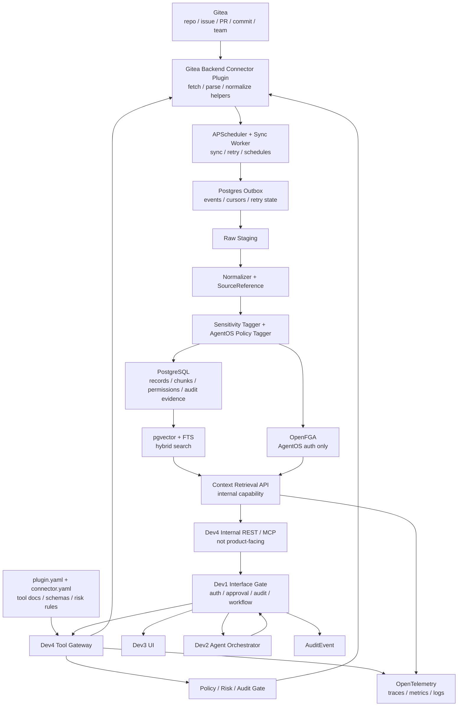

关键原则：

- Dev4 不直接决定业务动作是否执行，只提供事实、来源、权限过滤和证据包。
- 所有面向用户、Agent、Dev2、Dev3 或外部业务流程的读写操作都必须通过 Dev1 接口发起。包括上下文查询、权限过滤结果读取、账号线索 review、action proposal 创建、写动作执行和审计回放；Dev1 统一完成身份、权限、模式、审批、白名单和审计控制。
- Dev2 通过 Dev1 包装后的 MCP/REST 能力构建 Agent 回答和 action proposal，不直接访问 Dev4 内部接口。
- Dev1 接管审批、审计和高风险动作执行闭环。
- Dev3 展示来源、敏感等级、同步状态、过滤提示和审批详情。
- Agent 面向 Dev1 暴露的 MCP / Tool Gateway，不直接拿 token、不直接执行脚本、不直接访问 Gitea，也不直连 Dev4。
- 技能文档可以指导 Agent 如何使用能力，但技能不是权限边界；权限边界在 Gateway、Policy Gate 和 Dev1 审批闭环。

## 3. 推荐技术栈

| 层 | 推荐 | 替代 | 为什么 |
| --- | --- | --- | --- |
| 服务语言 | Python 3.12+ | [TypeScript](https://www.typescriptlang.org/)/[Go](https://go.dev/) | Python 对 Agent 工具体系、数据处理、FastAPI、[LangGraph](https://docs.langchain.com/oss/python/langgraph/overview)/[LlamaIndex](https://docs.llamaindex.ai/en/stable/) 等开源生态更顺 |
| API 服务 | FastAPI + [Pydantic v2](https://docs.pydantic.dev/latest/) | [Litestar](https://litestar.dev/) / [NestJS](https://docs.nestjs.com/) | OpenAPI/JSON Schema 自动化，契约冻结成本低 |
| DB | PostgreSQL 16+ | [MySQL](https://dev.mysql.com/doc/) | 权限、关系、JSONB、FTS、pgvector 可放在一个库里 |
| 向量检索 | pgvector | 暂不引入独立向量数据库 | 第一版少维护一个系统，后续只保留 VectorStore 抽象接口 |
| 关键词检索 | [Postgres FTS](https://www.postgresql.org/docs/current/textsearch.html) + [trigram](https://www.postgresql.org/docs/current/pgtrgm.html) | 暂不引入独立搜索集群 | 数据量小中期足够，权限过滤更容易前置 |
| 工作流 | APScheduler + Postgres outbox + 幂等 worker | 暂不引入重型 workflow service | 同步、webhook 补偿扫描都先落在轻量可恢复任务模型里 |
| 权限模型 | OpenFGA | [OPA](https://www.openpolicyagent.org/docs/latest/) / [Casbin](https://casbin.org/docs/overview) / 自研 RBAC | 只承接 AgentOS 自身授权；外部系统权限首版不映射 |
| Agent 协议 | MCP Server | 框架内部工具调用 | 对多 Agent 框架更兼容，可暴露 tools/resources/prompts，避免绑定单一厂商协议 |
| Connector 形态 | 后端 Connector Plugin + Tool Gateway | 独立 Connector Service / 裸脚本 | 既轻量又受控；避免 Agent 直接执行裸脚本，当前暂定集成到后端 |
| 服务协议 | REST/OpenAPI | [GraphQL](https://graphql.org/learn/)/[gRPC](https://grpc.io/docs/) | Dev1/Dev3/QA 最容易冻结契约和调试 |
| 内部事件 | [Postgres outbox](https://microservices.io/patterns/data/transactional-outbox.html) + [LISTEN/NOTIFY](https://www.postgresql.org/docs/current/sql-listen.html) | 暂不引入独立事件流或消息系统 | MVP 阶段减少基础设施，保留事件总线升级点 |
| 可观测 | OpenTelemetry | 各 SDK 自带日志 | trace tool call、sync run、retrieval、permission check |
| Agent 编排 | Dev2 可选 LangGraph | [LlamaIndex Workflows](https://docs.llamaindex.ai/en/stable/module_guides/workflow/) / 轻量手写状态机 | Dev4 不绑定编排框架，只提供 MCP/REST；编排框架不进入 Dev4 核心依赖 |

## 4. Gitea 权限与 AgentOS 权限边界

### 4.0 首版暂不做权限映射

接入 Gitea 或其他工具平台时，首版明确不把外部系统权限翻译、镜像或同步成 AgentOS 权限关系。外部系统和 AgentOS 各自做各自的鉴权：

- **Gitea 鉴权仍由 Gitea 完成**：repo、team、collaborator、unit permission、token scope 都以 Gitea 的返回和拒绝为准。
- **AgentOS 鉴权仍由 AgentOS 完成**：用户角色、Agent mode、tenant、敏感等级、break-glass、审批和审计由 Dev1/OpenFGA/策略层判断。
- **Connector 不授予权限**：connector 只能在后端插件运行时里使用已配置的外部系统凭据调用外部 API，不能把外部权限写入 AgentOS，也不能因为 AgentOS 角色去扩大外部系统权限。
- **首版没有 Gitea -> AgentOS 权限映射表**：不生成 OpenFGA tuples、不维护 `gitea_permission_edges`、不提供 `effective_permission = 外部权限 ∩ AgentOS 权限` 这类权限镜像接口。

运行时可以同时经过两道门，但这只是调用链上的组合校验，不是权限模型映射：

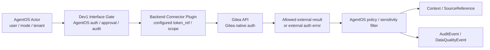

### 4.1 外部账号只做线索和审计，不做权限依据

Dev4 仍可以同步或记录 Gitea user id、login、verified email、display name、commit author 等信息，但这些信息的首版用途限定为：

- 来源展示和贡献归因。
- 审计追踪，例如某条记录来自哪个外部账号或 token scope。
- 账号绑定提示，例如提醒 Admin 某个 Gitea 账号可能对应某个 AgentOS 用户。
- 故障解释，例如外部 token scope 不足、Gitea 返回 401/403、仓库不存在或当前安装未覆盖该 repo。

关键原则：

- **commit author_email 不能作为权限依据**。它只能作为贡献线索，因为 commit author 可能被伪造、来自旧邮箱或代提交。
- 外部账号确认不自动改变 AgentOS 权限，也不自动改变 Gitea 权限。
- Agent 可以解释账号线索、外部鉴权失败和最小修复建议，但不应自动确认账号绑定、扩大权限或删除权限。

### 4.2 外部权限信息的处理方式

首版允许记录外部 API 返回的状态和错误，用于审计与排障，但不进入 AgentOS 授权关系：

| 信息 | 可记录 | 首版用途 | 禁止用途 |
| --- | --- | --- | --- |
| token scope | 是 | 安装检查、错误解释、审计 | 翻译成 AgentOS 角色 |
| Gitea 401/403 | 是 | 返回外部鉴权失败原因 | 静默降级成 AgentOS allow/deny |
| repo/team/collaborator 信息 | 可选 | 来源展示、同步范围说明 | 写入 OpenFGA tuples |
| commit author_email | 是 | 贡献线索、搜索辅助 | 授予或推断访问权限 |

如果未来要做权限映射，需要另起 ADR，至少明确：

- 外部系统账号和 AgentOS 用户的可信绑定来源。
- 映射方向、冲突处理和过期策略。
- 外部系统权限变更对已生成 context bundle 的影响。
- QA 的 deny-by-default、权限漂移和审计测试矩阵。

### 4.3 权限变化处理

因为首版不做权限映射，所以不存在自动更新 AgentOS 权限镜像。外部权限变化只作为外部系统状态处理：

- connector 调用外部系统时，如果 token scope 或外部权限变化导致 401/403，记录 `DataQualityEvent` / `AuditEvent`。
- 对已索引数据，AgentOS 仍按自身 tenant、mode、敏感等级和记录可见性过滤。
- 如果外部系统权限变化意味着某些同步范围应停用或缩小，需要由 Dev1 生成治理提醒或待审批配置变更。
- 不自动改 Gitea 权限，不自动改 AgentOS 权限，不自动刷新 OpenFGA 关系。

## 5. Agent 在哪些环节介入

| 环节 | 是否适合 Agent 介入 | Agent 做什么 | 禁止做什么 |
| --- | --- | --- | --- |
| repo/issue/PR 同步 | 否 | 不介入 | 不参与 token、分页、重试 |
| 账号线索 | 部分 | 解释外部账号候选、冲突和外部鉴权失败原因 | 不自动确认绑定、不用 commit author 授权 |
| 数据标准化 | 部分 | 对无法解析的 commit message 做摘要建议 | 不改原始记录 |
| 权限边界 | 部分 | 解释 AgentOS 鉴权和外部系统鉴权分别在哪里失败 | 不把外部权限映射成 AgentOS 权限 |
| 知识检索 | 是 | 根据 intent 选择检索工具，解释出处 | 不绕过权限过滤 |
| PR review 准备 | 是 | 总结变更、风险、评论草稿 | 不直接发表评论 |
| issue triage | 是 | 识别重复、长期无更新、阻塞 | 不直接改 assignee/label |
| release risk | 是 | 聚合风险、生成建议 | 不直接合并/发布 |
| 审批动作 | 是 | 生成 action proposal 和影响说明 | 不执行高风险动作 |
| 审计回溯 | 是 | 帮 Admin 检索和解释链路 | 不隐藏或改审计记录 |

## 6. Dev4 通过 Dev1 为 Agent 提供什么接口或技能

Dev4 同时定义 REST/OpenAPI 和 MCP 能力，但这些能力是**内部能力契约**，不是面向 Agent、Dev2 或 Dev3 的裸入口。产品级读写请求必须先进入 Dev1 Interface Gate，由 Dev1 完成统一权限、审批、审计和模式控制后，再调用 Dev4 内部能力。

### 6.1 MCP Tools

```yaml
mcp_tools:
  - name: gitea.list_external_accounts
    description: List discovered Gitea accounts and account hint status.
  - name: gitea.suggest_external_account_links
    description: Explain account hints between AgentOS users and Gitea accounts; not used for permission checks.
  - name: gitea.explain_auth_boundary
    description: Explain AgentOS policy decision and Gitea native auth status separately.
  - name: gitea.search_context
    description: Search AgentOS-policy-filtered Gitea-derived knowledge.
  - name: gitea.get_repo_activity
    description: Get repository activity summary for a time range.
  - name: gitea.get_issue_context
    description: Get issue facts, related commits, PRs, and source references.
  - name: gitea.get_pr_context
    description: Get PR facts, commits, related issues, risk hints, and source references.
  - name: gitea.get_release_risk_context
    description: Get release branch, open PR, issue, and commit risk context.
  - name: gitea.explain_external_auth_status
    description: Explain Gitea auth errors, token scope issues, and connector installation scope.
  - name: gitea.propose_action
    description: Build an action proposal for Dev1 approval, never execute directly.
```

### 6.2 MCP Resources

```yaml
mcp_resources:
  - uri: gitea://accounts/{external_account_id}
  - uri: agentos://external-account-hints/{suggestion_id}
  - uri: gitea://repos/{owner}/{repo}
  - uri: gitea://repos/{owner}/{repo}/issues/{number}
  - uri: gitea://repos/{owner}/{repo}/pulls/{number}
  - uri: gitea://records/{record_id}
  - uri: gitea://evidence/{evidence_bundle_id}
  - uri: gitea://sync-runs/{sync_run_id}
```

### 6.3 MCP Prompts

```yaml
mcp_prompts:
  - name: external_account_hint_review
  - name: dev_daily_brief
  - name: pr_review_prep
  - name: issue_triage
  - name: release_risk_scan
  - name: external_auth_status_review
```

MCP 只暴露经过权限过滤后的工具结果。Agent 不拿原始 token，不直接访问 Gitea。

### 6.4 Connector Backend Plugin Pack

Gitea connector 第一版建议按后端插件包管理，而不是把所有逻辑散落在 Agent prompt 里。`connector.yaml` 可以继续作为能力声明，但实际载体是后端插件，由后端插件运行时加载和执行。

```yaml
connector:
  id: gitea
  display_name: Gitea Connector
  execution_model: backend_plugin_via_governed_tool_gateway
  auth:
    mode: service_token
    token_visibility: connector_runtime_only
    external_system_auth: gitea_native
    map_external_permissions_to_agentos: false
  tools:
    gitea.search_issues:
      access: read
      risk: low
      approval_required: false
      agent_direct_call: true
    gitea.get_pr_context:
      access: read
      risk: low
      approval_required: false
      agent_direct_call: true
    gitea.comment_pr:
      access: write
      risk: medium
      approval_required: true
      agent_direct_call: false
    gitea.merge_pr:
      access: write
      risk: high
      approval_required: true
      agent_direct_call: false
    gitea.change_repo_permission:
      access: admin
      risk: critical
      approval_required: true
      agent_direct_call: false
  outputs:
    normalized_record: schemas/normalized_record.json
    source_reference: schemas/source_reference.json
    action_proposal: schemas/action_proposal.json
  policies:
    agentos_access_policy: policies/agentos_access.yaml
    risk_rules: policies/risk_rules.yaml
  tests:
    fixtures: tests/fixtures.json
    auth_boundary_cases: tests/auth_boundary_cases.yaml
```

这里的 `agent_direct_call` 不是指 Agent 直接运行脚本，也不是指 Agent 直连 Dev4，而是指 Agent 可以通过 Dev1 暴露的 MCP / Tool Gateway 发起受控请求。所有调用仍然会经过：

1. Dev1 Interface Gate 的 actor 身份、mode、tenant 和白名单检查。
2. AgentOS policy 检查。
3. 外部系统由 connector 插件携带的 `token_ref` / scope 触发原生鉴权，失败时返回外部鉴权错误。
4. risk rules 判断。
5. tool call audit。
6. 必要时生成 approval proposal，而不是执行外部写动作。

### 6.5 工具调用控制流

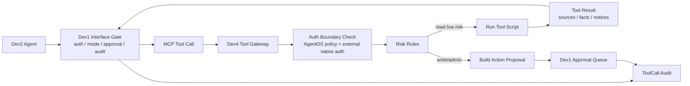

低风险只读工具也必须经 Dev1 Interface Gate 返回结果；写工具和 admin 工具只能返回 action proposal。这样 Agent 使用体验仍然轻，但所有读写权限都能被 Dev1 完整控制。

## 7. 知识定义、产生、存储与使用

### 7.1 什么是知识，什么不是知识

Dev4 需要先把“外部数据”和“组织知识”区分开。Gitea 里的 commit、issue、PR 首先是**事实记录**，不自动等于组织知识。只有当事实记录被结构化、引用、总结、确认或用于工作流闭环时，才逐步成为可复用知识。

| 类型 | 例子 | 是否是知识 | 说明 |
| --- | --- | --- | --- |
| 原始事件 | Gitea webhook、API 原始 JSON | 否 | 只是外部系统事件，先进入 raw staging |
| 事实记录 | commit、issue、PR、release | 半成品 | 可索引、可引用，但仍是事实材料 |
| 来源支撑摘要 | “PR #42 修改了鉴权边界模块” | 是 | 来自事实记录，可作为 Agent 回答事实 |
| 推断 | “该 PR 可能影响 repo 权限判定” | 条件性知识 | 必须标记 inference，并附依据 |
| 建议 | “建议补 deny-by-default 测试” | 条件性知识 | 不能伪装成事实，可转 action proposal |
| 决策记忆 | “团队决定外部系统权限与 AgentOS 权限首版各自鉴权，不做映射” | 是 | 需要人确认或来自正式记录 |
| 审批证据 | 某 action 的 evidence bundle | 是 | 服务审计和回溯 |
| 私人共事内容 | 员工未确认的讨论草稿 | 默认不是组织知识 | 不能自动进入团队/管理上下文 |

一句话：

> 原始数据是矿石，知识是经过来源标注、权限治理、上下文整理和必要确认后的可复用材料。

### 7.2 知识类型分层

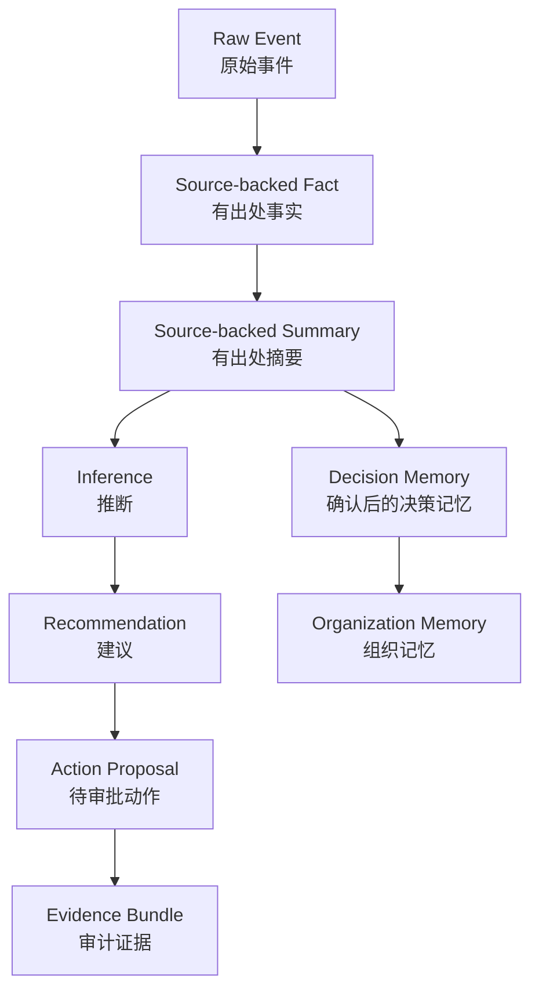

推荐知识分层：

| 层级 | 名称 | 产生方式 | 是否需要人确认 | 使用边界 |
| --- | --- | --- | --- | --- |
| L0 | Raw Event | connector 拉取或 webhook | 不需要 | 不直接给 Agent/UI |
| L1 | Normalized Fact | normalize 后形成事实记录 | 不需要 | 可检索，必须带 source |
| L2 | Source-backed Summary | 系统摘要或 Agent 摘要 | 低风险可自动，高影响需确认 | 可回答事实性问题 |
| L3 | Inference | Agent 或规则基于事实推断 | 不一定，但必须标记 | 不可伪装事实 |
| L4 | Recommendation | Agent 建议下一步 | 高风险需审批 | 可进入 action proposal |
| L5 | Decision Memory | 会议、审批、确认后的决策 | 需要 | 可沉淀组织记忆 |
| L6 | Audit Evidence | 审批和执行链路产生 | 系统生成 | 只读、可回溯 |

### 7.3 知识产生路径

第一版有四条知识产生路径。

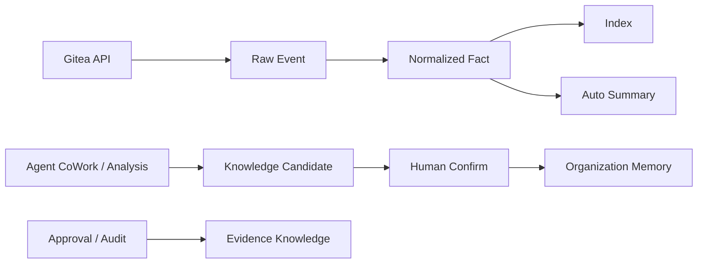

#### 路径 A：外部同步产生事实

- Gitea repo、commit、issue、PR、release 被 connector 拉取。
- Dev4 写入 raw staging。
- Normalizer 转换为 `NormalizedRecord`。
- 生成 `SourceReference` 和 chunks。
- 进入 Knowledge Index。

#### 路径 B：系统摘要产生来源支撑摘要

- 对 issue、PR、release 做稳定规则摘要。
- 摘要必须保存引用来源。
- 摘要可以自动生成，但要有 `generated_by=system` 和 `source_record_ids`。

#### 路径 C：Agent 生成知识候选

- Agent 根据事实记录生成推断、建议、review comment、release risk。
- 默认是 `knowledge_candidate`。
- 只有用户确认或进入审批/发布流程后，才可变成团队知识或组织记忆。

#### 路径 D：审批与决策产生组织记忆

- 批准的 action、正式决策 memo、发布复盘、PR review 结论可沉淀为 `DecisionMemory` 或 `AuditEvidence`。
- 这类知识对后续检索价值最高，也最需要可追溯。

### 7.4 知识生命周期

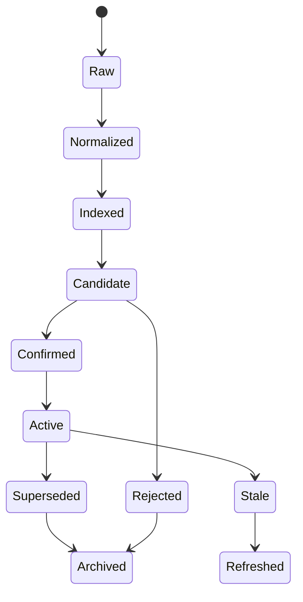

状态含义：

| 状态 | 含义 |
| --- | --- |
| `raw` | 原始数据，未标准化 |
| `normalized` | 标准事实记录 |
| `indexed` | 已切块、可检索 |
| `candidate` | Agent 或系统生成的知识候选 |
| `confirmed` | 被人或正式流程确认 |
| `active` | 当前有效 |
| `stale` | 可能过期，需要刷新 |
| `superseded` | 被新知识取代 |
| `rejected` | 被拒绝进入组织记忆 |
| `archived` | 历史保留，不参与默认检索 |
| `compressed_archive` | 压缩归档备份，只保留摘要、来源和可恢复引用 |
| `deleted` | 经审批后删除或软删除 |

典型失效规则：

- issue closed 后，之前的“阻塞风险”摘要应标记 stale 或 resolved。
- PR merged 后，PR review context 变成历史知识，不再作为当前阻塞。
- release 发布后，release risk scan 变成 release evidence。
- Gitea 权限变化后，旧 context bundle 不可继续复用，必须重新做权限过滤。
- 决策被新 memo 覆盖后，旧决策标记 superseded 并链接新决策。
- 存储空间不足时，先按引用频率、最近使用时间、敏感等级和业务价值选择压缩归档候选；默认优先压缩归档备份，确需删除时必须审批。

### 7.5 第一版索引对象

第一版索引：

- repo summary
- commit
- issue
- PR
- release/tag
- external auth status summary
- sync error summary
- external account hint summary
- decision memory
- evidence bundle

暂不索引：

- 原始代码全文。
- secrets、CI 原始日志。
- settings/admin 详情。
- 大型 binary artifacts。
- 未确认的私人共事原文。

### 7.6 存储模型

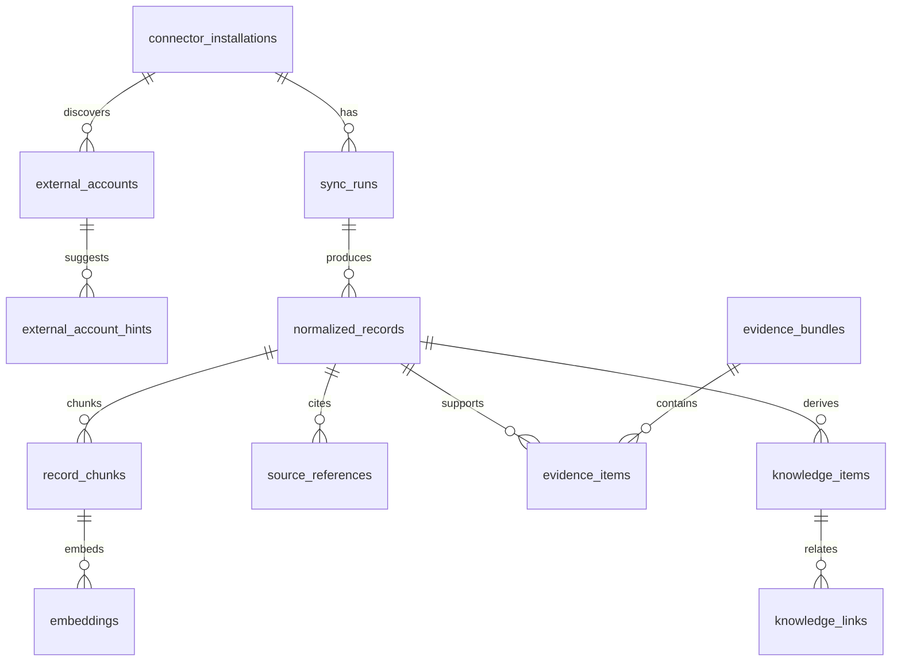

核心表：

```sql
connector_installations(
  id, tenant_id, source_type, base_url, auth_mode,
  token_ref, enabled, created_by, created_at
)

external_accounts(
  id, tenant_id, source_type,
  external_user_id, external_login, external_email,
  display_name, raw_profile, status, last_seen_at
)

external_account_hints(
  id, tenant_id, agentos_user_id, external_account_id,
  source_type, confidence, suggestion_method,
  status, reviewed_by, reviewed_at, usable_for_permission_check
)

sync_runs(
  id, installation_id, scope, status, started_at, finished_at,
  cursor, error_code, error_message
)

normalized_records(
  id, tenant_id, source_type, source_url, external_id,
  entity_type, entity_id, title, content, metadata,
  owner_user_id, team_id, project_id, timestamp,
  permission_scope, sensitivity, visibility, sync_run_id,
  knowledge_status
)

record_chunks(
  id, record_id, chunk_index, chunk_text, token_count,
  metadata, tsvector_content
)

embeddings(
  chunk_id, embedding_model, embedding vector, created_at
)

evidence_bundles(
  id, tenant_id, created_by, purpose, created_at
)

evidence_items(
  id, bundle_id, record_id, chunk_id, source_reference,
  reason, sensitivity
)

knowledge_items(
  id, tenant_id, knowledge_type, title, body,
  status, generated_by, confirmation_required,
  confirmed_by, confirmed_at,
  source_record_ids, source_reference_ids,
  supersedes_id, stale_reason,
  sensitivity, visibility,
  reference_count, last_used_at, retention_class,
  archive_status, archive_uri, archive_summary,
  deletion_status,
  created_at, updated_at
)

knowledge_links(
  id, tenant_id, from_knowledge_id, to_knowledge_id,
  relation_type, created_at
)
```

### 7.7 检索策略

第一版采用 hybrid search：

1. 根据 actor、mode、tenant、repo/project 做权限预过滤。
2. 排除 `raw`、`rejected`、默认 `archived` 和权限过期数据。
3. 对 `record_chunks.tsvector_content` 做关键词检索。
4. 对 `embeddings.embedding` 做向量检索。
5. 合并排序，保留 source references。
6. 返回 `ContextBundle`，不返回未授权原文。

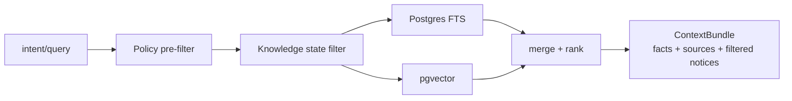

### 7.8 Agent 如何使用知识

Agent 使用知识必须遵守以下输出规则：

| 输出类型 | 要求 |
| --- | --- |
| fact | 必须有 `SourceReference` |
| inference | 必须标记为推断，并列出依据 |
| recommendation | 必须说明风险和下一步，写动作需审批 |
| decision memory | 必须来自 confirmed knowledge 或正式记录 |
| uncertainty | 无来源或来源不足时明确标记不确定 |

Agent 不应：

- 把推断说成事实。
- 把未确认私人讨论当组织记忆。
- 在 Management Mode 输出个人原始内容。
- 在权限变化后复用旧 context bundle。

### 7.9 UI 如何展示知识

Dev3 展示知识时应区分：

- 事实：显示来源卡片。
- 推断：显示“推断”标签和依据。
- 建议：显示是否需要审批。
- 决策记忆：显示确认人、确认时间、来源。
- 过期知识：显示 stale/superseded 状态。
- 被过滤内容：显示 filtered notice，而不是静默消失。

### 7.10 QA 如何验证知识可信

QA 至少验证：

- 无来源内容不能标记为事实。
- Restricted 数据不能进入普通 Agent 上下文。
- 私人共事内容不能自动进入团队或管理视图。
- issue/PR 状态变化后，旧风险摘要会 stale 或 superseded。
- 权限变化后，旧 context bundle 不可继续访问。
- decision memory 必须能追溯到确认人或正式来源。

## 8. 第一版 REST/OpenAPI 接口

本节接口是 Dev4 与 Dev1 之间的内部能力契约。对 Dev2、Dev3、Agent、UI 或外部业务系统暴露时，应由 Dev1 重新包装为产品级接口；禁止把这些 Dev4 能力路径作为公开读写入口直接暴露。

### 8.1 Connector 安装与同步

```http
POST /v1/connectors/gitea/installations
GET  /v1/connectors/gitea/installations/{installation_id}
POST /v1/connectors/gitea/installations/{installation_id}/sync
GET  /v1/connectors/gitea/sync-runs/{sync_run_id}
```

安装请求：

```json
{
  "tenant_id": "tenant_acme",
  "base_url": "https://gitea.example.com",
  "auth_mode": "service_token",
  "token_ref": "secret://gitea/acme/dev-readonly",
  "scope": {
    "owners": ["platform"],
    "repos": ["platform/agentos", "platform/api"],
    "include_private": true
  },
  "sync_options": {
    "mode": "incremental",
    "interval_minutes": 15,
    "include": ["repos", "branches", "commits", "issues", "pulls", "releases"]
  }
}
```

### 8.2 外部账号线索与审计

Dev4 可以向 Dev1 提供外部账号线索内部接口，用于来源展示、贡献归因、账号候选提示和审计。首版这些线索**不参与权限判断**，也不生成外部系统到 AgentOS 的权限映射。

```http
GET  /v1/external-accounts?source_type=gitea
GET  /v1/external-accounts/suggestions?source_type=gitea
GET  /v1/external-accounts/conflicts?source_type=gitea
POST /v1/connectors/gitea/accounts/sync
```

account suggestion 响应：

```json
{
  "suggestions": [
    {
      "suggestion_id": "acct_suggest_123",
      "agentos_user": {
        "user_id": "user_123",
        "email": "zhang.rui@company.com",
        "display_name": "张瑞"
      },
      "external_account": {
        "source_type": "gitea",
        "external_account_id": "ext_gitea_17",
        "external_user_id": "17",
        "external_login": "zr",
        "external_email": "123457@qq.com",
        "display_name": "zr"
      },
      "confidence": 0.62,
      "suggestion_method": "login_similarity_and_commit_email_hint",
      "status": "suggested",
      "evidence": [
        "Gitea login resembles AgentOS username",
        "Commit author email appeared in recent commits, but is not used as permission proof"
      ],
      "usable_for_permission_check": false,
      "requires_admin_review": true
    }
  ]
}
```

external account 响应：

```json
{
  "agentos_user_id": "user_123",
  "source_type": "gitea",
  "link_status": "suggested",
  "external_account": {
    "external_account_id": "ext_gitea_17",
    "external_user_id": "17",
    "external_login": "zr"
  },
  "usable_for_permission_check": false,
  "reason": "External account hints are used for attribution and audit only in MVP."
}
```

如果外部系统鉴权失败：

```json
{
  "source_type": "gitea",
  "external_auth_status": "forbidden",
  "http_status": 403,
  "reason": "Gitea denied the connector token for this repo or API scope.",
  "next_step": "Review connector token scope or installation scope in Dev1."
}
```

### 8.3 鉴权边界检查

```http
GET  /v1/connectors/gitea/installations/{installation_id}/auth/status
POST /v1/connectors/gitea/installations/{installation_id}/auth/preflight
```

auth preflight 请求：

```json
{
  "tenant_id": "tenant_acme",
  "actor": {
    "user_id": "user_123",
    "roles": ["Manager"],
    "teams": ["team_platform"]
  },
  "object": {
    "type": "repo",
    "id": "gitea_repo_platform_agentos"
  },
  "mode": "Team",
  "action": "read_context",
  "external_probe": {
    "repo": "platform/agentos",
    "api": "pulls.list"
  }
}
```

响应：

```json
{
  "agentos_decision": "allow",
  "external_auth_status": "ok",
  "permission_mapping_applied": false,
  "sensitivity": "Internal",
  "policy_version": "policy_2026_05_02",
  "reason": "AgentOS policy allows Team mode context and Gitea accepted the connector token for the requested API."
}
```

### 8.4 检索与上下文

```http
POST /v1/records/search
POST /v1/context/retrieve
GET  /v1/records/{record_id}
POST /v1/evidence-bundles
GET  /v1/evidence-bundles/{evidence_bundle_id}
```

context retrieve 请求：

```json
{
  "tenant_id": "tenant_acme",
  "actor": {
    "user_id": "user_123",
    "roles": ["Manager"],
    "teams": ["team_platform"]
  },
  "mode": "Team",
  "intent": "prepare PR review for platform/agentos#42",
  "filters": {
    "source_type": ["gitea"],
    "repo": "platform/agentos",
    "entity_type": ["pull_request", "code_change", "dev_issue"],
    "time_range": {
      "from": "2026-04-25T00:00:00+08:00",
      "to": "2026-05-02T23:59:59+08:00"
    }
  },
  "limit": 20
}
```

响应：

```json
{
  "context_bundle_id": "ctx_01H...",
  "facts": [
    {
      "text": "PR #42 contains 5 commits and touches auth middleware.",
      "source_references": ["src_ref_1"],
      "confidence": "high"
    }
  ],
  "inferences": [
    {
      "text": "The change may affect repository permission checks.",
      "basis": ["src_ref_1", "src_ref_2"],
      "confidence": "medium"
    }
  ],
  "source_references": [
    {
      "record_id": "rec_123",
      "source": "gitea",
      "source_type": "gitea",
      "source_url": "https://gitea.example.com/platform/agentos/pulls/42",
      "title": "PR #42: tighten repository auth mapping",
      "entity_type": "pull_request",
      "timestamp": "2026-05-02T09:12:00+08:00",
      "owner_user_id": "user_alice",
      "permission_scope": ["repo#viewer"],
      "sensitivity": "Internal"
    }
  ],
  "filtered_notices": [
    {
      "reason": "restricted_ci_log",
      "count": 2,
      "message": "2 CI log records were filtered because they may contain secrets."
    }
  ]
}
```

### 8.5 Action Proposal

Dev4 不执行 Gitea 写动作，只帮助 Dev2/Dev1 构造证据。

```http
POST /v1/action-proposals/gitea
```

请求：

```json
{
  "tenant_id": "tenant_acme",
  "actor": {"user_id": "user_123"},
  "action_type": "gitea.pr.comment",
  "target": {
    "repo": "platform/agentos",
    "pull_request": 42
  },
  "draft": {
    "body": "建议补充外部鉴权失败时的可审计错误返回测试。"
  },
  "evidence_bundle_id": "ev_456"
}
```

响应：

```json
{
  "proposal_id": "proposal_789",
  "requires_approval": true,
  "risk_level": "medium",
  "target_tool": "gitea",
  "required_gitea_permission": "pull_requests:write",
  "approval_payload": {
    "action_schema": "AgentAction",
    "action_type": "gitea.pr.comment",
    "target": {
      "repo": "platform/agentos",
      "pull_request": 42
    },
    "draft": {
      "body": "建议补充外部鉴权失败时的可审计错误返回测试。"
    },
    "source_references": ["src_ref_1", "src_ref_2"],
    "rollback_hint": "delete or edit the PR comment manually if approved by mistake"
  }
}
```

## 9. 典型真实业务场景

### 场景一：PR Review 准备与评论草稿审批

业务描述：

Tech Lead 明天要 review 一个权限相关 PR。Agent 帮他读取 PR、commit、关联 issue、历史权限设计，生成 review 关注点和评论草稿。若要发布评论，必须审批。

数据流：

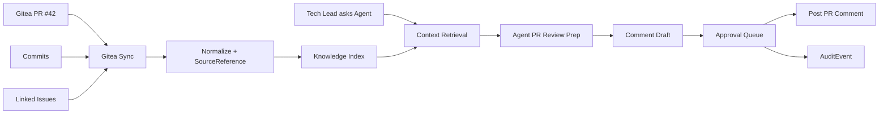

泳道图：

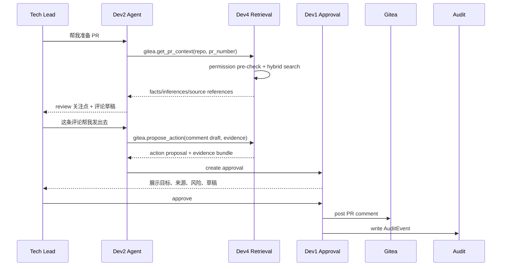

接口冻结关注点：

- Dev4 必须返回 `source_references` 和 `filtered_notices`。
- Dev2 不能直接调用 Gitea 写评论。
- Dev1 需要知道 `required_gitea_permission` 和 `risk_level`。
- Dev3 需要展示评论草稿、出处和审批状态。

### 场景二：Issue Triage 与阻塞识别

业务描述：

项目负责人每周一要整理本周 issue。Agent 帮他找出长期无更新、可能重复、关联 PR 卡住的 issue，并建议分派或关闭。分派、改 label、关闭 issue 均需审批。

数据流：

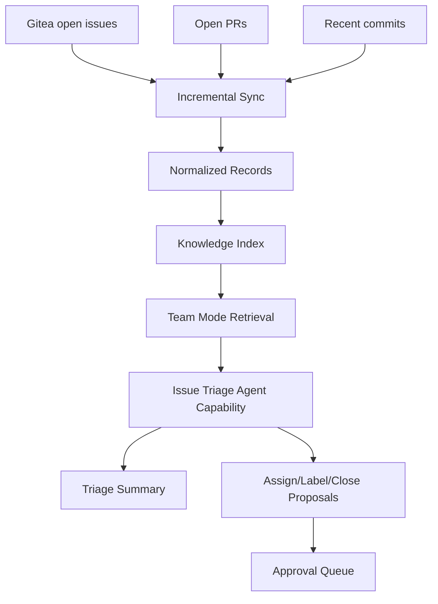

泳道图：

```mermaid
sequenceDiagram
  participant PM as Project Owner
  participant D2 as Agent
  participant D4 as Dev4
  participant D3 as Dev3 UI
  participant D1 as Approval/Audit

  PM->>D3: 打开 Issue Triage 页面
  D3->>D4: POST /v1/context/retrieve mode=Team
  D4->>D4: check AgentOS policy; connector uses Gitea native auth
  D4-->>D3: issue facts + PR links + source cards
  PM->>D2: 哪些 issue 本周要处理？
  D2->>D4: gitea.search_context(issue triage)
  D4-->>D2: top issues + sources + filtered notices
  D2-->>PM: 长期无更新/可能重复/阻塞清单
  PM->>D2: 给这些 issue 加 label
  D2->>D1: create approval for label changes
  D1-->>PM: 等待审批
```

接口冻结关注点：

- `entity_type=dev_issue` 需要关联 `pull_request`、`code_change`。
- `filtered_notices` 要说明被过滤的 Restricted/Private 数据数量。
- `action_type` 至少支持 `gitea.issue.label`, `gitea.issue.assign`, `gitea.issue.close`。

### 场景三：Release Risk Scan 与管理层研发风险摘要

业务描述：

发布前，Agent 汇总 release 分支、未合并 PR、严重 issue、近期高风险 commit，给 Tech Lead 和管理层生成不同粒度的风险摘要。管理层只看聚合风险，不看个人排名。

数据流：

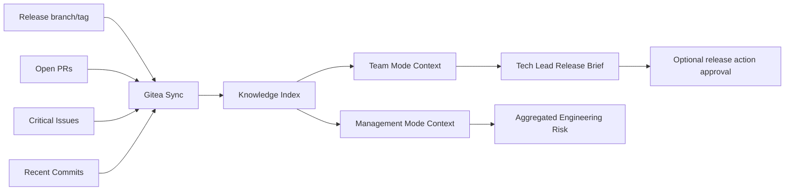

泳道图：

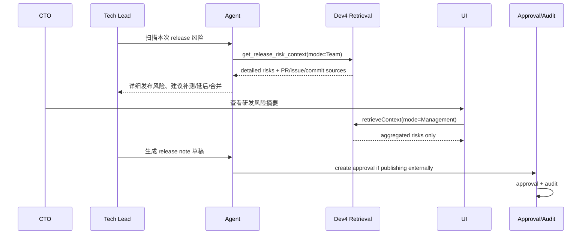

接口冻结关注点：

- 同一个底层 Gitea 数据，在 Team Mode 和 Management Mode 返回不同粒度。
- Management Mode 不返回个人绩效式字段。
- release note 草稿可生成，正式发布或写回 Gitea release 必须审批。

### 场景四：Gitea 权限变更与独立鉴权边界

业务描述：

Gitea 管理员在 Gitea 中修改某个仓库或 token 的访问范围。AgentOS 不自动镜像这次权限变化；下一次 connector 调用时，由 Gitea 原生鉴权返回成功或 401/403，Dev4 只记录外部鉴权结果、影响范围和治理提醒。

数据流：

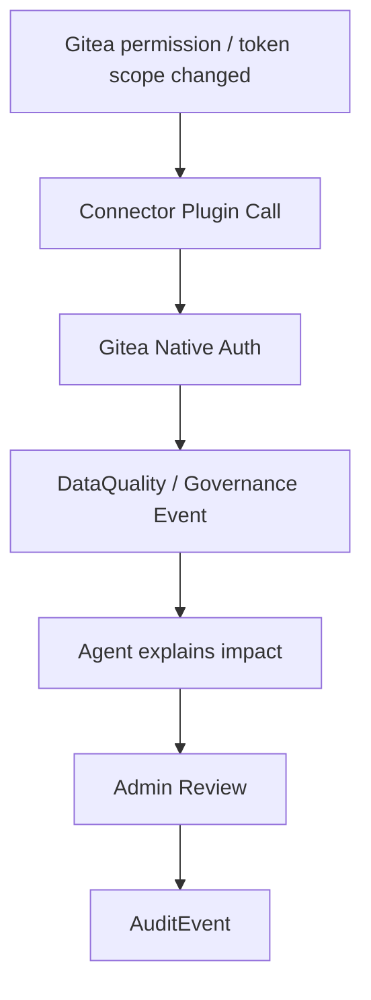

泳道图：

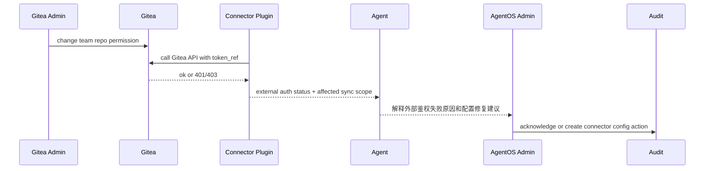

接口冻结关注点：

- Gitea -> AgentOS 权限不自动镜像。
- AgentOS -> Gitea 反向修改仍必须经审批。
- 外部鉴权失败、token scope 不足、同步范围变化应写入 Governance/Audit 视图。

### 场景五：新成员 Gitea 账号线索与访问解释

业务描述：

新成员加入开发团队，AgentOS 里已经有员工账号，Gitea 里也有相似账号。这个用户问 Agent：“为什么我看不到 platform/agentos 的 PR 风险？”Dev4 应能分别解释 AgentOS 策略是否允许、connector 的 Gitea 原生鉴权是否成功、是否存在账号线索；但不把 Gitea 账号线索当作访问授权。

数据流：

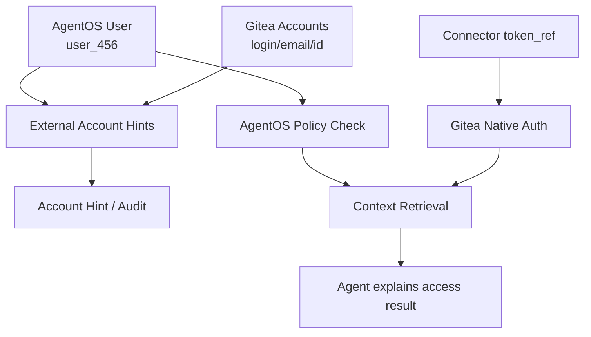

泳道图：

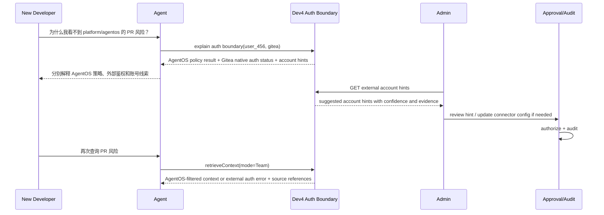

接口冻结关注点：

- `commit author_email` 只能作为 evidence，不能作为权限证明。
- 外部账号线索缺失或冲突不等同于权限 deny；权限由 AgentOS 策略和外部系统原生鉴权分别判断。
- Admin review 账号线索或修改 connector 配置需要写审计；是否需要审批由 Dev1 策略决定。
- Dev3 需要展示账号线索、置信度、证据、冲突和 review 状态。

## 10. Dev4 初步实现里程碑

### M0：契约冻结

- 定义 Gitea `entity_type`。
- 定义外部账号线索模型：`external_accounts`、`external_account_hints`，明确不参与权限判断。
- 定义 `NormalizedRecord`、`SourceReference`、`ContextBundle`、`FilteredNotice`。
- 明确首版不定义 Gitea permission -> OpenFGA relation mapping。
- 定义后端 connector plugin pack 结构：`plugin.yaml`、`connector.yaml`、docs、tools、schemas、policies、tests。
- 定义 Tool Gateway 调用协议：tool name、input schema、output schema、risk level、approval policy。
- 和 Dev1 冻结 `AgentAction` evidence 字段。
- 和 Dev2 冻结 MCP tools/resources/prompts。
- 和 Dev3 冻结 source card / filtered notice UI 字段。

### M1：只读同步

- 实现 connector installation 和后端 plugin pack loader。
- 实现受控 Tool Gateway，先支持 Gitea 只读后端插件。
- 支持 service token。
- 同步 Gitea users 和贡献身份线索，写入 `external_accounts` / `external_account_hints`。
- 拉取 repo、branch、commit、issue、PR、release。
- 支持分页、增量 cursor、错误事件。
- APScheduler 触发同步任务，Postgres outbox / sync cursor 管理同步状态、重试和补偿扫描。

### M2：独立鉴权边界

- 生成外部账号线索建议，支持 confidence、suggestion_method、status。
- 提供 external account hint 查询、冲突检测和审计接口。
- 实现 connector auth status / preflight API，分别返回 AgentOS policy decision 和外部系统原生鉴权结果。
- 不拉取权限用于 AgentOS 授权，不写入 `permission_edges`，不同步 OpenFGA tuples。
- 外部系统 401/403、token scope 不足、安装 scope 不覆盖时，返回可审计失败原因。

### M3：知识索引

- 生成 chunks。
- 写入 Postgres FTS。
- 写入 pgvector embeddings。
- 实现 `records/search` 和 `context/retrieve`。
- 返回 source references 和 filtered notices。

### M4：Agent 接口

- 实现 MCP server。
- 提供 5 个核心 tools：search_context、get_pr_context、get_issue_context、get_release_risk_context、propose_action。
- 提供 prompt templates：dev_daily_brief、pr_review_prep、issue_triage、release_risk_scan。
- 所有 MCP tool 调用经 Tool Gateway 执行，记录 actor、mode、tool、输入摘要、输出摘要、source references 和 risk decision。

### M5：审批证据链

- 实现 evidence bundle。
- 实现 action proposal 构造。
- 对接 Dev1 approval API。
- 写入审计所需 source references。

### M6：QA 与试点

- 权限测试：AgentOS mode 不允许时 deny。
- 外部鉴权测试：Gitea token/scope 不足时返回外部鉴权错误，不写入 AgentOS 权限。
- 身份测试：外部账号线索不参与权限判断。
- 身份测试：commit author_email 匹配不能授予权限。
- token 泄露测试。
- Restricted CI log 过滤测试。
- PR comment approval E2E。
- issue label approval E2E。

## 11. 接口冻结清单

需要和其他 Dev 角色讨论冻结：

| 接口 | 参与角色 | 冻结内容 |
| --- | --- | --- |
| `NormalizedRecord` | Dev1/2/3/4/QA | 字段名、敏感等级、visibility、metadata |
| `SourceReference` | Dev2/3/4 | source card 必需字段 |
| `ContextBundle` | Dev2/4 | facts/inferences/sources/filtered notices |
| `FilteredNotice` | Dev2/3/QA | 被过滤原因和展示方式 |
| `EvidenceBundle` | Dev1/2/4 | 审批证据链 |
| `AgentAction` extension | Dev1/2/4 | Gitea action_type、target、required permission |
| `MCP tools` | Dev2/4 | tool names、input schema、output schema |
| `Connector Backend Plugin Pack` | Dev2/4/QA | plugin.yaml、connector.yaml、docs、tools、schemas、policies、tests |
| `Tool Gateway` | Dev1/2/4/QA | tool execution policy、risk decision、approval_required、tool audit fields |
| `ExternalAccount` | Dev1/3/4/QA | external_user_id、login、email、status、last_seen_at |
| `ExternalAccountHint` | Dev1/3/4/QA | suggestion status、confidence、method、review、conflict handling、usable_for_permission_check=false |
| `AuthBoundaryStatus` | Dev1/2/4/QA | AgentOS policy decision 与外部系统原生鉴权状态分开返回 |
| `ExternalProjectLink` | Dev1/3/4/QA | AgentOS project 与 Gitea/Jira/Notion/CRM 等外部项目索引地址的绑定方式 |
| `PreflightCheck` | Dev1/2/4/QA | 写动作执行前的成功率评估、串行步骤、失败报告和回滚计划 |
| `ProactiveReminder` | Dev2/3/4/QA | PR recipient 提醒规则、频率控制、来源、关闭/稍后提醒 |
| `Approval UI payload` | Dev1/3/4 | action detail、source references、risk level |
| `Permission mapping` | Dev1/4/QA | 首版不冻结；如需外部系统权限映射，后续另起 ADR |

## 12. 已确认的盲区决策与实现影响

本节记录针对方案盲区已确认的产品/架构决策，作为后续 Dev1/2/3/4/QA 接口冻结和实现讨论的基线。

### 12.1 用户、账号与组织来源

| 问题 | 已确认决策 | 实现影响 |
| --- | --- | --- |
| AgentOS 用户、团队、组织结构来源 | AgentOS 维护主用户/团队/组织，Gitea 只作为外部账号线索和数据来源 | Dev4 维护 `external_accounts` / `external_account_hints`；Dev1 维护 AgentOS 主用户、团队、角色和治理策略 |
| 账号绑定确认权 | 首版只做账号线索 review，不作为权限确认 | `external_account_hints` 需要支持 reviewed_by、reviewed_at、conflict；Dev3 可展示线索和审计记录；Dev1 记录 review 审计 |
| 多 Gitea 实例 / 多 Git 平台账号 | 支持一人多外部账号，甚至支持不同 Git 仓库实例 | `external_accounts` 必须包含 `installation_id`、`source_type`、`base_url`；不能假设一个用户只有一个 Gitea principal，也不能用它做权限依据 |

### 12.2 Token、脚本和 Connector 信任边界

| 问题 | 已确认决策 | 实现影响 |
| --- | --- | --- |
| token 与密钥管理 | 由 Dev1 角色确定 | Dev4 只保存 `token_ref`，不管理明文 token；secret backend、轮换、撤销策略由 Dev1 冻结 |
| connector 载体 | 当前暂定以插件形式集成到后端 | 需要后端 plugin loader、安装/启停、版本、审计和回滚机制；不先拆独立 connector service |
| connector 脚本安全沙箱 | 敏感操作才审核；用户自己的资产可自行决定是否加入白名单，或参考 Codex 式自动审核 | Tool Gateway 需要支持 risk level、白名单、自动审核结果、人工审核结果；QA 检查 backend plugin pack 输出是否符合接入标准 |
| 第三方 connector / 脚本信任 | QA 审核输出产物是否符合接入标准；系统不为第三方脚本背书，用户签署信任即可 | backend plugin pack 需要声明 trust_level、publisher、review_status、user_acceptance；UI 需要提示“用户信任第三方脚本，系统仅校验接入标准” |
| 外部系统权限 | 首版不做外部系统权限到 AgentOS 权限的映射 | Gitea/Jira/Notion/CRM 等外部系统各自鉴权；AgentOS 只做自身产品入口、模式、租户、敏感等级和审计鉴权 |

### 12.3 同步、索引和存储策略

| 问题 | 已确认决策 | 实现影响 |
| --- | --- | --- |
| webhook 还是轮询 | webhook + 轮询。webhook 用于审查紧急问题，例如 CI 失败；轮询用于补偿和全量一致性 | webhook 写入 Postgres outbox，APScheduler 定时触发补偿扫描；事件处理必须幂等、去重，并记录 cursor 与 retry state |
| 是否索引源码内容 | 需要索引源码，但不分析源码内容，只对其功能做简单摘要 | Dev4 可索引 file path、module、language、符号/README 摘要、功能摘要；默认不把完整源码交给 Agent；源码摘要必须标明 generated_by 和 source refs |
| 知识保留、压缩归档和删除策略 | 有空间就一直保存；空间不足后按引用频率筛选，经过审批后删除或压缩归档备份 | 需要记录 `reference_count`、`last_used_at`、`retention_class`、`archive_status`、`archive_uri`、`deletion_status`；默认优先压缩归档备份，确需删除时走 approval，不直接硬删 |

### 12.4 写动作、失败和回滚

| 问题 | 已确认决策 | 实现影响 |
| --- | --- | --- |
| 读写动作入口 | 所有产品级读写都通过 Dev1 接口进入；Dev4 只接受 Dev1 授权后的内部服务调用 | 推荐冻结为：Dev1 拥有读写入口、审批/执行编排和审计闭环，Dev4 Tool Gateway 只在 Dev1 授权上下文中执行具体外部工具动作；Dev2/Dev3/Agent/UI 不直连 Dev4，不持有 token，不直接读写外部系统或 Dev4 存储 |
| 失败补偿与回滚 | 先由 QA 检查评估是否能成功；若评估能成功但执行失败，通知失败原因、已完成内容和未完成内容。过程应串行、可回滚，但不默认回滚 | AgentAction 需要 `preflight_check`、`steps`、`completed_steps`、`failed_step`、`rollback_plan`、`rollback_default=false`；执行器应串行记录 step audit |

### 12.5 管理视图与主动提醒

| 问题 | 已确认决策 | 实现影响 |
| --- | --- | --- |
| 管理层视图粒度 | 任何级别都可以，但必须受权限、模式和信任边界约束 | Management Mode 可 drill-down 到项目/仓库/团队/个人级，但个人级必须避免绩效化和监控化表达，并保留来源和访问审计 |
| Agent 主动提醒边界 | 可以主动提醒，提醒接收 PR 的人 | 主动提醒首版聚焦 PR review recipient；需要 frequency cap、quiet hours、reason/source、dismiss/snooze 和 audit |

### 12.6 跨工具实体对齐和项目接入

| 问题 | 已确认决策 | 实现影响 |
| --- | --- | --- |
| 跨工具实体对齐 | 立项时自动生成所选工具平台对应的项目索引地址，或手动选择配置 connector 接入已有项目 | 需要 `project_index` / `external_project_links`：AgentOS project -> Gitea repo/Jira project/Notion space/CRM account；支持自动生成和手动绑定 |
| 成功指标 | 能够自动识别风险、汇总日报，并推送相关事件信息给合适角色 | 首版 metrics 应包含 risk_detected_count、daily_brief_delivery_rate、event_routed_to_right_role、approval_completion_rate、false_positive_feedback |

### 12.7 对 Dev4 的新增落地要求

基于以上决策，Dev4 需要额外落实：

- `external_accounts` 支持多安装实例、多平台、多账号。
- `external_account_hints` 支持 review、冲突和过期，并固定 `usable_for_permission_check=false`。
- `connector_installations` 支持 webhook 配置和 polling 配置并存。
- 后端 connector plugin loader 支持插件安装、启停、版本、审计和回滚。
- `normalized_records` / `knowledge_items` 增加源码摘要类知识，但默认不向 Agent 暴露完整源码。
- `knowledge_items` 增加 `reference_count`、`last_used_at`、`retention_class`、`archive_status`、`archive_uri`、`archive_summary`、`deletion_status`。
- Tool Gateway 增加 `preflight_check`、串行 step execution、rollback plan 和 failure report。
- 主动提醒接口只先支持 PR recipient 场景，并带 reason/source/frequency 控制。
- `external_project_links` 支持立项时自动生成和手动配置。

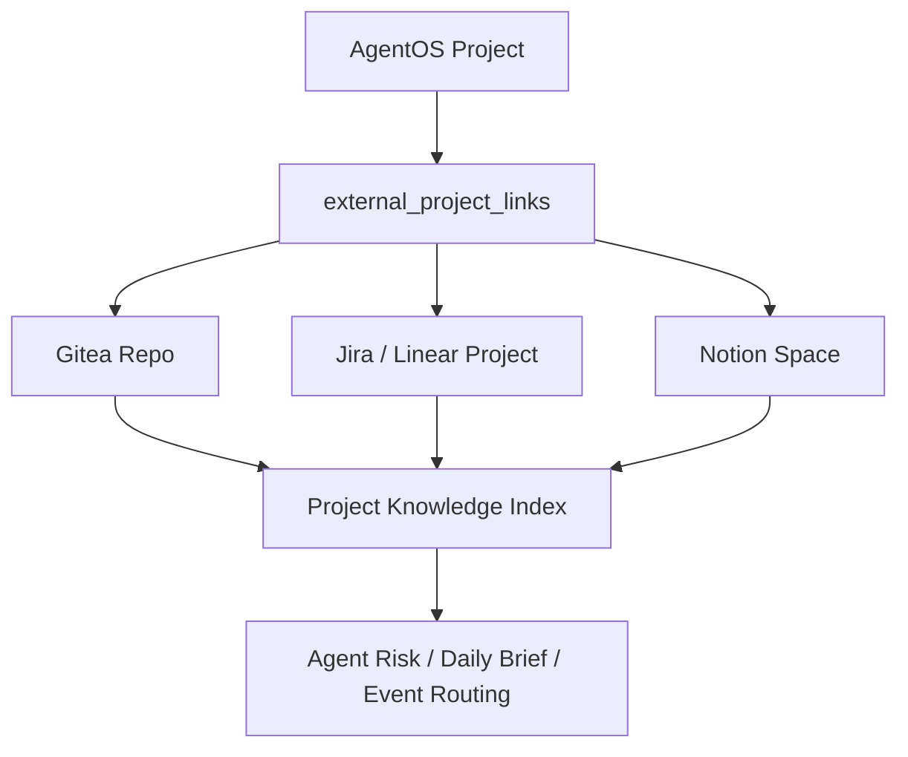

## 13. 官方资料参考

- Gitea API Usage: https://docs.gitea.com/development/api-usage
- Gitea Permissions: https://docs.gitea.com/1.26/usage/access-control/permissions
- Gitea API Reference: https://docs.gitea.com/api/
- Model Context Protocol Architecture: https://modelcontextprotocol.io/docs/learn/architecture
- MCP Tools: https://modelcontextprotocol.io/specification/2025-06-18/server/tools
- LangGraph Durable Execution: https://docs.langchain.com/oss/python/langgraph/durable-execution
- APScheduler Docs: https://apscheduler.readthedocs.io/
- OpenFGA: https://openfga.dev/
- OpenTelemetry Docs: https://opentelemetry.io/docs/
- pgvector: https://github.com/pgvector/pgvector
- FastAPI Features: https://fastapi.tiangolo.com/features/
