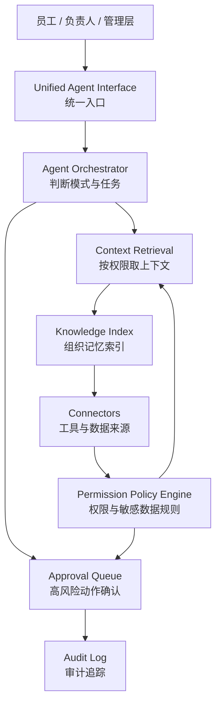
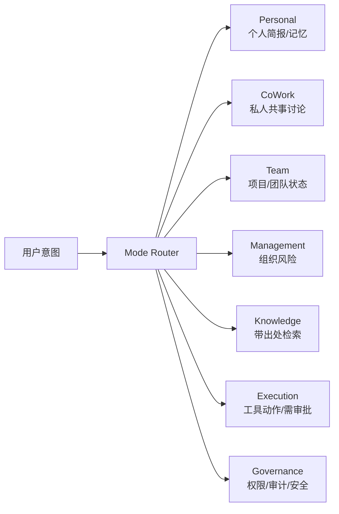
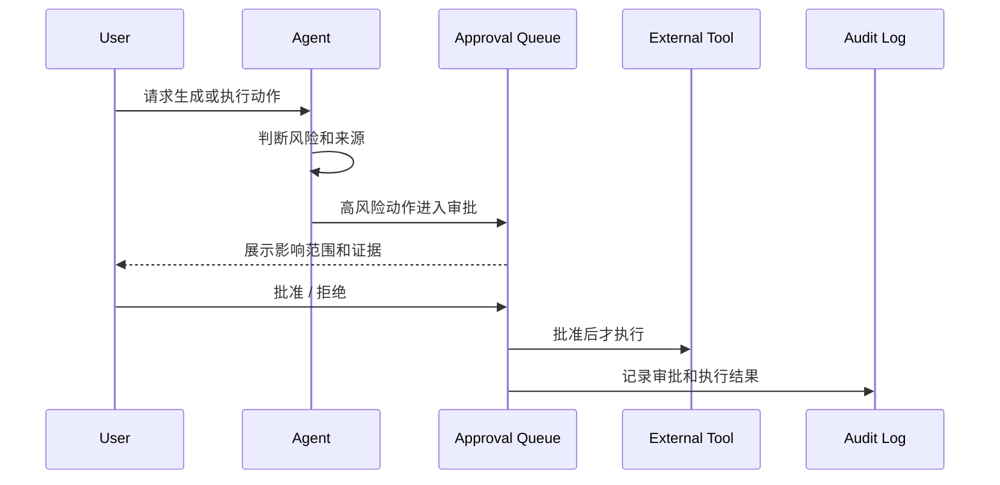
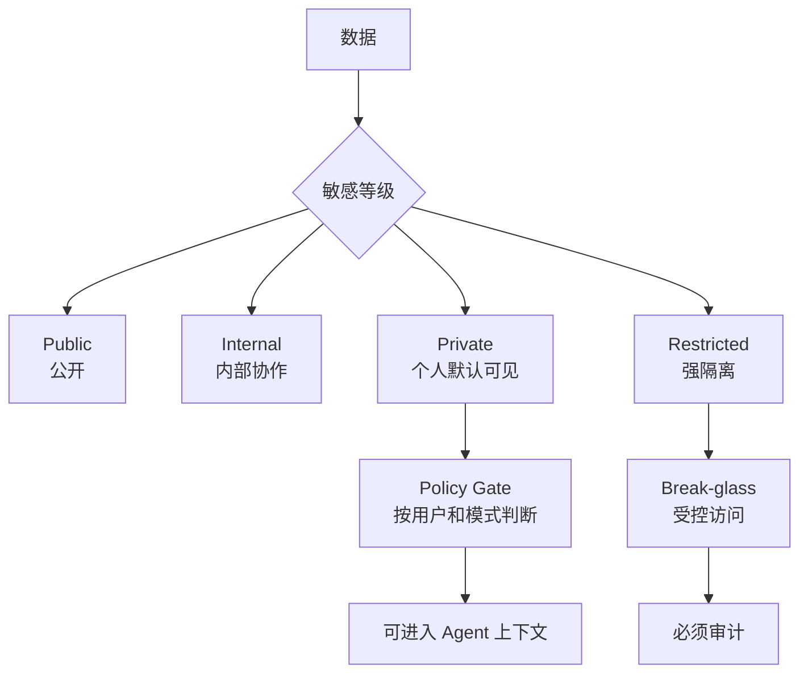
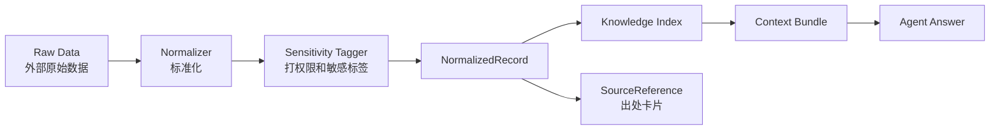
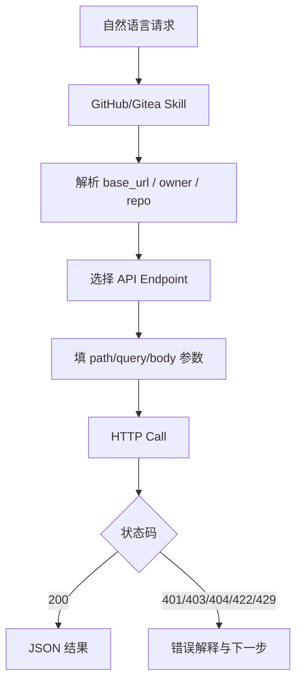
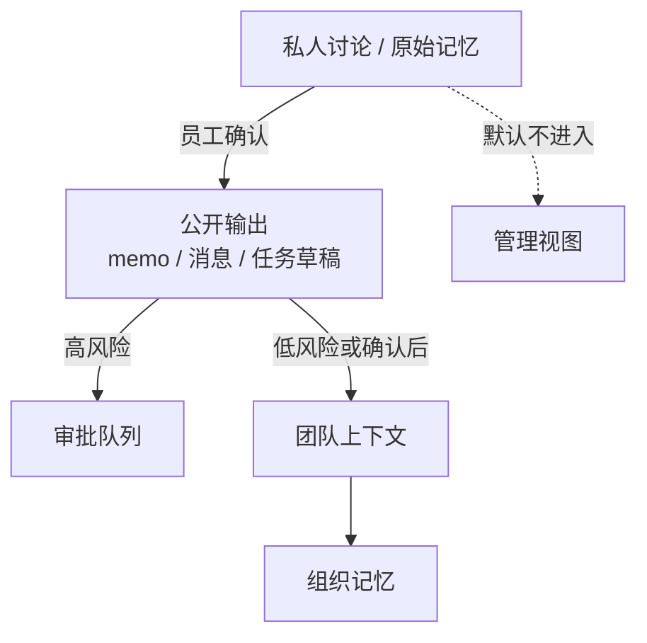

# AgentOS 术语 / 缩写 / 生僻名词解构清单

本文汇总当前目录所有文档中反复出现、容易误解或需要项目内统一理解的术语。每个术语都尽量用通俗语言和类比解释，并跟踪到文档出处。若同一词在不同文档里有概念重叠或潜在冲突，会直接在标题中注明“概念冲突”。

## 文档出处代号

| 代号 | 文档路径 |
| --- | --- |
| D0 | `agentos-product-design.md` |
| D1 | `docs/development-plans/dev1-backend-tech-lead.md` |
| D2 | `docs/development-plans/dev2-ai-agent-engineer.md` |
| D3 | `docs/development-plans/dev3-frontend-product-engineer.md` |
| D4 | `docs/development-plans/dev4-integrations-data-engineer.md` |
| D3O | `docs/dev3/dev3-frontend-mvp-options.md` |
| D4O | `docs/dev4/dev4-integrations-data-mvp-options.md` |
| QA | `docs/development-plans/qa-test-security.md` |
| GiteaSkill | `funkyape/general_agent/skills/gitea-repo-api/SKILL.md` |
| GitHubSkill | `funkyape/general_agent/skills/github-repo-api/SKILL.md` |
| GiteaCommon | `funkyape/general_agent/skills/gitea-repo-api/references/common-options.md` |
| GitHubCommon | `funkyape/general_agent/skills/github-repo-api/references/common-options.md` |
| GiteaJSON | `gitea_zhangrui_last_month.json` |

## 总体图例：AgentOS 不是一个聊天框

类比：AgentOS 像公司里的“智能调度室”。聊天入口只是前台窗口，后面还有资料室、权限门禁、审批台、工具接口和审计本。

## 产品定位与理念类

### AgentOS

- 通俗解释：公司的 AI 操作系统，把人、任务、项目、会议、知识、决策和工具串起来。
- 类比：不是一个会聊天的员工，而是公司内部的“神经系统 + 工作流总控台”。
- 易误解点：它不是单点机器人，也不是简单 BI 看板。
- 出处：D0、D1、D2、D3、D4、D3O、D4O、QA。

### AI-Native

- 通俗解释：产品从一开始就按 AI 能理解上下文、参与决策、生成行动来设计，而不是把 AI 当插件后加上去。
- 类比：不是给老房子装智能灯，而是从地基开始按智能楼宇设计。
- 出处：D0。

### AI OS

- 通俗解释：AI 作为公司运行层的一部分，像电脑操作系统管理文件、权限、进程一样管理公司的知识、流程和执行。
- 类比：Windows/macOS 管应用，AgentOS 管会议、项目、任务、审批、知识和工具。
- 出处：D0、D3O。

### Workflow-first

- 通俗解释：先让工作流跑起来，而不是先做闲聊体验。
- 类比：餐厅不能只做迎宾聊天，核心要能点菜、下单、出餐、结账。
- 出处：D0、D3O。

### Thinking-partner

- 通俗解释：Agent 像共事搭档，能陪员工澄清问题、推演方案、反驳和整理。
- 类比：不是搜索框，而是坐在你旁边帮你把事想明白的同事。
- 出处：D0、D3O。

### Memory-compounding

- 通俗解释：每次会议、讨论、决策和复盘都会沉淀成以后可复用的组织记忆。
- 类比：公司越工作，自己的“经验账本”越厚。
- 出处：D0、D3O。

### Employee-trust by design

- 通俗解释：从设计上保护员工信任，避免系统变成监控工具。
- 类比：办公室有协作白板，但不能把每个人的草稿本直接挂到大屏上。
- 出处：D0、D3O。

### Suggest + Confirm

- 通俗解释：Agent 可以建议、草拟和总结，但高风险动作必须由人确认。
- 类比：秘书可以拟好邮件，但不能未经你同意直接发给客户。
- 出处：D0、D2、D3O、D4O、QA。

### Explainable Agent

- 通俗解释：Agent 要说明自己用了什么资料、进入了什么模式、要不要审批、下一步是什么。
- 类比：像医生开药时解释诊断依据，而不是只递一瓶药。
- 出处：D0、D2、D3、D3O、QA。

### MVP

- 通俗解释：最小可用版本，先证明核心闭环有价值。
- 类比：先造一辆能跑、能刹、能转向的小车，不先造豪华内饰。
- 出处：D0、D1、D2、D3、D4、D3O、D4O、QA。

### SaaS

- 通俗解释：软件作为在线服务提供给多家公司使用。
- 类比：自己公司内部先用厨房，未来变成可对外营业的餐厅连锁。
- 出处：D0、D4O。

### Alpha / 内部 Alpha

- 通俗解释：内部试点版，先给小范围真实用户验证。
- 类比：餐厅试营业，先让熟人试吃并发现问题。
- 出处：D0、QA。

## 用户、角色与团队类

### CEO / COO / CTO

- 通俗解释：CEO 管公司方向，COO 管运营执行，CTO 管技术路线。
- 类比：船长、甲板总管、轮机长。
- 出处：D0。

### HR / People

- 通俗解释：人力与组织发展角色，首版只能有限接入。
- 类比：可以看公开成长画像，但不能翻员工私人日记。
- 出处：D0、D1、D3、QA。

### Admin / IT / Security

- 通俗解释：负责系统配置、权限、安全和审计的管理角色。
- 类比：公司的门禁管理员、消防员和监控审计员，但不能越权看私人内容。
- 出处：D0、D1、D3、QA。

### PM / Tech Lead / Owner

- 通俗解释：PM 通常管产品和项目推进，Tech Lead 管技术实现，Owner 是某件事的明确负责人。
- 类比：PM 像项目导航员，Tech Lead 像施工队长，Owner 是签字负责的人。
- 出处：D0、D1、D2、D3、D4。

### Dev1 / Dev2 / Dev3 / Dev4

- 通俗解释：四个开发职责切片。Dev1 管后端和工作流，Dev2 管 Agent，Dev3 管前端体验，Dev4 管数据和集成。
- 类比：一台车里，Dev1 是底盘和刹车，Dev2 是驾驶大脑，Dev3 是驾驶舱，Dev4 是油路和传感器。
- 出处：D1、D2、D3、D4、D3O、D4O。

### QA

- 通俗解释：质量与安全测试角色，尤其盯权限、隐私、审批和 Agent 行为。
- 类比：不是最后挑错的人，而是从设计阶段就检查消防通道的人。
- 出处：QA、D1、D2、D3、D4、D3O、D4O。

## Agent 模式类

### Agent

- 通俗解释：能读上下文、判断模式、给出建议或生成动作的 AI 工作搭档。
- 类比：不是“有问必答的机器人”，更像带流程意识的助理。
- 出处：D0、D1、D2、D3、D4、D3O、D4O、QA。

### Personal Mode

- 通俗解释：处理个人日程、任务、待办、私人记忆。
- 类比：你的私人工作助理。
- 出处：D0、D2、D4、D4O。

### Co-Work Mode / Cowork

- 通俗解释：陪员工讨论问题，默认私人，不自动进入团队上下文。
- 类比：关起门来的白板讨论，只有你确认后才发会议纪要。
- 出处：D0、D2、D3、D4、D3O、D4O、QA。

### Team Mode

- 通俗解释：围绕团队和项目状态进行汇总、识别阻塞、整理行动项。
- 类比：项目周会前的自动会务助理。
- 出处：D0、D2、D4、D4O。

### Management Mode

- 通俗解释：给管理层看组织级风险、目标偏离和需要介入的事项。
- 类比：公司仪表盘上的“异常警报”，不是员工个人摄像头。
- 出处：D0、D2、D4、D4O、QA。

### Knowledge Mode

- 通俗解释：检索公司知识，并带出处回答问题。
- 类比：带引用来源的公司内部搜索研究员。
- 出处：D0、D2、D3、D4、D3O、D4O。

### Execution Mode

- 通俗解释：准备调用工具执行动作，但高风险动作先进入审批。
- 类比：司机踩油门前先确认路权和刹车状态。
- 出处：D0、D2。

### Governance Mode

- 通俗解释：处理权限、审计、安全和敏感数据访问。
- 类比：系统里的合规办公室。
- 出处：D0、D2、D4O。

### Agent Orchestrator

- 通俗解释：Agent 的调度中枢，决定用什么模式、取什么上下文、调用什么工具。
- 类比：机场塔台，决定哪架飞机起飞、降落、走哪条跑道。
- 出处：D0、D2、D4O。

### Mode Router

- 通俗解释：判断用户问题应该进入哪种 Agent 模式。
- 类比：医院分诊台，先判断你该去内科、外科还是急诊。
- 出处：D2、D4O。

### Context Builder

- 通俗解释：把用户、项目、组织、知识检索结果组装成 Agent 可用上下文。
- 类比：开会前把相关材料装进一个文件夹。
- 出处：D2。

### Structured Response Generator

- 通俗解释：让 Agent 输出结构化结果，而不是一大段散文。
- 类比：把回答填进表单：事实、推断、建议、来源、下一步。
- 出处：D2、D3O。

### Prompt

- 通俗解释：给 Agent 的行为指令和回答模板。
- 类比：新人入职手册，告诉它遇到不同场景该怎么做。
- 出处：D2、GiteaSkill、GitHubSkill。

### Chain

- 通俗解释：一串连续的处理步骤，例如管理简报 chain、知识回答 chain。
- 类比：流水线，从取资料到判断再到生成答案。
- 出处：D2。

### Agent Eval Cases

- 通俗解释：用来评估 Agent 行为是否稳定、安全、符合预期的测试题集。
- 类比：驾照考试题库，检查 Agent 有没有乱开车。
- 出处：D2、QA。

## 工作流、审批与审计类

### Workflow Engine

- 通俗解释：管理会议、项目、审批、提醒、状态同步等流程的系统。
- 类比：工厂里的传送带和工序控制器。
- 出处：D0、D1。

### Approval / Approval Queue

- 通俗解释：高风险动作的确认队列。
- 类比：公司付款前的审批单。
- 出处：D0、D1、D2、D3、D3O、QA。

### Audit / Audit Log / AuditEvent

- 通俗解释：记录谁在什么时候基于什么来源做了什么动作，结果如何。
- 类比：银行流水，不能只知道钱少了，还要知道是谁、为什么、去哪了。
- 出处：D0、D1、D3、D3O、QA、D4O。

### Agent Action Schema

- 通俗解释：Agent 生成待执行动作时必须遵守的字段格式。
- 类比：审批单模板，必须填动作、来源、影响范围、风险等级。
- 出处：D1、D2、D3、QA。

### Approval Schema

- 通俗解释：审批数据的标准格式。
- 类比：每张审批单都要有申请人、审批人、状态、结果。
- 出处：D1、QA。

### Audit Event Schema

- 通俗解释：审计事件的标准格式。
- 类比：系统日志的登记表，保证事后查账能查清楚。
- 出处：D1、QA。

### Risk Classifier

- 通俗解释：判断某个动作是否高风险的模块。
- 类比：机场安检，区分普通行李和需要开箱检查的行李。
- 出处：D2。

### High-risk Action

- 通俗解释：可能影响他人、客户、项目状态、敏感数据或正式记录的动作。
- 类比：发正式邮件、改合同、更新客户记录都不能“手滑”。
- 出处：D0、D1、D2、D3、QA。

### Action（概念冲突：Agent Action vs 会议行动项）

- 通俗解释：在 Dev1/Dev2 中常指 Agent 准备执行的系统动作；在会议语境里也指行动项。
- 类比：一个是“系统执行按钮”，一个是“会后待办清单”。
- 冲突处理：写文档时建议用 `AgentAction` 表示审批动作，用 `ActionItem` 表示会议行动项。
- 出处：D0、D1、D2、D3、QA。

### Action Item

- 通俗解释：会议后明确谁去做什么、什么时候完成。
- 类比：会议结束后贴在每个人桌上的待办便签。
- 出处：D0、D2、D3、QA。

### Evidence Bundle

- 通俗解释：支撑某个 Agent 建议或审批动作的一组证据来源。
- 类比：法庭上提交的一袋证据，不只说结论，还附材料。
- 出处：D4O。

### First-loop E2E

- 通俗解释：第一条从 Agent 生成动作到审批、审计的端到端测试。
- 类比：新地铁开通前先跑一趟完整试运行。
- 出处：QA、D3O、D4O。

## 权限、安全与信任类

### Permission Policy Engine

- 通俗解释：判断谁能看什么、Agent 能用什么、哪些动作必须审批的规则引擎。
- 类比：门禁系统，不同卡能进不同房间。
- 出处：D0、D1、D4O。

### Permission Scope / permission_scope

- 通俗解释：数据允许被哪些人、团队或角色看到。
- 类比：文件夹共享范围。
- 出处：D4、D4O、D3O。

### Sensitivity Level

- 通俗解释：数据敏感等级，决定能否被检索、展示或进入 Agent 上下文。
- 类比：文件上的密级标签。
- 出处：D1、D4、D3O、D4O、QA。

### Public / Internal / Private / Restricted

- 通俗解释：四种数据可见性。Public 公开，Internal 内部，Private 个人，Restricted 强隔离。
- 类比：公告栏、部门共享盘、私人笔记本、保险柜。
- 出处：D0、D1、D4、D4O、D3O、QA。

### Restricted

- 通俗解释：最敏感的数据层，默认不进入普通 Agent 上下文。
- 类比：保险柜里的法律、薪酬、绩效、健康信息。
- 出处：D0、D1、D3O、D4、D4O、QA。

### Break-glass

- 通俗解释：紧急或合规场景下的受控访问流程，必须有原因、审批、范围、时间限制和审计。
- 类比：医院里“打破玻璃取急救钥匙”，可用但必须登记。
- 出处：D0、D1、QA、D4O。

### Policy Gate

- 通俗解释：数据进入检索、Agent 或展示之前先过权限门。
- 类比：资料室门口的安检，不合规的资料不能带进会议室。
- 出处：D4O。

### Redact / 脱敏

- 通俗解释：保留可用信息，遮住敏感部分。
- 类比：公开合同摘要时把身份证号打码。
- 出处：D4O。

### 越权访问 / Permission Bypass

- 通俗解释：用户或 Agent 看到不该看的数据。
- 类比：拿会议室门卡打开了财务保险柜。
- 出处：D1、D4、QA、D4O。

### P0 / P1 / P2 / P3

- 通俗解释：缺陷严重等级。P0/P1 通常是必须阻断试点的严重问题。
- 类比：P0 是刹车失灵，P1 是安全气囊故障，P2/P3 是体验或边缘问题。
- 出处：QA、D1、D2、D3。

### Security Test / Privacy Risk

- 通俗解释：安全测试和隐私风险清单，用来确认系统不会泄露敏感数据。
- 类比：产品上线前做门锁和摄像头盲区检查。
- 出处：QA。

## 数据、集成与知识类

### Connector

- 通俗解释：连接外部工具，把外部数据读进 AgentOS 的小模块。
- 当前口径：connector 的工程载体暂定为后端插件，由后端统一加载、配置、调用和审计。
- 权限口径：外部系统权限先不映射到 AgentOS；外部系统各自做原生鉴权，AgentOS 做自身鉴权。
- 类比：不同插头的转接头，把 GitHub、Notion、Jira 等都接到同一排插。
- 出处：D0、D4、D4O、D3O、GiteaSkill、GitHubSkill。

### Connector（概念冲突：Tool Connector Registry vs 具体 Connector）

- 通俗解释：具体 connector 是某个工具的接入模块；Tool Connector Registry 是管理这些接入模块的登记册。
- 类比：一个是“某把钥匙”，一个是“钥匙柜”。
- 冲突处理：建议写具体工具时用 `GitHub Connector`，写管理中心时用 `Connector Registry`。
- 出处：D0、D4、D4O。

### Tool Connector Registry

- 通俗解释：统一管理 Slack、飞书、Notion、Jira、GitHub、CRM 等工具接入。
- 类比：公司的工具插座总面板。
- 出处：D0、D4O。

### Mock

- 通俗解释：用假数据或假接口模拟真实系统，方便早期开发。
- 类比：消防演练用烟雾机，不是真火但能练流程。
- 出处：D1、D3、D4、D3O、D4O。

### Mock（概念冲突：Mock API vs Mock Connector vs Demo Dataset）

- 通俗解释：Mock API 是假的接口，Mock Connector 是假的数据接入模块，Demo Dataset 是演示数据集。
- 类比：假收银台、假送货车、样品货架，三者都“假”，用途不同。
- 冲突处理：建议分别写 `mockApiAdapter`、`mock connector`、`demo dataset`。
- 出处：D1、D3、D4、D3O、D4O。

### Demo Dataset

- 通俗解释：演示和测试用的数据集合。
- 类比：样板间里的家具，帮人理解完整生活场景。
- 出处：D4、D4O。

### Knowledge Index

- 通俗解释：把公司文档、会议、任务、客户事件等做成可检索的索引。
- 类比：图书馆的目录系统，不是书本身，但能帮你找到书。
- 出处：D0、D2、D3、D4、D3O、D4O、QA。

### Index（概念冲突：Knowledge Index vs `funkyape/index`）

- 通俗解释：Knowledge Index 是产品里的知识检索索引；`funkyape/index` 是本仓库保存产物索引的目录。
- 类比：一个是图书馆检索目录，一个是项目档案登记册。
- 冲突处理：产品设计里写 `Knowledge Index`，文件目录写 `artifact index`。
- 出处：D0、D4、D4O；本次用户指定目录 `funkyape/index`。

### Context Retrieval

- 通俗解释：根据用户、角色、Agent 模式，从知识和数据层取可用上下文。
- 类比：开会前按参会人权限发材料。
- 出处：D4、D4O、D2、D3O。

### Context Bundle

- 通俗解释：打包给 Agent 的上下文包，包含事实片段、来源、权限和过滤提示。
- 类比：给律师的一包案卷材料。
- 出处：D4O。

### Context（概念冲突：个人上下文 / 团队上下文 / 组织上下文 / Agent 上下文）

- 通俗解释：上下文不是一个东西，而是 Agent 回答前能参考的资料范围。
- 类比：同一个问题，在私人日记、项目会议、公司公告里取到的背景不同。
- 冲突处理：建议明确写 `personal context`、`team context`、`organization context`、`agent context`。
- 出处：D0、D2、D4、D4O、QA。

### Memory（概念冲突：个人原始记忆 vs 组织记忆）

- 通俗解释：个人原始记忆是员工自己的草稿和私人思考；组织记忆是确认后沉淀给团队或公司的知识。
- 类比：私人笔记本和公司知识库不是一回事。
- 冲突处理：建议写 `personal raw memory` 和 `organization memory`。
- 出处：D0、D1、D2、D3、QA。

### NormalizedRecord

- 通俗解释：外部数据进入系统后的标准记录格式。
- 类比：不同快递公司包裹进仓后都贴上统一仓库标签。
- 出处：D4O。

### SourceReference

- 通俗解释：回答或审批里展示的“这条信息来自哪里”的轻量来源卡。
- 类比：论文脚注，告诉你结论引用自哪里。
- 出处：D3、D4、D3O、D4O。

### Source（概念冲突：数据来源 vs 代码 source vs SourceReference）

- 通俗解释：在 AgentOS 文档里多指数据来源；在代码语境里可能指源码；SourceReference 是具体来源引用结构。
- 类比：水从哪个水厂来、菜从哪个农场来、论文引用哪篇文献。
- 冲突处理：写数据来源时用 `source`，写引用卡时用 `SourceReference`，写源码时用 `source code`。
- 出处：D0、D2、D3、D4、D3O、D4O、GiteaSkill、GitHubSkill。

### Raw Staging

- 通俗解释：原始数据进入系统后的临时暂存区，先不直接给 Agent 用。
- 类比：快递先到中转站，检查后再入库。
- 出处：D4O。

### Normalizer

- 通俗解释：把不同工具的数据转成统一结构。
- 类比：把不同语言的表格翻译成同一种格式。
- 出处：D4O。

### Sensitivity Tagger

- 通俗解释：给数据打敏感等级标签。
- 类比：给文件贴“公开、内部、私人、机密”的标签。
- 出处：D4O。

### Data Quality Event

- 通俗解释：数据同步、去重、来源冲突、失败等质量问题的记录。
- 类比：仓库质检单。
- 出处：D4O。

### Sync Run / sync_run_id

- 通俗解释：一次同步任务及其编号。
- 类比：快递批次号，出问题时能查是哪一批。
- 出处：D4、D4O。

### Incremental Sync / 增量同步

- 通俗解释：只同步上次之后新增或变化的数据。
- 类比：不用每天搬完整个仓库，只搬今天新来的货。
- 出处：D4、D4O。

### Dedup / 去重

- 通俗解释：发现重复数据并合并或忽略。
- 类比：同一张发票不要报销两次。
- 出处：D4。

### Metadata

- 通俗解释：描述数据的数据，例如作者、时间、类型、所属项目。
- 类比：书的封面信息，不是正文但很重要。
- 出处：D4、D4O。

### entity_type / entity_id

- 通俗解释：说明一条数据属于什么实体，以及这个实体的编号。
- 类比：快递标签上的“包裹类型”和“包裹编号”。
- 出处：D4、D4O。

### owner / owner_user_id

- 通俗解释：数据或任务的负责人。
- 类比：钥匙牌上写着谁保管。
- 出处：D0、D4、D4O、GiteaSkill、GitHubSkill。

### tenant_id

- 通俗解释：多租户场景下区分不同公司或组织的编号。
- 类比：同一栋写字楼里不同公司的门牌号。
- 出处：D4O、D0。

### Search Adapter / Search API

- 通俗解释：对外提供检索能力的接口或适配层。
- 类比：图书馆查询台。
- 出处：D4、D4O、GiteaSkill、GitHubSkill。

### FTS / Full-text Search

- 通俗解释：全文搜索，按文本内容查找。
- 类比：在整本书里搜某个词，而不只查标题。
- 出处：D4O。

### Hybrid Search

- 通俗解释：混合搜索，结合关键词和语义相似度。
- 类比：既查书名关键词，也找意思相近的章节。
- 出处：D4O。

### Vector Index

- 通俗解释：把文本变成向量后做语义检索的索引。
- 类比：不只按字面找“客户投诉”，也能找到“用户抱怨服务”。
- 出处：D4O。

### OpenSearch / Postgres FTS / SQLite FTS

- 通俗解释：三种可用于搜索索引的技术选项。
- 类比：小本子、档案柜、专业图书馆系统，规模和复杂度不同。
- 出处：D4O。

## 前端、后端与接口类

### Backend

- 通俗解释：服务端，负责数据库、API、权限、审批、审计、业务逻辑。
- 类比：餐厅后厨和仓库。
- 出处：D1。

### Frontend

- 通俗解释：用户看到和操作的 Web 工作台。
- 类比：餐厅前台和菜单。
- 出处：D3、D3O。

### Web 工作台 / Web App Shell

- 通俗解释：登录后进入的整体应用框架，包括导航、布局、角色切换等。
- 类比：办公楼大厅，里面再通往各个房间。
- 出处：D3、D3O。

### Dashboard

- 通俗解释：仪表盘页面，展示组织雷达或汇总状态。
- 类比：汽车仪表盘，提示速度、油量、故障灯。
- 出处：D3、D3O、D1。

### App Shell

- 通俗解释：前端应用的外壳，包括导航、布局、基础状态。
- 类比：手机系统桌面，应用内容在里面切换。
- 出处：D3、D3O。

### UI

- 通俗解释：用户界面。
- 类比：机器的按钮、屏幕和提示灯。
- 出处：D3、D3O、QA。

### E2E

- 通俗解释：端到端测试，从用户操作一路测到后端和结果。
- 类比：不是只检查车轮，而是开车从家到公司跑完整程。
- 出处：D3、QA、D3O。

### API

- 通俗解释：系统之间约定好的调用接口。
- 类比：餐厅点餐窗口，你按菜单格式下单，后厨按格式出餐。
- 出处：D1、D2、D3、D4、QA、GiteaSkill、GitHubSkill。

### API Contract

- 通俗解释：接口契约，约定请求和响应字段。
- 类比：合同写清楚双方交付什么。
- 出处：D1、D3、D3O、QA。

### Schema

- 通俗解释：数据结构说明，规定字段、类型和含义。
- 类比：表格模板，不能每个人随便加列。
- 出处：D1、D2、D3、D4、QA、D3O、D4O。

### Adapter

- 通俗解释：适配层，把不同来源或接口包装成统一调用方式。
- 类比：转接头，让不同插口都能接同一台设备。
- 出处：D3、D3O、D4、D4O、GiteaSkill、GitHubSkill。

### Fixture

- 通俗解释：测试或演示用的固定样例数据。
- 类比：考试样题。
- 出处：D3O、D4O。

### data-testid

- 通俗解释：前端元素上的测试标识，方便 E2E 稳定定位。
- 类比：给按钮贴一个内部编号，测试脚本不用猜它在哪。
- 出处：D3O。

### Loading / Empty / Error State

- 通俗解释：加载中、无数据、出错三种页面状态。
- 类比：餐厅等菜、卖完、后厨故障三种提示。
- 出处：D3、D3O、QA。

### README

- 通俗解释：说明文档，告诉别人如何启动、配置、测试或使用。
- 类比：工具箱里的说明书。
- 出处：D1、D3、D4、D3O、D4O。

## 外部工具、仓库与 API 类

### GitHub / Gitea

- 通俗解释：代码仓库平台，文档中主要作为真实只读 connector 的候选来源。
- 类比：代码项目的档案馆。
- 出处：D0、D4、D3O、D4O、GiteaSkill、GitHubSkill、GiteaJSON。

### Repo / Repository

- 通俗解释：代码仓库，一个项目的代码和协作记录集合。
- 类比：一个项目文件柜。
- 出处：GiteaSkill、GitHubSkill、GiteaCommon、GitHubCommon、GiteaJSON、D4O。

### Owner / Repo

- 通俗解释：仓库的拥有者和仓库名，例如 `zhangrui/tl_model`。
- 类比：楼号和房间号。
- 出处：GiteaSkill、GitHubSkill、GiteaCommon、GitHubCommon、GiteaJSON。

### Branch / Ref

- 通俗解释：代码分支或引用位置。
- 类比：同一本书的不同草稿版本。
- 出处：GiteaSkill、GitHubSkill、GiteaCommon、GitHubCommon、GiteaJSON。

### Commit / SHA / full_sha

- 通俗解释：一次代码提交及其唯一编号。
- 类比：文件柜每次改动的盖章流水号。
- 出处：GiteaSkill、GitHubSkill、GiteaJSON、D4O。

### Issue

- 通俗解释：仓库里的问题、需求或任务条目。
- 类比：项目问题登记单。
- 出处：GiteaSkill、GitHubSkill、GiteaCommon、GitHubCommon、GiteaJSON、D4O。

### PR / Pull Request

- 通俗解释：请求把一段代码改动合并进主分支。
- 类比：把修改稿递给负责人审核合入正式文档。
- 出处：D0、D3O、GiteaSkill、GitHubSkill、GiteaCommon、GitHubCommon、GiteaJSON。

### Release / Tag

- 通俗解释：Release 是正式发布版本，Tag 是给某个代码点打标签。
- 类比：书的正式出版版次和书签。
- 出处：GiteaSkill、GitHubSkill、GiteaCommon、GitHubCommon。

### REST API

- 通俗解释：一种常见网络接口风格，用 URL 和 HTTP 方法操作资源。
- 类比：通过标准窗口办理“查、增、改、删”。
- 出处：GiteaSkill、GitHubSkill。

### OpenAPI / Swagger

- 通俗解释：描述 API 能力的机器可读说明书。
- 类比：餐厅菜单和点餐规则的标准说明。
- 出处：GiteaSkill、GitHubSkill、GiteaJSON。

### Endpoint

- 通俗解释：某个具体 API 地址和操作。
- 类比：银行柜台里的某个业务窗口。
- 出处：GiteaSkill、GitHubSkill、GiteaCommon、GitHubCommon。

### HTTP Method

- 通俗解释：GET、POST、PATCH、DELETE 等请求动作。
- 类比：查资料、提交表单、修改记录、删除记录。
- 出处：GiteaSkill、GitHubSkill。

### Path Param / Query Param / Body Param

- 通俗解释：API 参数的三种放置位置：路径里、问号后、请求体里。
- 类比：地址、筛选条件、随信附上的表格。
- 出处：GiteaSkill、GitHubSkill。

### Pagination

- 通俗解释：分页返回大量列表数据。
- 类比：一本厚通讯录分很多页看。
- 出处：GiteaSkill、GitHubSkill、GiteaCommon、GitHubCommon。

### Authentication / Token

- 通俗解释：认证和令牌，用来证明你有权访问某些 API。
- 类比：门禁卡。
- 出处：D4、GiteaSkill、GitHubSkill、GiteaCommon、GitHubCommon。

### OAuth

- 通俗解释：让用户授权第三方访问工具数据的一种标准方式。
- 类比：给临时访客一张限定权限和有效期的通行证。
- 出处：D4。

### GITEA_TOKEN / GITHUB_TOKEN

- 通俗解释：访问 Gitea/GitHub API 的令牌环境变量。
- 类比：放在保险袋里的门禁卡编号，不能打印或泄露。
- 出处：GiteaSkill、GitHubSkill、GiteaCommon、GitHubCommon。

### 401 / 403 / 404 / 422 / 429

- 通俗解释：常见 API 错误码。401 未登录，403 无权限，404 找不到，422 参数不对，429 请求太频繁。
- 类比：没带门卡、门卡权限不够、房间不存在、表格填错、排队太快被限流。
- 出处：GiteaSkill、GitHubSkill、GiteaJSON。

### Rate Limit

- 通俗解释：接口调用频率限制。
- 类比：窗口每分钟只办一定数量的业务。
- 出处：GitHubSkill、GiteaSkill、GitHubCommon、GiteaCommon。

### GitHub Enterprise

- 通俗解释：企业自建或企业版 GitHub。
- 类比：不是公共图书馆，而是公司内部图书馆。
- 出处：GitHubSkill、GitHubCommon。

### Webhook / Deploy Key / Protected Branch

- 通俗解释：Webhook 是事件通知，Deploy Key 是部署访问钥匙，Protected Branch 是受保护分支。
- 类比：门铃通知、施工钥匙、不能随便改的正式文件柜。
- 出处：GiteaCommon、GitHubCommon。

## 业务系统与工具缩写

### CRM

- 通俗解释：客户关系管理系统，记录客户、销售、服务、投诉等信息。
- 类比：客户档案柜。
- 出处：D0、D4O、D3O。

### Jira / Linear

- 通俗解释：项目管理和任务跟踪工具。
- 类比：团队任务看板。
- 出处：D0、D3O、D4、D4O。

### Notion

- 通俗解释：文档和知识库工具。
- 类比：团队共享笔记本。
- 出处：D0、D4、D4O。

### Slack / 飞书 / 企微

- 通俗解释：团队聊天和协作工具。
- 类比：公司内部沟通大厅。
- 出处：D0。

### OKR

- 通俗解释：目标与关键结果，用来描述目标和衡量进展。
- 类比：登山目标和沿途里程碑。
- 出处：D0。

### KPI

- 通俗解释：关键绩效指标，文档没有重点展开，但与绩效和管理语境相关。
- 类比：仪表上的几个关键数字。
- 出处：D0 中“绩效”语境间接相关。

## 测试、交付与质量类

### Test Plan

- 通俗解释：测试计划，定义要测什么、怎么测、什么标准通过。
- 类比：体检套餐清单。
- 出处：QA。

### Permission Test Matrix

- 通俗解释：权限测试矩阵，列出不同角色能看什么、不能看什么。
- 类比：门禁权限表。
- 出处：QA、D1。

### Regression Checklist

- 通俗解释：回归测试清单，确保改动没有破坏旧功能。
- 类比：修车后重新检查刹车、灯、轮胎。
- 出处：QA。

### Go / No-Go Recommendation

- 通俗解释：是否可以进入试点的结论。
- 类比：发射前最后一句“可以发射 / 暂停发射”。
- 出处：QA。

### Alpha Readiness Report

- 通俗解释：内部试点准备度报告。
- 类比：开业前检查报告。
- 出处：QA。

### Known Issues

- 通俗解释：已知问题列表。
- 类比：交车时告诉你哪些小问题还在排期修。
- 出处：QA、D1、D2。

### Defect Severity Rules

- 通俗解释：缺陷严重等级规则。
- 类比：医院分诊规则，判断是急诊还是普通门诊。
- 出处：QA。

## 容易混淆的核心关系图

这张图拆解了项目里最重要的信任边界：私人讨论不是组织记忆，只有员工确认后的公开输出才可能进入团队或公司上下文。

## 推荐命名约定

| 容易混淆的词 | 建议明确写法 |
| --- | --- |
| Action | `AgentAction` 表示待审批系统动作；`ActionItem` 表示会议行动项 |
| Source | `source` 表示数据来源；`SourceReference` 表示出处卡片；`source code` 表示源码 |
| Memory | `personal raw memory` 表示个人原始记忆；`organization memory` 表示组织记忆 |
| Context | `personal context`、`team context`、`management context`、`agent context` |
| Connector | `GitHub Connector` 等具体连接器；`Connector Registry` 表示连接器登记管理 |
| Mock | `mockApiAdapter`、`mock connector`、`demo dataset` 分开写 |
| Index | `Knowledge Index` 表示产品检索索引；`artifact index` 表示文件产物索引 |

