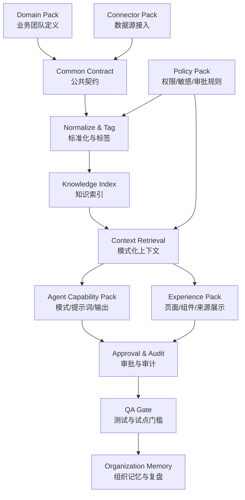
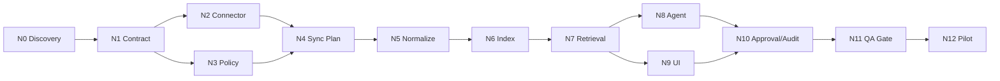
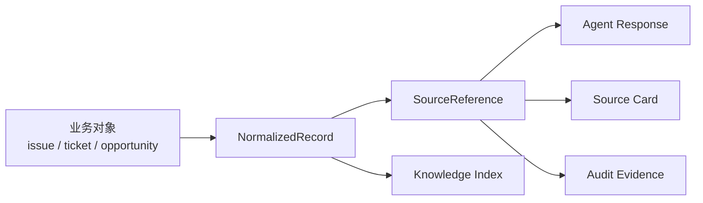
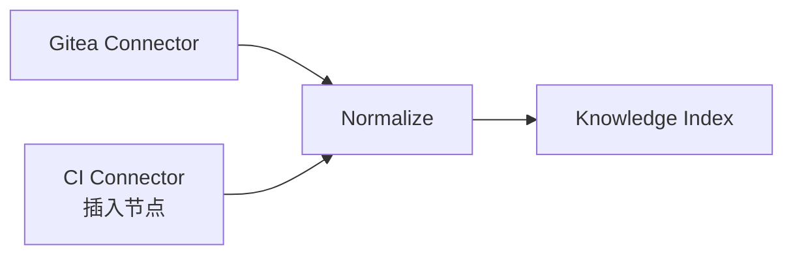
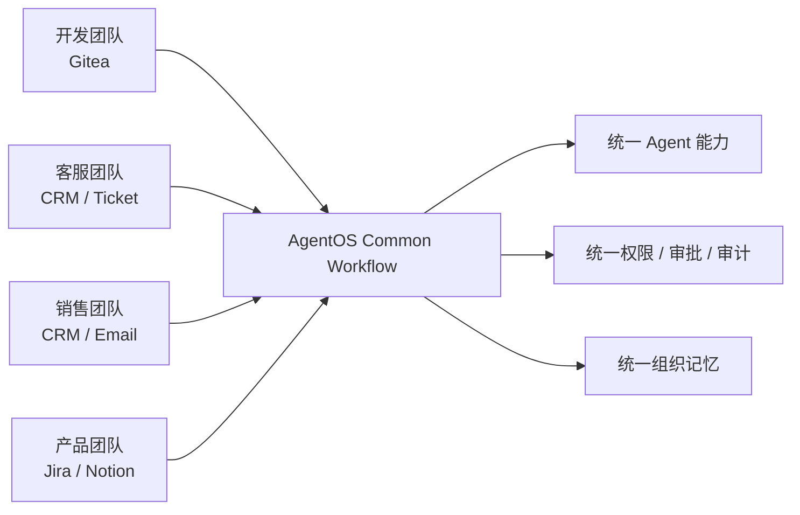


# 可复刻 AI-native 垂直工作流抽象

本文把 `docs/workflow/dev-team-ai-native.md` 中“接入 Gitea 支持开发团队 AI-native”的垂直工作流抽象成一套可复用框架。目标是让 AgentOS 在接入其他业务团队时，不重新发明架构，只通过简单修改、插入、删除工作节点完成复刻。

## 1. 抽象目标

一个垂直 AI-native 工作流不是“接一个工具”这么简单，而是把某个团队的工作方式转成 AgentOS 可理解、可执行、可审计的系统链路。

它必须同时回答：

- 这个团队的关键业务对象是什么？
- 哪些数据源能证明真实状态？
- 哪些数据可以进入 Agent 上下文？
- 哪些动作必须审批？
- 哪些界面让用户自然使用？
- 哪些结果会沉淀为组织记忆？
- 如何证明它没有越权、没有泄露、没有变成监控？

## 2. 顶层架构



类比：每接入一个团队，就像给 AgentOS 安装一个“业务插件包”。当前 connector 的工程载体暂定为后端插件：插件包可以换数据源和业务术语，但底座仍然是同一套契约、权限、检索、审批和审计。

## 3. 工作流 Pack 结构

每个垂直工作流都应由七个 pack 组成。

| Pack | 作用 | 开发团队 Gitea 示例 | 复刻时替换什么 |
| --- | --- | --- | --- |
| Domain Pack | 定义团队、角色、业务场景、成功标准 | 开发团队、Tech Lead、PR review、issue triage | 团队类型、业务场景、角色 |
| Connector Pack | 定义数据源和读取方式，当前暂定以后端插件承载 | Gitea repo/branch/commit/issue/PR | CRM、工单、Jira、Notion、邮件等 |
| Contract Pack | 定义标准数据结构 | `NormalizedRecord`、`SourceReference` | 通常保留，只扩展 entity_type |
| Policy Pack | 定义 AgentOS 权限、敏感等级和写动作边界 | token 隔离、写评论需审批 | 敏感字段、角色可见性、审批动作；外部系统权限首版各自鉴权不映射 |
| Retrieval Pack | 定义不同 Agent 模式取什么上下文 | Personal/Team/Management/Knowledge | 模式规则和过滤条件 |
| Agent Capability Pack | 定义 Agent 能力和提示词 | dev brief、PR prep、release risk | 业务 prompt、输出模板 |
| Experience Pack | 定义前端视图和组件 | repo risk、issue/PR blocking、source card | 页面、卡片、操作入口 |
| QA Gate | 定义验收、隐私、安全和 E2E 测试 | Gitea sync、写回审批、权限测试 | fixtures 和业务 E2E |

## 4. 标准节点模型

所有垂直工作流节点建议用同一套结构描述。

```yaml
node:
  id: N8
  title: Context Retrieval
  type: retrieval
  predecessors:
    - N7
  parallel_group:
    - frontend_surface
    - agent_prompt
  inputs:
    - NormalizedRecord[]
    - actor
    - mode
    - filters
  outputs:
    - ContextBundle
    - SourceReference[]
    - FilteredNotice[]
  gates:
    - permission_checked
    - source_traceable
    - restricted_filtered
  owner_role:
    - Dev2
    - Dev4
  reusable: true
```

字段含义：

- `id`：节点编号。
- `title`：节点名称。
- `type`：节点类别，例如 discovery、contract、connector、policy、sync、normalize、index、retrieval、agent、ui、approval、qa、pilot。
- `predecessors`：必须先完成的节点。
- `parallel_group`：可以并行推进的节点。
- `inputs` / `outputs`：输入输出契约。
- `gates`：通过门槛。
- `owner_role`：主要负责角色。
- `reusable`：是否可在其他团队复用。

## 5. 通用节点库



| 节点类型 | 通用任务 | 可复用程度 | 不可省略原因 |
| --- | --- | --- | --- |
| Discovery | 明确团队、场景、成功标准、数据源 | 高 | 防止接入变成无目标的数据堆积 |
| Contract | 统一数据、来源、权限、输出格式 | 最高 | 没有契约就无法并行开发 |
| Connector | 拉取外部数据 | 中 | 每个团队数据源不同 |
| Policy | 权限、敏感、审批规则 | 高 | 防止越权和监控感 |
| Sync | 同步计划、增量、错误处理 | 高 | 保证数据稳定可追溯 |
| Normalize | 标准化和来源引用 | 最高 | Agent/前端/审计共同依赖 |
| Index | 检索和组织记忆入口 | 高 | 支撑带出处回答 |
| Retrieval | 按模式取上下文 | 高 | 防止 Agent 拿错数据 |
| Agent | 业务能力和 prompt | 中 | 每个团队的 AI-native 价值在这里体现 |
| UI | 工作台和组件 | 中 | 每个团队的主路径不同 |
| Approval/Audit | 高风险动作闭环 | 最高 | AgentOS 的信任底座 |
| QA Gate | E2E、安全、隐私、准入 | 最高 | 防止问题进入试点 |
| Pilot | 小范围运行与复盘 | 高 | 验证价值而不是只验收功能 |

## 6. 如何用该工作流扩展本项目

### Step 1：选择一个垂直团队

例如：

- 开发团队：Gitea / GitHub / Jira。
- 客服团队：工单系统 / CRM。
- 销售团队：CRM / 邮箱 / 日历。
- 产品团队：Linear / Notion / 用户反馈。
- 运营团队：数据看板 / 活动系统 / 文档。

输出：

- 团队范围。
- 3-5 个高频工作流。
- 不做事项。
- 试点成功标准。

### Step 2：定义 Domain Pack

把业务对象列出来。

开发团队示例：

- repository
- commit
- issue
- pull request
- release
- code review

客服团队可能替换为：

- customer
- ticket
- complaint
- escalation
- reply draft
- SLA

### Step 3：映射到公共契约

所有业务对象最终都要映射到公共结构：



原则：

- 不为每个团队发明一套数据结构。
- 允许扩展 `entity_type` 和 `metadata`。
- 不允许绕过 `source`、`permission_scope`、`sensitivity`。

### Step 4：配置 Policy Pack

每个团队都要明确：

- 哪些数据是 Public / Internal / Private / Restricted。
- 哪些角色能看哪些数据。
- 哪些动作属于高风险动作。
- 哪些动作必须审批。
- 哪些数据不能进入 Management Mode。

### Step 5：配置 Retrieval Pack

为不同 Agent 模式定义上下文范围：

| 模式 | 通用规则 | 开发团队示例 |
| --- | --- | --- |
| Personal | 当前用户授权上下文 | 我需要 review 的 PR、分配给我的 issue |
| CoWork | 私人讨论上下文 | 私下准备技术沟通，不进入团队上下文 |
| Team | 团队协作上下文 | 项目 issue、PR、release 风险 |
| Management | 聚合风险和业务例外 | 研发风险、跨项目阻塞，不做个人排名 |
| Knowledge | 带出处检索结果 | 某 bug 为什么修过、某模块历史决策 |
| Execution | 待执行动作 | 评论 PR、创建 issue、改状态 |
| Governance | 权限、审计、安全 | token、同步失败、越权访问 |

### Step 6：配置 Agent Capability Pack

每个业务团队至少定义三类能力：

- 简报类：每日/每周状态。
- 分析类：风险、阻塞、异常、原因。
- 转行动类：草稿、任务、审批、同步。

开发团队示例：

- 每日开发简报。
- PR review 准备。
- issue triage。
- release risk scan。
- 技术决策 memo。

### Step 7：配置 Experience Pack

前端不应该为每个团队从零做页面，而应复用组件：

- `AgentResponseCard`
- `SourceReferenceList`
- `SensitivityBadge`
- `ApprovalActionPanel`
- `DataBoundaryNotice`
- `AuditTimeline`
- `SyncStatusPanel`

团队差异放在页面组合和字段命名里。

### Step 8：配置 QA Gate

每个垂直工作流都必须有：

- 权限矩阵测试。
- 敏感数据泄露测试。
- Agent 行为测试。
- 高风险动作审批 E2E。
- 同步失败和空数据测试。
- 试点准入结论。

## 7. 插入、删除、修改节点方法

### 7.1 插入节点

插入节点用于增强能力，不破坏框架。

示例：开发团队在 Gitea 之后接入 CI。



插入规则：

- 新节点必须输出公共契约或明确只服务某一 UI/Agent 子能力。
- 若输出数据给 Agent，必须过 Policy Gate。
- 若输出动作到外部系统，必须过 Approval/Audit。

### 7.2 删除节点

删除节点用于简化业务差异。

示例：某业务团队没有 release 流程，可以删除 release risk scan。

删除规则：

- 可以删除业务场景节点。
- 不应删除 Contract、Policy、Normalize、Approval/Audit、QA Gate。
- 删除 connector 时必须确认是否还有替代数据源或 mock fallback。

### 7.3 修改节点

修改节点用于迁移团队或替换工具。

示例：Gitea -> GitHub。

只改：

- connector fetch 逻辑。
- API 参数和错误处理。
- entity mapping 的少量字段。

不改：

- `NormalizedRecord`
- `SourceReference`
- `ContextBundle`
- `Approval`
- `AuditEvent`
- Agent 输出结构

## 8. 对本项目的扩展和改进建议

### 8.1 建立 `workflow_pack` 目录

建议后续在项目中增加类似结构：

```text
docs/workflow/
  abstract-workflow.md
  dev-team-ai-native.md
  packs/
    dev-gitea.workflow.yaml
    support-crm.workflow.yaml
    sales-crm.workflow.yaml
```

每个 `workflow.yaml` 记录：

- domain
- connector
- entity mapping
- mode rules
- agent capabilities
- UI surfaces
- approval actions
- QA gates

### 8.2 让 Dev1/2/3/4 都围绕 workflow pack 开发

| 角色 | 如何使用 workflow pack |
| --- | --- |
| Dev1 | 根据节点生成 API、审批、审计和权限模型 |
| Dev2 | 根据 mode rules 和 capability pack 写 Agent prompt 与结构化输出 |
| Dev3 | 根据 UI surfaces 组合页面和来源展示组件 |
| Dev4 | 根据 connector 后端插件和 entity mapping 做数据接入、标准化和检索 |
| QA | 根据 QA gates 写权限、隐私、E2E 和 Agent 行为测试 |

### 8.3 建立统一评审问题

每新增一个垂直工作流，都问同一组问题：

- 这个团队的 AI-native 价值是什么？
- 数据源能否证明真实状态？
- 哪些内容不能给 Agent？
- 哪些动作必须审批？
- 哪些结果进入组织记忆？
- 哪些视图可能引发监控感？
- QA 如何阻断 P0/P1 风险？

### 8.4 把工作流当产品能力，而不是交付文档

工作流不应停留在 Markdown。后续可演进成：

- workflow registry。
- connector registry。
- mode-aware retrieval config。
- approval policy config。
- QA fixture generator。
- pilot readiness checklist。

这样 AgentOS 才能从“为一个团队定制”成长为“为多个团队复制 AI-native 操作系统能力”。

## 9. 最小可复刻模板

```yaml
workflow_pack:
  id: "<domain>-<connector>-ai-native"
  domain: "<team/domain>"
  connector: "<primary data source>"
  goal:
    - "<business problem 1>"
    - "<business problem 2>"
  non_goals:
    - "<what not to do>"
  entities:
    - name: "<domain entity>"
      maps_to: "<NormalizedRecord.entity_type>"
  modes:
    Personal:
      retrieval: "<personal authorized context>"
    Team:
      retrieval: "<team collaboration context>"
    Management:
      retrieval: "<aggregated risk context>"
    Knowledge:
      retrieval: "<source-backed search results>"
    Execution:
      approval_required: true
  approval_actions:
    - "<external write action>"
  ui_surfaces:
    - "<page or component>"
  qa_gates:
    - permission_matrix
    - sensitive_data_leakage
    - approval_e2e
    - sync_failure
    - agent_safety
```

## 10. 核心结论

这套抽象的价值在于：每个团队都可以有自己的业务语言和工具，但它们进入 AgentOS 后必须共享同一套骨架。



换句话说：垂直工作流负责贴近业务，抽象工作流负责守住系统的一致性。二者结合，AgentOS 才能既深入一个团队，又能复制到更多团队。
