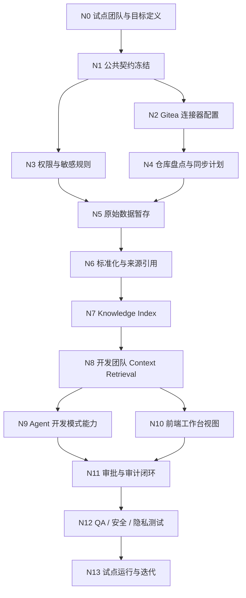
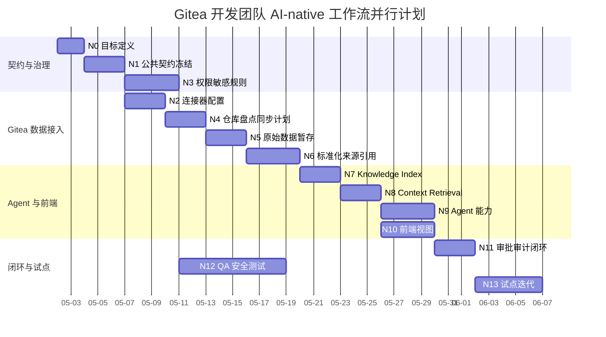
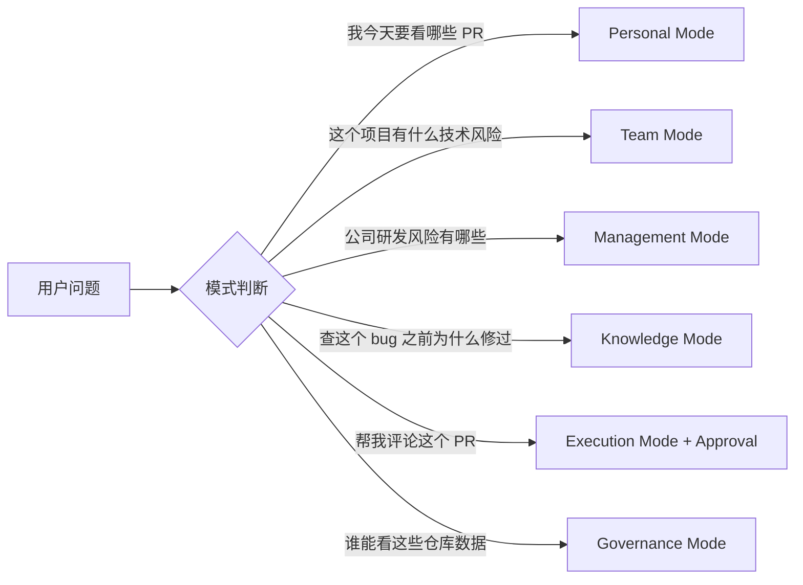
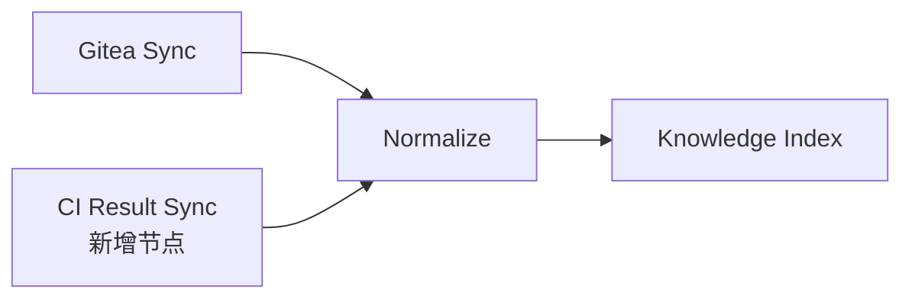


# 开发团队 AI-native 垂直工作流：接入 Gitea

本文描述一个以 Gitea 为开发团队核心数据源的 AI-native 垂直工作流。它既要让开发团队获得真实价值，也要保持 AgentOS 的项目初衷：不是代码仓库报表，不是员工监控，而是以工作流自动化为骨架、以共事 Agent 为体验核心、以组织记忆为长期复利的公司 AI OS。

## 1. 工作流目标

### 1.1 要解决什么

开发团队的真实状态通常散落在 Gitea 仓库、issue、PR、commit、分支、release、会议纪要和聊天记录里。管理者或 Tech Lead 很难稳定回答：

- 本周哪些仓库最活跃，哪些长期无更新？
- 哪些 issue 或 PR 正在阻塞项目？
- 哪些变更可能影响 release 风险？
- 某个需求从 issue 到 commit 到 PR 的链路是否闭环？
- 新成员如何快速理解一个仓库最近为什么这么改？
- Agent 能不能基于真实开发上下文帮我准备站会、周会、复盘、PR review 和发布前检查？

### 1.2 首版不做什么

- 不把 commit 数、issue 数做成员工绩效判断。
- 不默认输出“某员工卡住了”这种个人监控视图。
- 不做写回 Gitea 的自动执行，首版以只读为主；评论、建 issue、改状态等写动作必须走审批。
- 不把 Gitea 当成唯一事实来源；它只是开发证据之一，还要能接会议、文档、任务、客户事件等。

### 1.3 首版成功标准

- Gitea 数据能被标准化为 AgentOS 的 `NormalizedRecord` / `SourceReference`。
- 开发团队可以获得每日开发简报、项目风险摘要、PR/issue 阻塞提示、release 风险扫描。
- Agent 回答开发问题时能带出处，并区分事实、推断和建议。
- 高风险写动作进入审批队列，审批和审计可追溯到 Gitea 来源。
- 工作流节点可以通过简单插入、删除、修改，复刻到其他业务团队。

## 2. 垂直工作流总览



## 3. 节点清单：先后顺序与并行性

| 节点 | 名称 | 必须在前 | 可并行事项 | 主要交付物 | 验收口径 |
| --- | --- | --- | --- | --- | --- |
| N0 | 试点团队与目标定义 | 无 | 可与 N1 初稿并行 | 试点团队、仓库范围、核心问题列表 | 目标不是“看代码活跃度”，而是服务开发工作流 |
| N1 | 公共契约冻结 | N0 | 可与 N3 并行 | `NormalizedRecord`、`SourceReference`、Gitea entity mapping | Dev1/2/3/4 对字段语义一致 |
| N2 | Gitea 连接器配置 | N1 | 可与 N3、N10 UI 草图并行 | base URL、repo 范围、token 配置、只读限制 | 不泄露 token，连接失败有错误结构 |
| N3 | 权限与敏感规则 | N1 | 可与 N2、N12 测试用例并行 | 权限矩阵、敏感等级、过滤原因 | Private/Restricted 不进入错误上下文 |
| N4 | 仓库盘点与同步计划 | N2 | 可与 N5 暂存结构并行 | repo inventory、branch/ref 策略、分页策略 | 能处理空仓库、404、500、分页、限流 |
| N5 | 原始数据暂存 | N2、N3、N4 | 可与 N6 mapping 细化并行 | raw staging、sync run、error event | 原始数据不直接给 Agent 使用 |
| N6 | 标准化与来源引用 | N5 | 可与 N7 索引方案并行 | commit/issue/PR/release -> `NormalizedRecord` | 每条数据都有 source、owner、timestamp、sensitivity |
| N7 | Knowledge Index | N6 | 可与 N9 prompt 草案并行 | 关键词检索、过滤、source snippets | 检索结果可回溯来源 |
| N8 | 开发团队 Context Retrieval | N7 | 可与 N10 前端组件并行 | mode-aware retrieval rules | Team/Knowledge/Management 模式返回不同上下文 |
| N9 | Agent 开发模式能力 | N8 | 可与 N10 并行 | daily brief、PR prep、issue triage、release risk prompt | 回答可解释，事实/推断/建议分离 |
| N10 | 前端工作台视图 | N8 | 可与 N9 并行 | repo health、issue/PR 阻塞、source card、approval panel | 不呈现为员工监控界面 |
| N11 | 审批与审计闭环 | N9、N10 | 可与 N12 部分并行 | Gitea 写动作 approval schema、audit event | 写评论/建 issue/改状态必须审批 |
| N12 | QA / 安全 / 隐私测试 | N3 后可提前设计，N11 后完整执行 | 贯穿所有节点 | E2E、权限、泄露、Agent 行为测试 | 无 P0/P1 权限和隐私缺陷 |
| N13 | 试点运行与迭代 | N12 | 可与下一个团队 discovery 并行 | 试点报告、改进 backlog、复刻参数 | 形成可复制 workflow pack |

## 4. 可并行工作拆分



并行原则：

- N2 连接器配置、N3 权限规则、N10 前端草图可以在 N1 契约冻结后并行。
- N12 QA 用例不必等实现完成；权限、泄露、错误码、空数据、token 泄露等测试可以从 N3 开始设计。
- N9 Agent prompt 草案可以在 N7/N8 完成前基于 mock context 编写，但最终必须用真实 retrieval 输出验证。
- N13 试点运行时，可以并行启动下一个业务团队的 N0 discovery。

## 5. Gitea 数据接入范围

### 5.1 首版读取对象

| Gitea 对象 | AgentOS entity_type | 用途 |
| --- | --- | --- |
| repository | `project` / `code_repository` | 仓库范围、默认分支、活跃度背景 |
| branch/ref | `code_branch` | 识别开发线、release 分支、长期分叉 |
| commit | `code_change` | 变更事实、作者、时间、关联 issue/PR |
| issue | `task` / `dev_issue` | bug、需求、阻塞、待决策 |
| pull request | `pull_request` / `code_review` | review 状态、合并风险、阻塞 |
| release/tag | `release_event` | 发布节点、版本风险、回溯 |
| API error | `data_quality_event` | 同步失败、权限问题、仓库不可用 |

### 5.2 首版只读字段

最小字段：

- `source`: `gitea`
- `source_url`
- `external_id`
- `entity_type`
- `entity_id`
- `title`
- `content`
- `metadata`
- `owner_user_id`
- `team_id`
- `project_id`
- `timestamp`
- `permission_scope`
- `sensitivity`
- `sync_run_id`

Gitea 具体字段：

- repo: `full_name`、`default_branch`、`updated_at`
- branch: `name`
- commit: `sha`、`full_sha`、`message`、`author_name`、`author_email`、`date`、`branches`
- issue/PR: `number`、`title`、`state`、`author`、`assignee`、`labels`、`updated_at`
- error: `_error`、`_body`、`_url`、`resource`

### 5.3 只读边界

首版允许：

- 拉取 repo、branch、commit、issue、PR、release/tag。
- 做增量同步。
- 建 Knowledge Index。
- 给 Agent 和前端提供带来源上下文。

首版不直接允许：

- 自动创建 issue。
- 自动评论 PR。
- 自动关闭 issue。
- 自动合并 PR。
- 自动修改分支保护或仓库设置。

这些动作必须由 Agent 生成 `AgentAction`，进入 Approval Queue。

## 6. 开发团队 AI-native 场景

### 6.1 每日开发简报

输入：

- 昨日 commit、open issue、open PR、release 分支变化。
- 会议或项目上下文。
- 当前用户的权限范围。

输出：

- 今日优先级。
- 需要 review 的 PR。
- 可能阻塞的 issue。
- 需要同步给团队的风险。
- 建议动作，但不自动写回。

### 6.2 PR Review 准备

输入：

- PR 标题、描述、commit 列表、相关 issue、近期开会结论。

输出：

- review 关注点。
- 可能影响模块。
- 需要确认的问题。
- 可发布给作者的评论草稿。

高风险边界：

- 评论草稿可以生成。
- 真实发表评论必须审批。

### 6.3 Issue Triage

输入：

- open issues、labels、assignee、更新时间、关联 commit/PR。

输出：

- 需要分派的 issue。
- 长期无更新 issue。
- 可能重复 issue。
- 需要 PM/Tech Lead 决策的问题。

高风险边界：

- 改 label、改 assignee、关闭 issue 必须审批。

### 6.4 Release Risk Scan

输入：

- release 分支、近期 commit、未合并 PR、严重 issue、测试结果。

输出：

- release 风险列表。
- 风险原因与出处。
- 建议延后、补测或合并的动作。

高风险边界：

- 修改 release 状态、合并 PR、发正式 release note 必须审批。

### 6.5 技术决策记忆

输入：

- 关键 commit、PR 讨论、会议纪要、架构文档。

输出：

- “为什么这么改”的决策 memo。
- 后续新人 onboarding 的知识条目。
- 项目复盘材料。

边界：

- 私人共事讨论默认不进入组织记忆。
- 只有确认后的公开 memo 才进入团队上下文。

## 7. 模式路由规则



规则：

- Personal Mode 只返回当前用户授权的 issue、PR、review、提醒。
- Team Mode 返回团队项目、仓库、issue、PR、会议等协作上下文。
- Management Mode 返回聚合研发风险，不返回私人讨论和个人绩效式列表。
- Knowledge Mode 返回带出处检索结果。
- Execution Mode 只生成待审批动作，不直接写回 Gitea。
- Governance Mode 处理 token、权限、审计、同步失败与敏感访问。

## 8. 技术框架中的可复刻节点

此垂直工作流应被实现为一组可配置节点，而不是一次性项目。

```yaml
workflow_pack:
  id: dev-team-gitea-ai-native
  domain: development
  connector: gitea
  connector_runtime: backend_plugin
  external_permission_mapping: false
  entities:
    - repository
    - branch
    - commit
    - issue
    - pull_request
    - release_event
  modes:
    - Personal
    - Team
    - Management
    - Knowledge
    - Execution
    - Governance
  reusable_nodes:
    - discovery
    - contract
    - connector_config
    - permission_policy
    - sync
    - normalize
    - index
    - retrieval
    - agent_capability
    - frontend_surface
    - approval_audit
    - qa_gate
    - pilot_iteration
```

复刻到其他业务团队时，只替换：

- `domain`
- `connector`
- `entities`
- `mode rules`
- `business scenarios`
- `approval actions`
- `QA fixtures`

保留：

- `NormalizedRecord`
- `SourceReference`
- `ContextBundle`
- `Policy Gate`
- `Approval Queue`
- `AuditEvent`
- `Knowledge Index`
- `Workflow Pack` 节点结构

## 9. 插入、删除、修改节点的规则

### 9.1 插入节点

适用场景：

- 新增 CI/CD 数据源。
- 新增代码扫描结果。
- 新增 release note 草稿流程。

规则：

- 新节点必须声明输入、输出、权限和验收口径。
- 若节点产生可被 Agent 使用的数据，必须输出 `NormalizedRecord` 或 `ContextBundle`。
- 若节点产生外部动作，必须进入 Approval Queue。

示例：



### 9.2 删除节点

适用场景：

- 某团队没有 PR 流程。
- 某业务团队没有 release 概念。

规则：

- 删除业务节点不能删除权限、审计、来源引用节点。
- 删除数据源节点时，要保留 mock 或替代数据，避免演示和测试断裂。

### 9.3 修改节点

适用场景：

- 从 Gitea 换成 GitHub。
- 从开发团队换成客服团队。
- 从 issue triage 换成 customer ticket triage。

规则：

- 修改 connector 时，只改后端插件里的 fetch 和 entity mapping，不改 retrieval、approval、audit 的公共契约；外部系统权限首版各自鉴权，不映射到 AgentOS。
- 修改业务场景时，只改 prompt 和 UI surface，不改敏感数据默认规则。

## 10. 复刻示例：接入其他业务团队

| 目标团队 | 替换 connector | 替换实体 | 保留节点 | 典型 AI-native 场景 |
| --- | --- | --- | --- | --- |
| 客服团队 | 工单系统 / CRM | ticket、customer_event、sla | contract、policy、index、retrieval、approval、audit | 客户投诉原因检索、升级风险、回复草稿 |
| 销售团队 | CRM / 邮箱 | account、opportunity、email、meeting | contract、policy、index、retrieval、approval、audit | 商机简报、客户跟进、风险预测 |
| 运营团队 | 数据看板 / Notion | campaign、metric、incident | contract、policy、index、retrieval、approval、audit | 活动复盘、异常提醒、日报生成 |
| 产品团队 | Linear/Jira / Notion | feature、requirement、decision | contract、policy、index、retrieval、approval、audit | 需求梳理、版本风险、决策 memo |

## 11. 实施计划

### Phase 0：准备

- 确认试点开发团队。
- 确认 Gitea 实例、仓库范围、connector 后端插件载体和外部系统原生鉴权边界。
- 确认首版场景：每日简报、PR review、issue triage、release risk scan。

### Phase 1：数据底座

- 完成 Gitea 只读 connector 后端插件。
- 完成 raw staging、sync run、error event。
- 完成 `NormalizedRecord` 和 `SourceReference` mapping。

### Phase 2：检索与 Agent

- 完成 Knowledge Index。
- 完成 Context Retrieval。
- 完成开发团队 Agent prompt 和结构化回答。

### Phase 3：工作台与闭环

- 完成开发团队页面或组件。
- 完成审批动作：评论 PR、创建 issue、改 issue 状态、生成 release note。
- 完成审计链路。

### Phase 4：QA 与试点

- 完成权限、隐私、同步失败、Agent 行为测试。
- 选择小团队试点。
- 收集反馈并沉淀 `workflow_pack`。

### Phase 5：复刻

- 选择下一个业务团队。
- 替换 connector 和 entity mapping。
- 插入/删除/修改业务节点。
- 复用公共契约、权限、检索、审批、审计和 QA gate。

## 12. 风险清单

| 风险 | 影响 | 缓解 |
| --- | --- | --- |
| 把开发工作流做成仓库活跃度报表 | 偏离 AgentOS 初衷，引发监控感 | 管理视图只展示聚合风险和工作流阻塞，不展示个人排名 |
| token 泄露 | 高安全风险 | token 不落日志，不进 Agent 上下文，只在 connector 配置层使用 |
| Gitea API 错误或仓库不可用 | 数据不完整 | 记录 `DataQualityEvent`，UI 显示同步状态，允许 mock fallback |
| PR/issue 写回绕过审批 | 破坏 Suggest + Confirm | 所有写动作统一进入 Approval Queue |
| 数据源单一 | Agent 结论片面 | Gitea 只作为开发证据之一，后续接会议、任务、文档 |
| 私人讨论进入管理视图 | 破坏员工信任 | CoWork 私人上下文默认隔离，公开输出需确认 |

## 13. 最小验收清单

- Gitea connector 以后端插件形式可只读拉取 repo、branch、commit、issue、PR。
- 同步失败有结构化错误事件。
- 每条数据都有来源、时间、owner、AgentOS 可见性字段、敏感等级。
- 开发团队 Knowledge Mode 回答带出处。
- Team Mode 能生成项目/仓库风险摘要。
- Personal Mode 能生成个人开发简报。
- Management Mode 只输出聚合研发风险。
- 写回 Gitea 的动作必须进入审批。
- 审计日志能追溯 Agent 建议、来源、审批人和结果。
- QA 无 P0/P1 权限和隐私缺陷。
