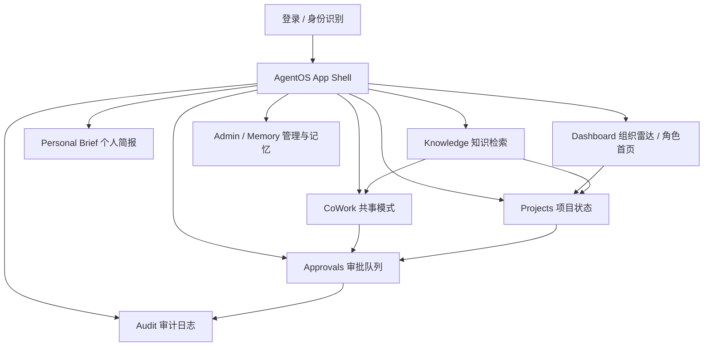

# AgentOS MVP 前端设计方案

## 1. 设计目标

AgentOS MVP 前端以 Web 工作台应用形式呈现，不做营销页或说明页。用户登录后直接进入可操作的工作台，通过角色化首页、统一 Agent 输出组件、审批闭环和审计追溯，让管理层、团队负责人和员工都能在可信边界内完成日常协作。

核心目标：

- 清楚表达 Agent 当前模式、数据来源、审批状态和下一步动作。
- 明确区分私人数据、团队数据和管理数据，避免形成员工监控感。
- 支持从 Agent 建议自然进入审批、发布和审计闭环。
- 在无真实后端阶段，通过 mock API 支撑完整 MVP 体验验证。

## 2. 产品定位

AgentOS Workbench 是一个面向组织内部的 AI 协作工作台。它不是单纯的聊天界面，而是把组织雷达、项目状态、个人简报、共事讨论、知识检索、审批队列和审计日志整合到同一个应用壳中。

应用体验应保持工作型、可信、克制：

- 信息密度适中，优先呈现可行动内容。
- 不使用夸张营销式视觉，不把首页做成宣传页。
- 管理视图关注趋势、风险和需要介入的事项，不展示个人行为流水。
- 员工视图优先保护私人工作上下文，公开输出必须由用户确认。

## 3. 用户角色

### 管理层 Executive

关注组织级聚合状态：

- 目标进展。
- 项目风险。
- 客户升级。
- 团队负载趋势。
- 待管理层介入事项。

管理层不应看到员工个人级细节，除非该信息已经被聚合、授权或进入正式审批/审计流程。

### 团队负责人 Manager

关注团队项目交付：

- 项目进展。
- 阻塞事项。
- 跨团队依赖。
- 待决策事项。
- 行动项和负责人。

团队负责人可看到团队范围数据，但不能访问成员的私人简报和私人共事内容。

### 员工 Employee

关注个人工作流：

- 今日优先级。
- 会议准备。
- 待回复事项。
- 被阻塞任务。
- 阻塞他人的任务。

员工的默认工作空间是私人空间，任何公开输出都需要显式确认。

### 系统管理员 Admin

关注系统运行状态与策略管理：

- 记忆条目管理（所有用户范围）。
- 全局审批策略配置。
- 用户权限概览。

Admin 角色在 MVP 阶段只开放 `/admin` 路由的完整访问权限。Admin 也可访问 Audit 全量记录（不受 `actorId` 限制）。Admin 默认路由为 `/admin`，需在 `CurrentUser.defaultRoute` 中补充 `"/admin"` 可选值。

## 4. 应用信息架构



## 5. 前端路由设计

| 路由 | 页面 | 核心用途 | 可访问角色 | 默认跳转 |
| --- | --- | --- | --- | --- |
| `/dashboard` | Dashboard | 角色化首页、组织雷达、关键风险摘要 | Executive / Manager | Executive、Manager 登录后默认 |
| `/projects` | Projects | 项目进展、阻塞、依赖、决策事项 | Executive / Manager | — |
| `/brief` | Personal Brief | 个人工作简报、今日优先级 | Employee（仅本人数据） | Employee 登录后默认 |
| `/cowork` | CoWork | 私人讨论、公开输出草稿、发布确认 | 全部角色（各自独立 thread） | — |
| `/approvals` | Approvals | 待审批动作、风险和影响范围判断 | Executive / Manager / 拥有 `approvals:review` 权限的员工 | — |
| `/knowledge` | Knowledge | 知识检索、事实/推断/出处展示 | 全部角色 | — |
| `/audit` | Audit | Agent 行为、审批人和结果追溯 | 拥有 `audit:view` 权限的角色（员工只看自身相关记录）；Admin 可查看全量记录 | — |
| `/admin` | Admin / Memory | 记忆管理、策略、系统状态 | Admin / 拥有 `memory:manage` 权限的角色 | Admin 登录后默认 |

**defaultRoute 逻辑**：前端在收到 `GET /me` 响应后，读取 `CurrentUser.defaultRoute` 字段并跳转。Employee 固定为 `/brief`，Executive/Manager 固定为 `/dashboard`。未包含在 `permissions` 中的路由，访问时展示"无权限"状态页，不做 404 处理。

MVP 阶段可使用前端状态模拟路由；正式工程建议使用 `react-router` 或同类路由库。

## 6. App Shell 设计

App Shell 包含：

- 左侧主导航：进入所有 MVP 页面。
- 顶部栏：当前页面标题、当前视角、用户信息、刷新和通知入口。
- 角色切换 mock：用于演示 Executive、Manager、Employee 的差异。
- 权限边界提示条：始终展示当前视角的数据边界。
- 主内容区：承载页面核心工作流。

布局原则：

- 桌面端使用左侧导航加主内容双区布局。
- 窄屏下导航收拢为顶部区域，页面内容改为单列。
- 表格、审批详情、共事双栏都需要移动端降级方案。

**移动端断点规格**：

| 断点 | 宽度 | 导航形态 | 内容变化 |
| --- | --- | --- | --- |
| desktop | ≥ 1024px | 左侧固定导航（宽 220px） | 双栏布局，表格完整列 |
| tablet | 768–1023px | 左侧可收拢导航（图标模式，宽 56px） | 双栏保留，部分列隐藏 |
| mobile | < 768px | 顶部 tab 栏，汉堡菜单展开全屏 | 单列，审批/来源进入抽屉式 Sheet |

移动端优先保证可用的交互：审批详情（批准/拒绝）、公开输出确认、来源查看。CoWork 双栏在移动端改为 tab 切换（私人讨论 / 公开输出）。

**RoleSwitcher 安全边界**：`RoleSwitcher` 仅在环境变量 `VITE_MOCK_ROLE=true` 为真时渲染（使用 Vite 构建时需 `VITE_` 前缀；若改用其他构建工具，对应调整前缀）。生产构建默认不传该变量，组件不挂载。演示环境需在构建参数中显式开启，避免未授权用户在生产环境切换权限视角。

## 7. 核心页面设计

### Dashboard

Dashboard 是角色化首页。

Executive 看到：

- 组织目标健康度。
- 高风险项目。
- 客户升级。
- 团队负载趋势。
- 待管理层介入事项。

Manager 看到：

- 团队项目准时率。
- 阻塞事项数量。
- 待决策事项。
- 团队负载。

Employee 不默认进入组织 Dashboard，优先进入 Personal Brief。

### Projects

Projects 用于呈现项目状态和推进闭环：

- 项目进展。
- 阻塞事项。
- 依赖关系。
- 待决策事项。
- 行动项。

每条项目摘要必须带来源或生成依据，用户可以从项目风险进入审批或共事讨论。

### Personal Brief

Personal Brief 是员工的私人工作入口：

- 今日优先级。
- 会议准备。
- 待回复事项。
- 被阻塞任务。
- 阻塞他人的任务。

页面必须明确标记私人边界，不得默认把个人上下文展示给团队或管理层。

### CoWork

CoWork 分为两个区域：

- 私人讨论区：用户与 Agent 讨论、整理思路、生成草稿。
- 公开输出区：memo、消息草稿、任务草稿等可发布内容。

公开输出必须经过用户确认。涉及外部渠道、高敏感内容或跨团队影响时，应进入 Approvals。

**各角色数据边界**：

| 角色 | 私人讨论区 | 公开输出区 |
| --- | --- | --- |
| Employee | 仅自己的 thread（`visibility: "private"`） | 仅自己发起的草稿 |
| Manager | 仅自己的 thread | 自己发起的草稿 + 团队范围内待审批草稿（`visibility: "team"`） |
| Executive | 仅自己的 thread | 自己发起的草稿 + 管理范围内待审批草稿（`visibility: "management"`） |

不同用户之间的私人 thread 互相不可见。Manager/Executive 可在公开输出区看到所在可见范围内的待确认草稿，但不能查看其他人的私人讨论内容。

### Approvals

Approvals 展示待审批动作：

- 动作内容。
- 目标工具。
- 来源。
- 影响范围。
- 风险等级。
- 审批状态。

用户必须能清楚判断是否批准。批准或拒绝后，状态应立即反映在 UI，并写入审计日志。

**各审批状态的 UI 处理**：

| `ApprovalStatus` | UI 表现 |
| --- | --- |
| `not_required` | 不进入队列，仅在 AgentOutputCard 中标注"无需审批" |
| `pending` | 高亮展示在队列顶部，批准/拒绝按钮可点击 |
| `approved` | 显示"已批准"badge，按钮禁用，展示审批人和时间 |
| `rejected` | 显示"已拒绝"badge，展示拒绝理由，按钮禁用 |
| `expired` | 显示"已过期"badge，说明因超时未处理自动失效；按钮禁用；在 Audit 中记录过期事件 |

过期审批不从队列中移除，保留可查看状态，支持在 Audit 中追溯过期原因。

### Knowledge

Knowledge 用于知识检索：

- 展示答案。
- 区分事实和推断。
- 展示出处。
- 对无来源回答标记“不确定”。

知识检索结果可以被引用到 CoWork、Projects 或 Agent 输出组件中。

### Audit

Audit 用于追溯：

- Agent 做过什么。
- 谁批准了动作。
- 动作结果是什么。
- 风险等级和影响范围是什么。

支持按时间、用户、动作、风险等级筛选。未授权用户不能看到不属于自己的审计记录。

### Admin / Memory

Admin / Memory 管理基础记忆和策略：

- 记忆条目。
- 可见范围。
- 敏感等级。
- 引用次数。
- 归档和删除操作。

MVP 阶段只需支持基础列表和管理入口。

## 8. 核心组件清单

| 组件 | 用途 |
| --- | --- |
| `AppShell` | 应用整体布局、导航、顶部栏 |
| `RoleSwitcher` | 角色切换 mock |
| `BoundaryStrip` | 当前视角的数据边界提示 |
| `AgentOutputCard` | 统一展示 Agent 输出 |
| `SourceReference` | 来源、生成依据和引用展示 |
| `MetricCard` | 首页指标 |
| `ProjectStatusItem` | 项目状态摘要 |
| `ApprovalQueue` | 审批列表 |
| `ApprovalDetail` | 审批详情与批准/拒绝 |
| `AuditFilter` | 审计筛选 |
| `AuditTable` | 审计记录 |
| `CoWorkThread` | 私人讨论区 |
| `PublicOutputPanel` | 公开输出确认区 |
| `KnowledgeAnswer` | 答案展示 |
| `FactInferenceSource` | 事实/推断/出处分区 |
| `MemoryList` | 记忆管理列表 |
| `EmptyState` | 空状态 |
| `ErrorState` | 错误状态（含 `type` prop: `"forbidden"` / `"not_found"` / `"internal"` / `"unauthorized"`） |
| `LoadingState` | 加载状态 |
| `ConfidenceWarningBanner` | `confidence: "low"` 警告条，复用于 AgentOutputCard 和 KnowledgeAnswer |
| `Toast` | 全局轻提示（APPROVAL_REQUIRED 等非阻断通知） |
| `Sheet` | 移动端抽屉式容器（审批详情、来源列表在 mobile 断点下的降级容器） |
| `CitationTargetSelector` | 引用目标选择器（知识引用到 CoWork thread 或 Project 时的弹窗） |

## 9. Agent 输出组件规范

所有 Agent 输出必须使用统一组件，包含：

- 模式：诊断、建议、执行准备、私人助理、知识回答等。
- 标题：一句话摘要。
- 正文：可读解释。
- 来源：数据来源、文档、任务、会议、API 或用户输入。
- 审批状态：`not_required`（无需审批）/ `pending`（待审批）/ `approved`（已批准）/ `rejected`（已拒绝）/ `expired`（已过期）。
- 下一步动作：查看项目、进入审批、生成草稿、查看来源等。
- 不确定性：无来源或低置信内容必须标记。

**置信度视觉规格**：

| `confidence` | 视觉表达 |
| --- | --- |
| `high` | 无额外标记，正常展示 |
| `medium` | 卡片右上角显示"中等置信"文字 badge（中性色） |
| `low` | 卡片顶部显示黄色警告条："内容基于有限来源，建议人工核实"；正文文字颜色降低对比度；`hasMissingSources: true` 时额外显示"部分来源缺失"inline 标记 |

`confidence: "low"` 的 AgentOutputCard 不隐藏内容，但"批准"和"发布"类动作按钮显示为次级样式，并在 tooltip 中说明置信度偏低。

示例字段（结构与 §13.5 `AgentOutput` 接口保持一致）：

```json
{
  "id": "agent_out_preview",
  "mode": "suggestion",
  "title": "客户可见输出需要走确认",
  "body": "涉及外部客户频道的摘要已标记为高风险，公开前必须由负责人确认内容和影响范围。",
  "confidence": "medium",
  "visibility": "team",
  "sensitivity": "high",
  "sources": [
    { "id": "src_001", "type": "message", "title": "CoWork 讨论", "sensitivity": "high", "visibility": "private" }
  ],
  "approval": {
    "required": true,
    "status": "pending",
    "approvalId": "approval_001",
    "reason": "外部发布且包含项目风险"
  },
  "actions": [
    { "id": "act_001", "label": "进入审批", "type": "open_approval", "target": "approval_001" },
    { "id": "act_002", "label": "查看来源", "type": "view_sources" }
  ],
  "createdAt": "2026-04-30T09:15:00Z"
}
```

## 10. 数据边界设计

### 私人数据

包括个人简报、私人 CoWork 讨论、个人偏好记忆。默认仅本人可见。

UI 表达：

- 使用“私人”标记。
- 不出现在团队 Dashboard。
- 公开前必须确认。

### 团队数据

包括项目进展、团队阻塞、行动项、团队会议输出。

UI 表达：

- 使用“团队可见”标记。
- 展示负责人和状态，但避免个人监控式行为明细。

### 管理数据

包括组织级聚合、风险趋势、客户升级、管理层待介入事项。

UI 表达：

- 使用聚合指标和风险摘要。
- 不展示未经授权的个人上下文。

### 公开数据

`visibility: "public"` 用于已正式发布、面向组织内所有成员或外部受众的内容，例如已审批通过并发布的 memo、正式公告或归档报告。

UI 表达：

- 无边界颜色标记（无 `BoundaryStrip`）。
- 展示发布时间和审批人，供追溯。
- 公开内容仍保留 `sources` 和 `AuditRecord`，但不受数据边界访问控制限制。

MVP 阶段 `visibility: "public"` 主要出现在已发布的 `PublicOutputDraft` 和对应的 `AuditRecord` 中，不作为独立页面入口。

## 11. 关键交互流程

### 从 Agent 建议到审批

1. Agent 在 Dashboard、Projects 或 CoWork 中提出建议。
2. UI 展示来源、风险等级和影响范围。
3. 若动作需要授权，显示”进入审批”。
4. 用户进入 Approvals 查看详情。
5. 用户批准或拒绝（拒绝需填写原因）。
6. 审批结果写入 Audit（新增一条 `approve_action` 或 `reject_action` 记录，原 `request_approval` 记录保持不变）。
7. 用户返回来源页（Dashboard/Projects/CoWork），原 `AgentOutputCard` 的 `approval.status` 更新为 `approved` 或 `rejected`；若关联的 `PublicOutputDraft` 存在，其 `status` 同步变更（`approval_pending → published` 或 `→ draft`）。

### 从私人讨论到公开输出

1. 用户在 CoWork 私人讨论区与 Agent 讨论。
2. Agent 生成 memo、消息草稿或任务草稿，草稿状态为 `draft`。
3. 用户在公开输出区看到草稿，点击"确认发布"，草稿状态变为 `confirmed`。
4. 系统判断风险等级：
   - `sensitivity: "high"` 或目标为外部系统：状态变为 `approval_pending`，进入 Approvals 队列，写入 `request_approval` 审计记录。
   - 其他情况（低/中风险、内部目标）：状态直接变为 `published`，写入 `publish_output` 审计记录。
5. 高风险路径：审批通过后状态变为 `published`，写入 `approve_action` + `publish_output` 两条审计记录；审批拒绝后状态回退为 `draft`，写入 `reject_action` 审计记录。
6. 用户可在任意阶段点击"撤回"，状态变为 `withdrawn`（终态），写入 `withdraw_output` 审计记录。

### 从知识检索到引用

1. 用户在 Knowledge 中提出问题。
2. Agent 返回答案。
3. UI 区分事实、推断和出处。
4. 用户查看来源。
5. 用户点击事实或推断条目上的"引用"动作（`AgentAction.type: "cite_in_cowork"` 或 `"cite_in_project"`）。
6. 前端打开目标选择器（选择 CoWork thread 或 Project 条目），将 `KnowledgeFact` 或 `KnowledgeInference` 的内容和 `sources` 插入目标上下文。
7. 引用内容在目标页面以 `SourceReference` 形式展示，`type: "document"`，`title` 为知识答案标题，`excerpt` 为原文摘要。

## 12. Mock API 设计建议

MVP 阶段需要前端可独立运行，建议提供以下 mock adapter：

**用户与导航**
- `GET /me`：当前用户、角色和权限。

**Dashboard / Projects / Brief**
- `GET /dashboard?role=`：角色化首页数据。
- `GET /projects?teamId=&status=on_track|at_risk|blocked|done&page=&pageSize=`：项目状态列表，支持团队和状态筛选及分页。
- `GET /brief`：当前用户个人简报（仅返回自己的数据）。

**Agent 输出**
- `GET /agent-output?context=dashboard|projects|brief|cowork`：按页面上下文返回对应的 Agent 输出列表；各页面 embedded `agentOutputs` 字段已内联，此端点供独立展示区使用。

**CoWork**
- `GET /cowork/threads`：当前用户的 thread 列表（仅自己可见）。
- `POST /cowork/threads`：新建 thread。
- `GET /cowork/threads/:id`：单个 thread 详情含消息和公开草稿。
- `POST /cowork/threads/:id/messages`：发送消息。
- `GET /cowork/public-outputs?visibility=team|management`：Manager/Executive 查看可见范围内待确认草稿。
- `POST /cowork/public-outputs/:id/confirm`：用户确认公开输出。
- `POST /cowork/public-outputs/:id/withdraw`：撤回公开输出草稿（状态变为 `withdrawn`）。

**Approvals**
- `GET /approvals?status=pending|approved|rejected|expired&page=&pageSize=`：审批队列，支持状态筛选和分页。
- `GET /approvals/:id`：审批详情。
- `POST /approvals/:id/approve`：批准（`reason` 可选）。
- `POST /approvals/:id/reject`：拒绝（`reason` 必填，mock 层校验非空）。

**Knowledge**
- `GET /knowledge/search?q=`：知识检索，返回答案、事实、推断和出处。

**Audit**
- `GET /audit`：审计日志，支持 `from`、`to`、`actorId`、`actionType`、`riskLevel`、`page`、`pageSize` 参数。

**Memory**
- `GET /memory`：记忆列表（默认 `status=active,archived`；`showDeleted=true` 时额外返回已删除条目）。
- `PATCH /memory/:id/archive`：归档记忆。
- `DELETE /memory/:id`：软删除记忆（状态变为 `deleted`，不物理删除）。

所有 mock 数据需要带 `visibility` 字段：

```json
{
  "visibility": "private | team | management",
  "sensitivity": "low | medium | high",
  "sources": []
}
```

## 13. API 数据结构

以下数据结构用于前端、Dev 1 API contract、Dev 2 Agent response schema 和 Dev 4 知识检索结果对齐。字段命名建议在正式工程中保持稳定，前端组件和 E2E 测试都应围绕这些结构建立。

### 13.1 通用枚举

```ts
type Role = "executive" | "manager" | "employee" | "admin";

type Visibility = "private" | "team" | "management" | "public";

type Sensitivity = "low" | "medium" | "high";

type RiskLevel = "low" | "medium" | "high" | "critical";

type ApprovalStatus =
  | "not_required"
  | "pending"
  | "approved"
  | "rejected"
  | "expired";

type AgentMode =
  | "diagnosis"
  | "suggestion"
  | "execution_prepare"
  | "personal_assistant"
  | "knowledge_answer"
  | "audit_explain";

type Confidence = "low" | "medium" | "high";
```

### 13.2 通用响应包装

```ts
interface ApiResponse<T> {
  data: T;
  requestId: string;
  // AI 生成内容（AgentOutput、KnowledgeSearchResponse、DashboardResponse 等）的生成时间；
  // 非 AI 数据（CurrentUser、MemoryItem 等）此字段等同于响应时间戳，前端不用于显示"内容新鲜度"
  generatedAt: string;
}

interface ApiError {
  code:
    | "UNAUTHORIZED"
    | "FORBIDDEN"
    | "NOT_FOUND"
    | "VALIDATION_ERROR"
    | "APPROVAL_REQUIRED"
    | "INTERNAL_ERROR";
  message: string;
  requestId: string;
  details?: Record<string, unknown>;
}
```

### 13.3 用户与权限

`GET /me` 返回当前登录用户、角色和可见范围。前端用它决定默认首页、导航权限和数据边界提示。

```ts
interface CurrentUser {
  id: string;
  name: string;
  title: string;
  role: Role;
  teamId?: string;
  teamName?: string;
  permissions: Permission[];
  defaultRoute: "/dashboard" | "/projects" | "/brief" | "/cowork" | "/admin";
}

interface Permission {
  key:
    | "dashboard:view_management"
    | "projects:view_team"
    | "brief:view_self"
    | "cowork:use"
    | "approvals:review"
    | "knowledge:search"
    | "audit:view"
    | "memory:manage";
  scope: Exclude<Visibility, "public">;  // 权限边界只有 private / team / management 三档；public 内容无访问控制
}

interface BoundaryNotice {
  id: string;
  label: string;
  visibility: Visibility;
  description: string;
}
```

示例：

```json
{
  "data": {
    "id": "user_001",
    "name": "周远",
    "title": "产品负责人",
    "role": "manager",
    "teamId": "team_product",
    "teamName": "产品平台组",
    "permissions": [
      { "key": "projects:view_team", "scope": "team" },
      { "key": "approvals:review", "scope": "team" }
    ],
    "defaultRoute": "/dashboard"
  },
  "requestId": "req_001",
  "generatedAt": "2026-04-30T09:00:00Z"
}
```

### 13.4 Source Reference

所有 Agent 输出、项目摘要、知识答案和审批详情都应复用来源结构。

```ts
interface SourceReference {
  id: string;
  type:
    | "document"
    | "task"
    | "meeting"
    | "message"
    | "api"
    | "memory"
    | "manual_input";
  title: string;
  excerpt?: string;
  url?: string;
  owner?: UserLite;   // 统一用 UserLite，与其他接口一致（原 string 类型不够）
  updatedAt?: string;
  sensitivity: Sensitivity;
  visibility: Visibility;
}
```

### 13.5 Agent 输出

`GET /agent-output` 或各页面内嵌返回。前端统一用 `AgentOutputCard` 渲染。

```ts
interface AgentOutput {
  id: string;
  mode: AgentMode;
  title: string;
  body: string;
  confidence: Confidence;
  visibility: Visibility;
  sensitivity: Sensitivity;
  sources: SourceReference[];
  approval: ApprovalSummary;
  actions: AgentAction[];
  createdAt: string;
  updatedAt: string;  // 审批状态变更、来源更新时刷新；前端用于判断内容是否过期需重新拉取
}

interface ApprovalSummary {
  required: boolean;
  status: ApprovalStatus;
  approvalId?: string;
  reason?: string;
}

interface AgentAction {
  id: string;
  label: string;
  type:
    | "open_route"
    | "open_approval"
    | "create_draft"
    | "create_task"
    | "view_sources"
    | "cite_in_cowork"    // 将知识答案/事实引用到指定 CoWork thread
    | "cite_in_project"   // 将知识答案/事实引用到指定项目说明或决策事项
    | "dismiss";
  target?: string;        // open_route: 路由路径; open_approval: approvalId; cite_*: threadId 或 projectId
  disabled?: boolean;
  disabledReason?: string;
}
```

示例：

```json
{
  "id": "agent_out_001",
  "mode": "suggestion",
  "title": "客户可见输出需要走确认",
  "body": "涉及外部客户频道的摘要已标记为高风险，公开前必须由负责人确认内容和影响范围。",
  "confidence": "medium",
  "visibility": "team",
  "sensitivity": "high",
  "sources": [
    {
      "id": "src_001",
      "type": "message",
      "title": "CoWork 讨论",
      "sensitivity": "high",
      "visibility": "private"
    }
  ],
  "approval": {
    "required": true,
    "status": "pending",
    "approvalId": "approval_001",
    "reason": "外部发布且包含项目风险"
  },
  "actions": [
    { "id": "act_001", "label": "进入审批", "type": "open_approval", "target": "approval_001" },
    { "id": "act_002", "label": "查看来源", "type": "view_sources" }
  ],
  "createdAt": "2026-04-30T09:15:00Z"
}
```

### 13.6 Dashboard

`GET /dashboard?role=` 返回角色化首页数据。**安全注记**：真实后端不应信任 `role` 查询参数，应从认证 token 中派生角色；此参数仅在 mock 阶段用于模拟不同视角，正式工程需移除。

```ts
interface DashboardResponse {
  role: Role;
  scopeLabel: string;
  boundaryNotices: BoundaryNotice[];
  metrics: MetricItem[];
  highlights: StatusItem[];
  agentOutputs: AgentOutput[];
}

interface MetricItem {
  id: string;
  label: string;
  value: string | number;
  trend?: {
    direction: "up" | "down" | "flat";
    isPositive: boolean;  // true = 方向对业务有利（如准时率上升）；false = 方向有害（如团队负载上升）
    label: string;        // 人可读描述，如 "较上周 +12%"
  };
  riskLevel?: RiskLevel;
  visibility: Visibility;
}

interface StatusItem {
  id: string;
  title: string;
  summary: string;
  status: "healthy" | "watch" | "blocked" | "done";
  riskLevel: RiskLevel;
  visibility: Visibility;
  sources: SourceReference[];
  nextAction?: AgentAction;
}
```

### 13.7 Projects

`GET /projects` 返回项目列表、依赖、阻塞和待决策事项。

```ts
interface ProjectsResponse {
  projects: Project[];
  decisions: DecisionItem[];
  page: number;
  pageSize: number;
  total: number;
}

interface Project {
  id: string;
  name: string;
  owner: UserLite;
  teamId: string;
  status: "on_track" | "at_risk" | "blocked" | "done";
  progressPercent: number;
  riskLevel: RiskLevel;
  summary: string;
  blockers: Blocker[];
  dependencies: Dependency[];
  actionItems: ActionItem[];
  sources: SourceReference[];
  visibility: Visibility;
}

interface UserLite {
  id: string;
  name: string;
  title?: string;
}

interface Blocker {
  id: string;
  title: string;
  owner?: UserLite;
  severity: RiskLevel;
  dueAt?: string;
  sources: SourceReference[];  // Agent 识别该阻塞事项的依据
}

interface Dependency {
  id: string;
  title: string;
  fromTeamId: string;    // 原 fromTeam 重命名，明确为 ID
  fromTeamName: string;  // 展示用名称，不依赖前端二次查询
  toTeamId: string;
  toTeamName: string;
  status: "open" | "waiting" | "resolved";
}

interface DecisionItem {
  id: string;
  title: string;
  description: string;
  dueAt?: string;
  owner?: UserLite;
  riskLevel: RiskLevel;
  sources: SourceReference[];
}

interface ActionItem {
  id: string;
  title: string;
  owner?: UserLite;
  status: "todo" | "doing" | "done" | "blocked";
  dueAt?: string;
  sources?: SourceReference[];  // Agent 从哪些上下文中识别出该行动项
}
```

### 13.8 Personal Brief

`GET /brief` 只返回当前用户自己的私人工作简报。

```ts
interface PersonalBriefResponse {
  user: UserLite;
  date: string;  // 格式 YYYY-MM-DD，表示该简报覆盖的工作日（通常为当天，可预生成次日）
  priorities: BriefItem[];
  meetingPrep: BriefItem[];
  replies: BriefItem[];
  blockedByOthers: BriefItem[];
  blockingOthers: BriefItem[];
  agentOutputs: AgentOutput[];
}

interface BriefItem {
  id: string;
  title: string;
  summary?: string;
  sourceType: "task" | "calendar" | "message" | "memory";  // "mention" 归入 "message" 类型处理
  dueAt?: string;
  priority: "low" | "medium" | "high";
  visibility: "private";
  sources: SourceReference[];
}
```

### 13.9 CoWork

端点概览：`GET /cowork/threads`（列表摘要，不含消息体）、`POST /cowork/threads`（新建）、`GET /cowork/threads/:id`（完整详情含消息和草稿）、`POST /cowork/threads/:id/messages`（发送消息）、`GET /cowork/public-outputs?visibility=`（Manager/Executive 跨线程草稿查询）、`POST /cowork/public-outputs/:id/confirm`（确认）、`POST /cowork/public-outputs/:id/withdraw`（撤回）。

```ts
// 列表视图用轻量摘要，不含 messages 和 publicOutputs
interface CoWorkThreadSummary {
  id: string;
  title: string;
  owner: UserLite;
  visibility: "private";
  lastMessageAt: string;
  draftCount: number;   // 当前未确认草稿数，列表中展示徽标
}

// 详情视图返回完整 thread
interface CoWorkThread {
  id: string;
  title: string;
  owner: UserLite;
  visibility: "private";
  messages: CoWorkMessage[];
  publicOutputs: PublicOutputDraft[];
}

interface CoWorkMessage {
  id: string;
  authorType: "user" | "agent";
  author?: UserLite;      // authorType 为 "user" 时存在
  agentMode?: AgentMode;  // authorType 为 "agent" 时存在，用于在消息旁展示 Agent 当前模式标签
  body: string;
  createdAt: string;
  sources?: SourceReference[];
}

interface PublicOutputDraft {
  id: string;
  threadId: string;           // 所属 CoWork thread，Manager 跨线程查看草稿时用于回溯来源
  type: "memo" | "message" | "task";
  title: string;
  body: string;
  targetTool?: "slack" | "email" | "linear" | "notion";
  targetLabel?: string;
  riskLevel: RiskLevel;
  sensitivity: Sensitivity;
  // 状态流转：draft → confirmed → approval_pending → published
  //                                                 ↘ rejected（审批拒绝）→ draft（可重新编辑）
  //           draft → withdrawn（用户在任意阶段主动撤回，终态）
  status: "draft" | "confirmed" | "approval_pending" | "published" | "withdrawn";
  requiresApproval: boolean;
  approvalId?: string;
  sources: SourceReference[];
  createdAt: string;
  updatedAt: string;
}
```

### 13.10 Approvals

`GET /approvals` 返回队列，`GET /approvals/:id` 返回详情，批准和拒绝接口返回更新后的审批对象。

```ts
interface ApprovalsResponse {
  items: ApprovalRequest[];
  page: number;
  pageSize: number;
  total: number;
}

interface ApprovalRequest {
  id: string;
  title: string;
  description: string;
  requester: UserLite | { id: "agent"; name: "Agent" };
  reviewer?: UserLite;      // 未分配时为 undefined，UI 展示"待分配审批人"；MVP 阶段由 mock 数据预填
  status: ApprovalStatus;
  riskLevel: RiskLevel;
  sensitivity: Sensitivity;
  action: ApprovalAction;
  impact: ApprovalImpact;
  sources: SourceReference[];
  createdAt: string;
  expiresAt?: string;       // pending 状态下展示倒计时；超时后 status 变为 expired
  decidedAt?: string;
  decisionReason?: string;
}

interface ApprovalAction {
  type:
    | "publish_message"
    | "create_task"
    | "update_project"
    | "archive_memory"
    | "call_external_tool";
  targetTool: string;
  targetLabel: string;
  payloadPreview: Record<string, unknown>;
}

interface ApprovalImpact {
  scope: Visibility;
  affectedUsers?: UserLite[];
  externalAudience?: string;
  summary: string;
}

interface ApprovalDecisionRequest {
  reason?: string;  // 批准时可选；拒绝时后端校验必填，前端表单同步要求必填
}
```

### 13.11 Knowledge

`GET /knowledge/search?q=` 返回答案、事实、推断和出处。

```ts
interface KnowledgeSearchResponse {
  query: string;
  answer: KnowledgeAnswer;
  relatedSources: SourceReference[];  // 最多返回 10 条；MVP 不分页，超出截断并在 UI 标注"更多来源已省略"
}

interface KnowledgeAnswer {
  id: string;
  body: string;
  confidence: Confidence;
  hasMissingSources: boolean;
  facts: KnowledgeFact[];
  inferences: KnowledgeInference[];
}

interface KnowledgeFact {
  id: string;
  text: string;
  sources: SourceReference[];
}

interface KnowledgeInference {
  id: string;
  text: string;
  basis: SourceReference[];
  confidence: Confidence;
}
```

### 13.12 Audit

`GET /audit` 支持按时间、用户、动作、风险等级筛选。

```ts
interface AuditQuery {
  from?: string;
  to?: string;
  actorId?: string;
  actionType?: AuditRecord["actionType"];  // 收紧为枚举值，避免传入无效字符串
  riskLevel?: RiskLevel;
  page?: number;
  pageSize?: number;
}

interface AuditResponse {
  items: AuditRecord[];
  page: number;
  pageSize: number;
  total: number;
}

interface AuditRecord {
  id: string;
  occurredAt: string;
  actor: UserLite | { id: "agent"; name: "Agent" };
  actionType:
    | "read_source"
    | "generate_output"
    | "request_approval"
    | "approve_action"
    | "reject_action"
    | "expire_approval"   // 审批超时自动过期时系统写入
    | "publish_output"
    | "withdraw_output"   // 用户撤回公开草稿
    | "cite_source"       // 知识引用到 CoWork 或 Project
    | "update_memory"
    | "archive_memory"
    | "delete_memory";
  targetType: "project" | "approval" | "cowork" | "knowledge" | "memory" | "external_tool";
  targetId?: string;
  // "pending" 仅用于 request_approval 动作：审批发起后立即写入，结果出来后追加新记录（approve/reject/expire）
  // 不在原记录上更新，保持 Audit 只追加语义
  result: "success" | "failed" | "denied" | "pending";
  riskLevel: RiskLevel;
  visibility: Visibility;
  summary: string;
  approvalId?: string;
  sources?: SourceReference[];
}
```

### 13.13 Memory

`GET /memory` 返回当前用户可管理的记忆。MVP 阶段只需要列表、归档和删除。

```ts
interface MemoryResponse {
  items: MemoryItem[];
}

interface MemoryItem {
  id: string;
  title: string;
  body: string;
  owner: UserLite;
  visibility: Visibility;
  sensitivity: Sensitivity;
  source?: SourceReference;
  usageCount: number;
  status: "active" | "archived" | "deleted";
  createdAt: string;
  updatedAt: string;
}
```

### 13.14 前端数据使用原则

- 前端不能仅根据页面隐藏实现权限控制，接口也必须按用户权限过滤数据。
- 所有可被 Agent 引用的数据都必须带 `sources` 或明确标记 `hasMissingSources`。
- 任何 `sensitivity: "high"` 且目标为外部系统的动作，默认需要审批。
- `visibility: "private"` 的内容不得进入 Dashboard 管理视图，除非生成的是匿名聚合结果。
- 审批、发布、记忆变更必须产生 `AuditRecord`。

### 13.15 ApiError 错误码对应 UI 行为

| `ApiError.code` | 触发场景 | 前端 UI 行为 |
| --- | --- | --- |
| `UNAUTHORIZED` | 未登录或 token 失效 | 清空本地会话，跳转登录页 |
| `FORBIDDEN` | 已登录但无权访问该资源 | 展示"无权限"状态页（`ErrorState` with `type="forbidden"`），不做 404 处理 |
| `NOT_FOUND` | 资源不存在（如 approvalId 无效） | 展示"内容不存在"状态页，提供返回上一级导航 |
| `VALIDATION_ERROR` | 请求参数不合法 | 在表单或操作区域内联展示字段级错误；`details` 字段映射到具体表单项 |
| `APPROVAL_REQUIRED` | 动作需要审批但未经审批直接提交 | Toast 提示"此动作需要审批"，并提供"进入审批"快捷跳转；不展示通用错误弹窗 |
| `INTERNAL_ERROR` | 服务端未知错误 | 展示"服务暂时不可用"状态页，提供重试按钮；控制台输出 `requestId` 供排查 |

### 13.16 Memory 已删除条目显示规则

`MemoryItem.status` 的展示规则：

- `active`：正常展示，支持归档和删除操作。
- `archived`：以灰色降调样式展示，标注"已归档"badge；支持恢复和永久删除操作，不支持引用。
- `deleted`：默认不出现在列表中。列表顶部提供"显示已删除"开关（默认关闭），开启后以删除线样式展示已删除条目，仅支持查看，不支持任何写操作。已删除条目仍在 Audit 中保留变更记录。

## 14. 视觉与体验原则

- 使用工作台式布局，避免营销页视觉。
- 控件清晰、密度适中、信息可扫描。
- 风险和审批状态使用稳定颜色标识。
- 卡片只用于具体条目、详情和工具区域，不把整页 section 做成装饰卡片。
- 页面内文字避免解释功能本身，优先呈现业务内容。
- 移动端优先保证审批详情、公开确认、来源查看可用。

**风险与状态颜色规范**（语义 token，具体色值由设计系统定义）：

| 语义 token | 适用场景 | 参考色调 |
| --- | --- | --- |
| `color.risk.critical` | `riskLevel: "critical"` | 红色系（如 #DC2626） |
| `color.risk.high` | `riskLevel: "high"` | 橙红色系（如 #EA580C） |
| `color.risk.medium` | `riskLevel: "medium"` | 琥珀色系（如 #D97706） |
| `color.risk.low` | `riskLevel: "low"` | 绿色系（如 #16A34A） |
| `color.approval.pending` | `ApprovalStatus: "pending"` | 蓝色系（如 #2563EB） |
| `color.approval.approved` | `ApprovalStatus: "approved"` | 绿色系（同 low） |
| `color.approval.rejected` | `ApprovalStatus: "rejected"` | 红色系（同 critical） |
| `color.approval.expired` | `ApprovalStatus: "expired"` | 灰色系（如 #6B7280） |
| `color.confidence.low` | `confidence: "low"` 警告条 | 黄色系（如 #CA8A04） |
| `color.boundary.private` | 私人边界标记 | 紫色系（如 #7C3AED） |
| `color.boundary.team` | 团队边界标记 | 青色系（如 #0891B2） |
| `color.boundary.management` | 管理边界标记 | 靛蓝色系（如 #4338CA） |

所有颜色不得仅靠色彩传达状态，必须同时提供文字 label 或图标，以满足无障碍要求。

## 15. 状态设计

**页面级状态**（每个核心页面都需要覆盖）：

- 加载状态：骨架屏占位，不使用全屏 spinner，避免布局抖动。
- 空状态：无数据时展示引导文字，说明数据来源和可能的原因。
- 错误状态：区分 `forbidden` / `not_found` / `internal`，不统一显示"出错了"。
- 无权限状态：`forbidden` 型错误，保留导航，提示当前视角和可用路由。
- 审批处理中状态：用户点击批准/拒绝后，按钮进入 loading，页面不跳转，结果返回后就地更新状态。

**组件级状态**（在相关组件内部处理，不上升为页面状态）：

- 来源缺失状态（`AgentOutputCard`、`KnowledgeAnswer`）：`hasMissingSources: true` 时 inline 展示"部分来源缺失"标记。
- 低置信状态（`AgentOutputCard`、`KnowledgeAnswer`）：`confidence: "low"` 时展示 `ConfidenceWarningBanner`。
- 审批成功/失败状态（`ApprovalDetail`）：批准/拒绝后就地切换 badge 和按钮状态，不刷新整页。

## 16. QA 验收路径

核心 E2E 路径：

- Executive 登录后进入 Dashboard，看到组织级聚合状态。
- Manager 登录后进入 Dashboard/Projects，看到团队项目状态。
- Employee 登录后进入 Personal Brief，看到个人工作简报。
- 用户从 CoWork 生成公开输出，并在确认后进入审批。
- 用户在 Approvals 中批准或拒绝动作，Audit 中出现记录。
- 审批状态为 `expired` 时，队列中显示"已过期"badge，批准/拒绝按钮禁用，Audit 中存在过期事件记录。
- 用户在 Knowledge 中检索答案，并能查看事实、推断和出处。
- 用户点击知识事实上的"引用"动作，选择 CoWork thread，引用内容出现在 thread 中并携带来源。
- 未授权用户访问 Audit 或管理级数据时看到无权限状态（非 404）。
- 所有 Agent 输出都包含模式、来源、审批状态和下一步动作。
- `confidence: "low"` 的 Agent 输出卡片显示黄色警告条，"批准"/"发布"按钮为次级样式。
- FORBIDDEN 错误返回时展示无权限状态页；APPROVAL_REQUIRED 错误返回时显示 Toast 并提供审批跳转。
- Employee 直接访问 `/dashboard` 时看到无权限状态页，而非 404。
- Manager 在 CoWork 公开输出区看到团队范围内的待确认草稿，不能看到其他人的私人 thread。
- 用户撤回公开草稿后，草稿状态变为 `withdrawn`，不可再操作，Audit 中出现 `withdraw_output` 记录。
- Memory 列表默认不显示已删除条目；开启"显示已删除"开关后，已删除条目以删除线样式展示，不可编辑。
- RoleSwitcher 切换为 Executive 后，Dashboard 展示组织级聚合指标，不显示员工个人数据。
- 知识引用到 Projects 场景：用户在 Knowledge 点击"引用到项目"，选择项目，引用内容出现在对应项目的来源列表中。
- `GET /me` 失败时（网络错误或 token 失效），应用展示登录引导页，不进入工作台任何路由。
- Admin 角色登录后进入 `/admin`，可查看 Audit 全量记录（含其他用户的操作记录）。
- Approvals 列表 `expiresAt` 字段在 `pending` 状态下显示剩余时间；到期后自动刷新为 `expired` 状态。

建议为核心元素添加稳定选择器：

**导航**
- `data-testid="nav-dashboard"`
- `data-testid="nav-projects"`
- `data-testid="nav-brief"`
- `data-testid="nav-cowork"`
- `data-testid="nav-approvals"`
- `data-testid="nav-knowledge"`
- `data-testid="nav-audit"`
- `data-testid="nav-admin"`

**全局组件**
- `data-testid="role-switcher"`
- `data-testid="boundary-strip"`
- `data-testid="toast"`

**内容组件**
- `data-testid="agent-output-card"`
- `data-testid="confidence-warning-banner"`
- `data-testid="source-reference"`
- `data-testid="approval-detail"`
- `data-testid="approval-approve-btn"`
- `data-testid="approval-reject-btn"`
- `data-testid="audit-filter"`
- `data-testid="public-output-confirmation"`
- `data-testid="public-output-withdraw-btn"`
- `data-testid="citation-target-selector"`
- `data-testid="memory-show-deleted-toggle"`

## 17. 原型文件计划

静态原型尚未创建，以下为计划文件清单，开始 Phase 1 开发时同步生成：

- `index.html`：应用入口。
- `styles.css`：工作台样式，包含语义 token 变量定义。
- `app.js`：mock 数据、角色切换逻辑和页面渲染。
- `README.md`：打开方式、角色切换说明和已覆盖页面范围。

原型完成后直接用浏览器打开 `index.html` 即可验证四个角色（Executive、Manager、Employee、Admin）的核心视图。

## 18. 后续工程化建议

正式前端工程建议：

**技术栈**
- 使用 React + TypeScript。
- 使用 Vite 作为构建工具；环境变量统一使用 `VITE_` 前缀。
- 使用 React Router 管理路由；路由守卫基于 `CurrentUser.permissions` 做权限判断，未授权跳转"无权限"状态页而非 `/`。

**数据层**
- 使用 mock service worker（MSW）或本地 adapter 管理 mock API，便于切换真实后端。
- 将 Agent response schema、approval schema、source reference schema 定义为共享类型包，前端和 mock adapter 均引用。
- 客户端状态管理建议使用 Zustand 或 React Query：异步服务端状态用 React Query 管理（缓存、重试、失效），全局 UI 状态（当前角色、Toast 队列）用 Zustand。
- 会话管理：token 存储于 `httpOnly cookie`（生产）或 `sessionStorage`（mock 阶段）；`UNAUTHORIZED` 错误统一由 API client 拦截，触发登出和会话清除，不在各页面重复处理。

**骨架与加载策略**
- 页面首次加载使用骨架屏（Skeleton），不使用全屏 spinner，减少布局抖动。
- 操作性 loading（批准/拒绝按钮）在按钮上就地显示，不触发页面级 loading 状态。

**测试**
- 引入组件测试（Vitest + Testing Library）覆盖 `AgentOutputCard`、`ApprovalDetail`、`BoundaryStrip` 等核心组件。
- 引入 Playwright E2E 测试，覆盖 §16 中定义的核心验收路径。
- E2E 测试使用 `data-testid` 选择器，不依赖文本或样式类。

**权限与安全**
- 将权限边界作为 UI 和数据层的共同约束，而不是只靠页面隐藏。
- `RoleSwitcher` 通过 `VITE_MOCK_ROLE=true` 控制，生产构建不包含该组件。
